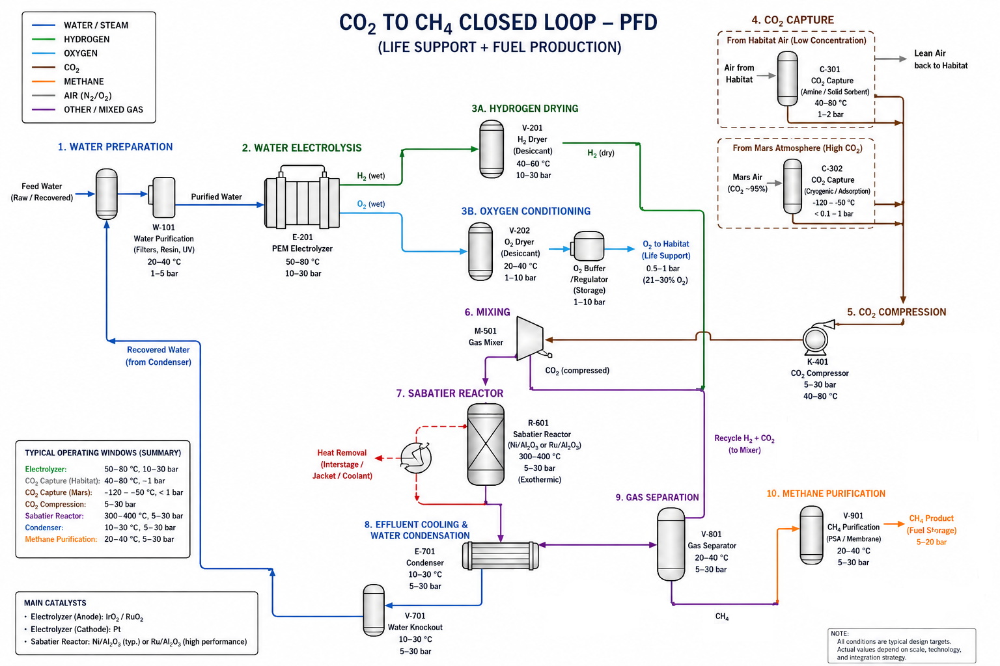

# ISimGraph v2 : notes de design et stratégie d'implémentation

## Objet du document

Ce document consigne les décisions architecturales pour la version 2 de ISimGraph
(remplacement de PmsmSimulation par un graphe générique chargé depuis JSON,
composition fractale `ISimGraph extends ISimNode`). Il sert de point de reprise
pour réamorcer le travail sans avoir à reconstruire le raisonnement.

Lecture à plusieurs niveaux : un glossaire en fin de document explique tous les
acronymes (chimie de procédés, numérique, machine learning, traitement du signal).
Les non-experts peuvent lire les sections en sautant les formules et utiliser le
glossaire pour les termes inconnus.

Vocabulaire : **ISimGraph v2** est le framework de simulation par graphe générique.
**HELIOS** est l'application de référence construite au-dessus (boucle ECLSS
CO2 vers CH4 lunaire avec 28 agents distribués). Le framework reste applicable
à d'autres cas (PMSM, vibration, mission profile, etc.).

## HELIOS comme plateforme de recherche ouverte

Décisions de cadrage prises **avant le premier commit**, pour éviter qu'elles
deviennent renégociables sous pression de delivery :

### Licence et exportabilité

- **Open source dès le premier commit**, licence permissive (Apache 2.0 ou
  MIT). Pas de période propriétaire « le temps de stabiliser ». Une fois
  publié sous licence permissive, le code reste réutilisable même si le projet
  bascule plus tard.
- **Zéro contenu ITAR par construction**. Le PFD ECLSS et le réacteur Sabatier
  sont des procédés industriels civils non couverts par l'ITAR. La modélisation
  doit éviter scrupuleusement tout équipement à dual-use militaire (capteurs
  haute précision défense, propulseurs, charges utiles classifiées). Cela
  préserve la possibilité pour des contributeurs non-US de travailler sur le
  projet et la possibilité pour le projet d'être hébergé sur GitHub public.
- **Documentation et discussions techniques en clair**. Pas de canal protégé,
  pas de section privée du repo.

### Instrumentation pour la recherche académique

Le code doit être utilisable par des laboratoires tiers sans intervention
de l'auteur. Concrètement :

- **Reproductibilité par graine** : tout RNG explicitement seedé, déterminisme
  garanti pour un même graphe + même configuration + même graine.
- **Logging structuré** : événements horodatés en format machine-readable
  (JSON Lines ou Parquet) pour rejouer une simulation et analyser hors-ligne.
- **Replay** : capacité de rejouer une trace de simulation et de vérifier la
  reproductibilité bit-à-bit (déjà standard dans le pipeline ONNX existant).
- **Métriques exposées** : conservation, stiffness ratio, taux d'inférence par
  agent, latence pipeline. Pas seulement la sortie « finale ».
- **Configurations de référence versionnées** : chaque cas d'usage publié avec
  son JSON de configuration immuable, permettant la comparaison de résultats
  entre publications.

### Compatibilité programmes de recherche

L'architecture vise la compatibilité avec les programmes publics de recherche
spatiale, sans contractualisation initiale :

- Périmètre ECLSS aligné avec la roadmap **NASA ECLSS Forward** (cycle eau,
  cycle carbone, cycle oxygène en boucle fermée).
- Variante ISRU compatible avec les appels **STMD Game Changing Development**
  (in-situ resource utilization).
- Modèle d'opération équipage compatible **NextSTEP** (commercial cislunar
  habitats) et **HRP** (Human Research Program, situational awareness).
- Cible matérielle déploiement compatible **HPSC** (High Performance
  Spaceflight Computing), production qualifiée vol attendue 2026-2027.

Ces compatibilités sont des **caractéristiques de design**, pas des engagements
contractuels. Toute collaboration avec NASA ou autre passe par les voies
institutionnelles normales (université partenaire, SBIR, Space Act Agreement).

### Couche expérience VR/AR research-grade

Pour qu'une couche VR/AR soit utilisable comme contribution de recherche (pas
seulement comme démo), l'architecture doit prévoir dès le départ :

- **Logging des interactions utilisateur** : gestes, fixations oculaires (sur
  Vision Pro), commandes vocales, latence de réaction. Format compatible avec
  outils d'analyse user research standards.
- **Métriques cognitives intégrées** : implémentation de NASA-TLX (Task Load
  Index), SAGAT (Situation Awareness Global Assessment Technique) en outils
  natifs du plugin. Permet de mener des études comparatives sans
  développement ad hoc.
- **Scénarios scriptables et reproductibles** : bibliothèque de scénarios
  (nominal, dégradation, emergency) déclenchables par script, mêmes
  conditions exactes entre sujets d'études.
- **Anonymisation et IRB-ready** : pipeline de collecte de données conforme
  aux normes IRB universitaires (consent forms, anonymisation, opt-out).

Sans ces éléments, la couche VR/AR reste une démo. Avec, elle devient un
instrument d'expérience scientifique.

## Cas d'usage de référence : PFD CO2 vers CH4 en habitat lunaire



Le cas test choisi pour valider ISimGraph v2 est une boucle fermée de support
vie + production de carburant. Plus exigeant qu'une simulation PMSM parce qu'il
force le framework à traiter des éléments absents du cas moteur :

- **Boucles de recyclage vraies** : condensat eau (V-701 vers W-101) et recycle
  H2 + CO2 non convertis (V-801 vers M-501). Le graphe est intrinsèquement
  cyclique, contrairement à un pipeline DAG.
- **Multi-espèces chimiques** : chaque flux porte au moins H2O, H2, O2, CO2, CH4,
  N2. Les arêtes ne sont plus des scalaires.
- **Échelles de temps séparées** : compression (ms), thermique des cuves
  (minutes), cinétique Sabatier (secondes), vieillissement catalyseur Ni
  (semaines à mois). Quatre ordres de grandeur dans le même graphe.
- **Invariants de sécurité** : la pureté O2 vers habitat doit rester entre 21 et
  30 %. La validation devient une propriété du graphe entier, pas d'un nœud
  isolé.

Le PFD comporte 10 unités principales, regroupées en sections numérotées :

| Tag | Unité | Section |
|---|---|---|
| W-101 | Purification eau | 1. Préparation eau |
| E-201 | Électrolyseur PEM | 2. Électrolyse |
| V-201 | Sécheur H2 | 3A. Séchage H2 |
| V-202 | Sécheur O2 + buffer | 3B. Conditionnement O2 |
| C-301 / C-302 | Captures CO2 (habitat / Mars-Lune) | 4. Capture CO2 |
| K-401 | Compresseur CO2 | 5. Compression |
| M-501 | Mélangeur | 6. Mixing |
| R-601 | Réacteur Sabatier (Ni/Al2O3 ou Ru/Al2O3) | 7. Sabatier |
| E-701 + V-701 | Condenseur + knockout eau | 8. Condensation |
| V-801 | Séparateur gaz | 9. Séparation |
| V-901 | Purification CH4 (PSA / membrane) | 10. Purification CH4 |

Convention de tag : lettre = type d'équipement (E = échangeur ou électrolyseur,
W = traitement eau, V = vessel, C = colonne, K = kompressor, M = mixer, R =
réacteur). Premier chiffre = numéro de section.

### Variante ISRU lunaire pertinente

Substituer le support du catalyseur Sabatier par de la zéolithe synthétisée à
partir du régolithe lunaire, et n'importer depuis la Terre que le nickel
métallique (densité 8.9, recyclable indéfiniment). Cette variante ajoute :

- Une **quatrième boucle** : cycle de vie catalyseur (synthèse support, imprégnation
  Ni, vieillissement, régénération oxydative ou vapeur, récupération Ni).
- Un **invariant supplémentaire** : conservation de l'inventaire Ni dans tout le
  système. Test d'intégrité gratuit (toute fuite se traduit par dérive Ni).
- Une **hiérarchie de sous-graphes** : le sous-système ISRU (synthèse zéolithe
  + impregnation + récupération) est un graphe distinct couplé au PFD principal
  par des débits de Ni neuf et Ni usagé. Cas idéal pour tester la composition
  fractale `ISimGraph extends ISimNode`.

## Architecture du framework

### Décision 1 : nœuds stateful, arêtes minimales

Chaque nœud porte un état interne explicite. C'est la même abstraction que
Modelica (composants acausaux à état), Simscape ou gPROMS, et c'est ce qui
manque dans une approche purement orientée signal-flow.

```
Node = {
  type: "reactor" | "vessel" | "exchanger" | ...,
  state: { T, P, x_i (composition), m_holdup, ... },
  internal_state: { catalyst_activity, Ni_loading, fouling, ... },
  parameters: { volume, area, kinetic_constants, ... },
  rhs(t, state, inputs) -> dstate_dt
}

Edge = {
  source, target,
  stream_type: "fluid" | "heat" | "work",
  payload: { mdot, composition[], T, P }  // pour fluid
}
```

Les arêtes restent simples : elles transportent l'information de couplage entre
nœuds, mais ne contiennent pas de dynamique propre par défaut. La dynamique
vit dans les nœuds.

### Décision 2 : constantes de temps physiquement motivées uniquement

Tentation classique : mettre un `tau` sur chaque arête « pour la stabilité ».
À éviter. Règle :

- `tau` uniquement quand il y a une **inertie physique vraie** (longueur de tuyau,
  capacité thermique de paroi, volume de cuve avec temps de résidence).
- Si tu ne peux pas écrire d'où vient le `tau` (en secondes, avec formule), ne
  l'ajoute pas.

Sinon, le nombre de variables d'état double pour rien et le système devient
artificiellement raide.

### Décision 3 : séparation assemblage / stepping

Architecture qui doit être en place dès le départ pour ne pas se peindre dans
un coin :

```
Graph (topologie + nœuds + arêtes)
    │
    │ assemble()
    ▼
Vecteur d'état plat y[N] + callback rhs(t, y, dy_out)
    │
    │ stepper choisi indépendamment
    ▼
ISolver { Euler | RK4 | RK45-DP | BDF | DAE }
```

Anti-pattern à éviter : `node.update(dt)` qui assume un pas fixe et fait
l'intégration dans le nœud. Tu ne pourras jamais brancher un solveur implicite
ou adaptatif derrière.

### Décision 4 : niveaux de fidélité explicites

Quatre niveaux qui correspondent à des solveurs différents et à des cas d'usage
différents :

| Niveau | Description | Solveur requis | Cas d'usage |
|---|---|---|---|
| 0 | Gain statique + composition fixe | Algébrique | Validation topologie graphe |
| 1 | 1er ordre par compartiment + bilan espèces | ODE explicite (RK4) | Validation archi ISimGraph |
| 2 | CSTR avec cinétique Arrhenius + thermique | ODE raide (BDF, Rosenbrock) | Sabatier réaliste |
| 3 | DAE complet avec thermo (Peng-Robinson, NRTL) | DAE (IDA) | Calibration industrielle |

**Pour le démarrage : niveau 1 suffit**. C'est délibéré. Tu valides le
framework, pas la précision physique. La précision viendra par montée en
niveau quand le besoin sera démontré.

## Topologie de déploiement

Le framework cible un déploiement à **trois runtimes**, avec un seul format
portable entre les trois :

```
┌─────────────────────────────────────────────────────┐
│         SPIKYPANDA (DESIGN + TRAINING)              │
│                                                     │
│  - SimGraph complet (ODE solveur, spectral, DMD)    │
│  - Conception et entraînement des agents            │
│  - Validation par solveur de référence              │
│  - Génération ONNX + manifest JSON portable         │
└──────────────┬───────────────────────┬──────────────┘
               │                       │
               │ export                │ export
               ▼                       ▼
   ┌──────────────────────┐   ┌─────────────────────────┐
   │  CYANMYCELIUM MCU    │   │  CYANMYCELIUM UNREAL    │
   │                      │   │                         │
   │  - Inference ONNX    │   │  - Inference ONNX       │
   │  - Vrais capteurs    │   │  - Twin simulé          │
   │  - Bus CAN / MQTT    │   │  - 3D / AR / VR         │
   │  - Actuateurs        │   │  - Scénarios scriptés   │
   └──────────┬───────────┘   └────────────┬────────────┘
              │                            │
              │  télémétrie                │  télémétrie
              └────────────┬───────────────┘
                           ▼
                ┌──────────────────────┐
                │  SPIKYPANDA          │
                │  (monitoring/replay) │
                │  boucle retraining   │
                └──────────────────────┘
```

### Runtime 1 : SpikyPanda (design et entraînement)

Environnement complet, sans contrainte de footprint :

- SimGraph avec solveur ODE choisi (RK4 puis BDF/Rosenbrock selon niveau).
- Outillage spectral natif (linéarisation, valeurs propres, DMD).
- Pipeline d'entraînement des agents (NN policies, surrogates, classifiers).
- Validation par solveur de référence (SUNDIALS si niveau 3 activé).
- Génération des artefacts de déploiement : `.onnx` quantisés + manifest JSON.

### Runtime 2 : CyanMycelium MCU

Cible matérielle physique :

- Inférence ONNX quantisée int8 (pipeline existant, voir
  `graph-runtime-architecture.md`).
- Footprint typique par MCU : 50-300 KB pour l'ensemble des agents d'un nœud.
- Cibles défauts : STM32H7, ESP32-S3.
- **Contrainte portabilité HPSC** : code C++14 portable, aucun intrinsic
  spécifique x86/ARM, aucune dépendance OS. Permet la migration vers HPSC
  (RISC-V multicore avec accélérateur ML intégré) sans refonte quand le
  matériel devient accessible.
- Communication inter-nœuds : bus CAN, Modbus, MQTT selon contexte
  d'installation.

### Runtime 3 : CyanMycelium Unreal plugin

Cible démonstrative et étude utilisateur :

- Plugin Unreal Engine 5 hébergeant CyanMycelium en C++.
- Le SimGraph C++ minimal tourne derrière (physique au pas fixe, 60 Hz ou
  moins selon besoin), pas la physique Unreal native.
- Unreal lit l'état via tick et s'occupe uniquement de la visualisation 3D
  et de l'interaction utilisateur.
- **Surface Blueprint riche** : chaque type d'agent, port, alerte, scénario
  exposé comme nœud Blueprint utilisable sans C++. Ce choix est dimensionnant
  pour l'accessibilité de la plateforme à des contributeurs non-C++.
- Progression matérielle : Meta Quest 3 en phase 1 (VR full immersion,
  simple à shipper), Apple Vision Pro en phase 2 (AR opérationnelle, target
  pour usage crew réel).

### Format portable : le manifest JSON

Le manifest JSON (voir `helios-agent-manifest-v1.fr.md` pour HELIOS) est
consommé identiquement par les trois runtimes :

- SpikyPanda l'utilise pour instancier les agents en simulation et les
  entraîner.
- CyanMycelium MCU l'utilise pour câbler les inférences ONNX avec les
  capteurs et actuateurs physiques.
- CyanMycelium Unreal l'utilise pour câbler les inférences ONNX avec les
  flux de données du twin et les éléments visuels.

**Un seul fichier source de vérité**. Pas de divergence possible entre
simulation et déploiement.

### Bus de télémétrie

Les runtimes déployés (MCU, Unreal) remontent leurs observations et leurs
décisions vers SpikyPanda en mode monitoring/replay :

- Canal par défaut : MQTT (latence acceptable, qualité de service
  configurable, déjà standard industriel).
- Données remontées : observations capteurs, sorties agents (scores,
  alertes, actions), métriques de performance.
- Usage : dashboards, replay pour debugging, déclenchement de retraining
  quand drift détecté.

## Stratégie de solveur (phasée)

Recommandation : **ne pas intégrer SUNDIALS dès le départ**, mais concevoir
l'interface du solveur pour qu'il puisse s'insérer plus tard sans refonte.

| Phase | Solveur | Justification |
|---|---|---|
| 1. Validation archi | RK4 adaptatif maison (Cash-Karp ou Dormand-Prince) | Zéro dépendance, 80-150 lignes, valide nœuds + arêtes + hooks |
| 2. Cinétique Sabatier réelle | Boost.odeint (Rosenbrock4) | Header-only, gère la raideur, intégration légère |
| 3. DAE acausal ou optimisation | SUNDIALS (IDA, CVODES) | Plus d'alternative sérieuse pour DAE ou sensibilités |

Signaux qui déclenchent la transition entre phases :

- Phase 1 vers 2 : introduction d'Arrhenius dans R-601, ratio
  `lambda_max / lambda_min` du Jacobien dépasse 10000.
- Phase 2 vers 3 : volonté de modéliser des équilibres de pression instantanés
  (DAE), ou besoin de dériver des gradients pour calibration ou optimisation.

### Alternative côté .NET

Si le runtime ISimGraph reste en C# (CyanMycelium) plutôt qu'en C++ pur :

- Math.NET Numerics couvre l'ODE explicite (Phase 1 OK).
- Pour le stiff (Phase 2 et 3), soit P/Invoke vers SUNDIALS, soit appel d'un
  kernel C++ via FFI. Pas d'équivalent natif .NET aussi mature que Boost.odeint
  ou SUNDIALS.

## Surrogate models (réseaux de neurones)

### Place dans l'architecture

Les surrogate models ont leur place mais **séparée du runtime de simulation
critique**. Architecture cohérente :

```
[Solveur de référence, niveau 2-3]
    │ génère N trajectoires (offline)
    ▼
[Surrogate GNN ou time-stepper]
    │ rapide, vit dans la variété d'entraînement
    ▼
[Exploration de design, sweeps paramétriques, optimisation]
```

Le solveur reste la vérité. Le surrogate sert à explorer 10000 configurations
en quelques secondes pour en garder 10 à valider. Le surrogate ne tourne
**jamais seul** pour décider d'un débit O2 vers l'habitat.

### Pourquoi ça marche : le latent absorbe la raideur

Un NN entraîné sur des sorties de solveur apprend la **flow map**
`Phi_h : y(t) -> y(t+h)` pour un `h` choisi librement. Tu peux entraîner avec
`h = 1 minute` même si la dynamique exige `h = 1 microseconde` numériquement.
Le NN absorbe les millions de pas du solveur dans une seule passe forward.

Intuition profonde : sur la variété attractrice du système, la dynamique vit
dans un sous-espace de dimension bien inférieure au vecteur d'état complet,
et la raideur vient des modes rapides déjà relaxés. Le NN découvre
implicitement cette variété et y reformule la dynamique. C'est la version
empirique de la **théorie de Koopman** (1931) : il existe une transformation
de coordonnées où la dynamique non linéaire raide devient quasi-linéaire et
bien conditionnée.

### Variantes architecturales

| Approche | Le NN remplace | Sidestep la raideur ? |
|---|---|---|
| Neural ODE | Le RHS `f(y, t)` | Non, intégration encore nécessaire |
| Latent ODE | RHS + projection | Partiellement |
| Flow map / time-stepper | `Phi_h` direct | Oui complètement |
| Operator learning (FNO, DeepONet) | Opérateur de la PDE entière | Oui, et générique en CL |

Pour ISimGraph : le **time-stepper discret** est le plus pertinent (entraînement
sur sorties du solveur de référence, inférence ultra-rapide).

### Trois limites à connaître

1. **Hors distribution = effondrement**. Le NN connaît la variété sur laquelle
   il a été entraîné. Régime nouveau (panne, perturbation forte) = extrapolation
   non fiable. La raideur ne disparaît pas, elle se transforme en fragilité
   hors-domaine.
2. **Conservation non garantie par construction**. Mass, énergie, inventaire Ni
   ne sont pas préservés sauf architecture contrainte (Hamiltonian NN,
   projection sur variété, soft penalty). Pour un habitat lunaire, c'est un
   point dur.
3. **Coût upfront**. Entraîner un surrogate exige d'abord de faire tourner le
   solveur lent sur des milliers de trajectoires. Le surrogate est rapide à
   l'inférence, pas à la conception.

## Outils spectraux natifs

L'analyse spectrale donne trois outils complémentaires pour diagnostiquer
et accélérer la simulation. À considérer comme infrastructure native d'ISimGraph
v2, pas comme add-on tardif.

### Outil 1 : analyse modale du système linéarisé

```
graph.linearize(operating_point) -> J = ∂f/∂y
graph.spectrum() -> {lambda_1, ..., lambda_n}
```

Chaque `lambda_k = alpha + i*omega` donne :

- `Re(lambda)` : taux de décroissance (constante de temps `tau = -1/alpha`)
- `Im(lambda)` : fréquence d'oscillation propre

Valeur immédiate :

- **Stiffness ratio** = `|lambda_max| / |lambda_min|`. Au-dessus de 10000,
  méthode implicite obligatoire. Diagnostic de raideur en 5 lignes de code.
- Identification des modes lents (candidats pour réduction d'ordre).
- Détection de bifurcations : tracer les `lambda` au cours de variations
  paramétriques. Un `lambda` qui s'approche de l'axe imaginaire annonce une
  **bifurcation de Hopf** (apparition d'oscillation, typique en boucle fermée
  avec régulation).

Coût d'implémentation : 20 lignes au-dessus de Eigen ou Math.NET. ROI élevé.

### Outil 2 : DMD (Dynamic Mode Decomposition) sur trajectoires

DMD est l'équivalent data-driven de l'analyse modale, et c'est l'extension
naturelle de MCSA appliquée à un système entier au lieu d'un seul signal.

```
Snapshots X = [y(t_1), y(t_2), ..., y(t_N)]
DMD(X) -> modes spatiaux Phi_k + fréquences complexes lambda_k
```

Avantages :

- Pas besoin de linéariser, marche sur les données du solveur non linéaire.
- Identification automatique des modes dominants.
- Détection précoce d'instabilités (mode dont l'amortissement passe à zéro).
- Possible en streaming (sliding window) pendant la simulation.

Connexion théorique : DMD est l'approximation finie de l'opérateur de Koopman.
Donc DMD (analytique) et NN-latent (appris) attrapent le même objet
mathématique.

Coût d'implémentation : module séparé au-dessus de SVD. 10 lignes avec Eigen.

### Outil 3 : surrogate spectral (plus tard)

Le **Fourier Neural Operator** (Li et al. 2020) remplace les convolutions par
`FFT -> filtre apprenable diagonal -> iFFT`. Très efficace pour PDE sur grille
régulière mais pas applicable directement à un graphe arbitraire.

Pour ISimGraph : la voie est le **Spectral GNN** (Defferrard 2016, ChebNet) qui
définit le spectre via la décomposition propre du laplacien du graphe. Plus
complexe à implémenter. À reporter jusqu'à ce que le surrogate GNN classique
montre ses limites de généralisation.

### Pourquoi le spectral dissout la raideur (intuition profonde)

Dans la base propre du Jacobien, le système découple :

```
Espace physique : dy/dt = J*y       (couplé, raide)
Espace modal :    dz/dt = Lambda*z  (diagonal, indépendant par mode)
                  où z = V^(-1)*y  et  Lambda = diag(lambda_k)
```

Chaque mode évolue indépendamment selon `z_k(t) = z_k(0) * exp(lambda_k*t)`.
Les modes rapides relaxent en `1/|lambda_k|` puis sont à leur valeur d'équilibre
forcée par les modes lents. On peut alors **éliminer analytiquement** les modes
rapides (approximation quasi-stationnaire, Bodenstein 1913) et n'intégrer
numériquement que les lents.

C'est ce que le NN latent fait empiriquement. C'est ce que DMD fait
analytiquement à partir des données. C'est ce que l'analyse modale fait
analytiquement à partir du Jacobien. **Trois implémentations de la même idée.**

### Limite spécifique aux systèmes chimiques

Le PFD CO2-CH4 a peu d'oscillations naturelles, c'est surtout de la relaxation
pure (`lambda` réels négatifs). FFT classique sur exponentielle décroissante
donne un spectre 1/f peu informatif. Pour ce cas :

- Analyse modale et DMD restent les bons outils (ils gèrent `lambda` réels et
  complexes pareillement).
- FFT brute redevient utile en boucle fermée (oscillations de régulation) ou en
  excitation périodique (analyse de réponse fréquentielle).
- STFT ou wavelets si on veut suivre l'évolution spectrale en non-stationnaire
  (démarrage, perturbation, régénération catalyseur).

## Validation et invariants

ISimGraph v2 doit exposer des hooks de validation globaux, pas seulement par
nœud. Trois invariants à vérifier en post-pas (désactivables en production
pour la vitesse) :

1. **Conservation de masse par espèce** : `sum_in - sum_out - d(holdup)/dt = 0`
   pour chaque espèce, à 1e-9 près après 1e6 pas.
2. **Conservation d'énergie** : bilan enthalpique global y compris pertes
   thermiques (et chaleur de réaction pour le Sabatier).
3. **Inventaire Ni** (si variante ISRU) : `Ni_total = Ni_actif_R601 +
   Ni_en_synthèse + Ni_recyclage + Ni_perdu`. Doit rester constant à la
   précision numérique.

Sans ces hooks, un surrogate ou un solveur défaillant dérive en silence
pendant des heures de simulation. La vérification gratuite via les invariants
catch les bugs immédiatement.

## Pièges à éviter (récap)

- **Ne pas ajouter `tau` partout** : seulement quand physiquement motivé.
- **LLM hors de la boucle physique et hors des agents safety** : ISimGraph
  reste déterministe et conservatif, et les agents qui ont autorité sur des
  actuateurs réels n'acceptent pas d'entrée LLM. En revanche, le LLM a sa
  place pour piloter des scénarios d'entraînement via la surface MCP (voir
  `helios-project-overview.fr.md` section 8), pour assister la conception en
  amont, et pour produire des debriefs post-session. La frontière passe entre
  « simuler l'environnement de décision » (autorisé) et « prendre la décision
  technique à la place du système » (interdit).
- **Ne pas accepter de prédiction surrogate sans vérification de conservation**.
- **Ne pas jumper sur SUNDIALS prématurément** : RK4 maison suffit pour valider
  l'archi en niveau 1.
- **Ne pas baker le stepping dans les nœuds** : sépare assemblage et solveur
  dès le début.
- **Ne pas confondre dynamics model et world model** : un world model décide,
  un dynamics model prédit. La différence est la fonction de coût
  (voir `world-models-and-regulation.fr.md`).
- **Ne pas oublier la non-stationnarité** : FFT classique suppose un signal
  stationnaire, ce qui est faux pendant démarrage, régen, perturbation.

## Roadmap d'implémentation suggérée

La roadmap couvre les trois runtimes (SpikyPanda design, CyanMycelium MCU,
CyanMycelium Unreal) et la couche de direction de scénario (LLM via MCP).
Les sprints 1 à 3 construisent les fondations communes, les sprints 4 à 8
introduisent les agents, le runtime Unreal, la couche VR et le scenario
director. Les sprints 9 à 13 couvrent la montée en fidélité physique et les
extensions optionnelles.

### Sprint 1 : socle du framework (niveau 1)

1. Définir `ISimNode` étendu (stateful, `rhs`, `state_dim`, ports typés
   observation/action).
2. Définir `ISimGraph extends ISimNode` (composition fractale).
3. Loader JSON pour topologie + paramètres nœuds.
4. Assemblage du vecteur d'état plat et de la fonction `rhs` globale.
5. Solveur RK4 adaptatif (Cash-Karp ou Dormand-Prince).
6. Hook de vérification de conservation, activable.
7. Refactoriser PMSM existant via la nouvelle interface, comportement identique.

### Sprint 2 : cas test PFD niveau 1

1. Définir `IChemicalStream` (composition multi-espèces + T + P).
2. Implémenter les 12 types de nœuds du PFD (W-101, E-201, V-201, V-202, C-301,
   C-302, K-401, M-501, R-601 simplifié, E-701, V-701, V-801, V-901).
3. JSON de configuration du graphe complet avec recyclages.
4. Validation : conservation H2O, H2, O2, CO2, CH4 sur 24h simulés.
5. Vérification : stiffness ratio reste raisonnable au niveau 1.

### Sprint 3 : outillage spectral

1. `graph.linearize()` via différences finies sur `rhs`.
2. `graph.spectrum()` via Eigen.
3. Module DMD séparé consommant les trajectoires de simulation.
4. Visualisation des modes (export pour MATLAB ou Python plotting).

### Sprint 4 : runtime agents générique

1. Formaliser le schéma manifest (extension du schéma HELIOS) :
   champs `kind: observer/advisor/controller/safety`, bindings sortants,
   politique d'arbitrage par nœud, déclaration d'état persistant, backends
   multiples (formula, rule, ONNX).
2. Loader manifest → instanciation runtime d'agents.
3. Arbitrator (3 politiques : priority, blend, vote).
4. Bus d'alertes et registre d'actuateurs.
5. Pipeline ONNX export + manifest depuis SpikyPanda.

### Sprint 5 : agents HELIOS priorité 1

Déploiement progressif du manifest HELIOS, dans l'ordre suggéré dans
`helios-agent-manifest-v1.fr.md` :

1. Pipeline e2e : R601-CONVERSION-EFFICIENCY + LOOP-MASS-BALANCE.
2. Sécurité : R601-RUNAWAY-PREVENTION + R601-THERMAL-REGULATION
   (validation arbitrage safety > controller).
3. Cross-node : LOOP-ENERGY-BALANCE + THERMAL-CHAIN.
4. Diagnostic ML : K401-BEARING-HEALTH, E201-GAS-PURITY,
   C302-CRYO-STABILITY (premiers agents NN sérieux).

### Sprint 6 : plugin Unreal Blueprint MVP

1. Plugin Unreal Engine 5 hébergeant CyanMycelium + SimGraph C++ minimal.
2. Surface Blueprint exposée : SimNode, IChemicalStream, IAgent, IAlertBus
   comme nœuds Blueprint avec catégories, icônes, tooltips.
3. Loader manifest JSON consommable depuis Blueprint.
4. Tick fixe (60 Hz par défaut), exposition de l'état au Blueprint via
   event dispatcher.
5. Bus de télémétrie MQTT vers SpikyPanda (mode monitoring).
6. Démo : PFD complet visualisé dans un environnement 3D simple (assets
   placeholder), agents tournent, alertes affichées en HUD.

### Sprint 7 : couche expérience VR phase 1

1. Cible matérielle : Meta Quest 3.
2. Assets 3D des équipements PFD (modèles instrumentés réagissant à l'état
   physique, niveaux de détail variables).
3. HUD VR : panneaux d'état agents, alertes, contrôles tactiles.
4. Logging des interactions utilisateur (gestes, regards, latence).
5. Bibliothèque scénarios scriptables : nominal, dégradation filtre,
   runaway thermique, perte de capture CO2.
6. Implémentation NASA-TLX et SAGAT comme outils natifs du plugin.

### Sprint 8 : direction de scénario via MCP et LLM

Le scenario director est ce qui rend HELIOS utilisable pour de la formation
crise au-delà des scripts figés.

1. Extension de `SpkSimulationAdapter` existant pour exposer les outils MCP
   du scenario director : `inject_fault`, `set_objective`, `broadcast_comm`,
   `observe_trainee_actions`, `adjust_difficulty`, `snapshot`, `restore`,
   `query_agent_state`.
2. Validation côté MCP : toute action LLM est traduite en perturbation
   physique bien-formée avant injection dans le SimGraph.
3. Intégration d'un LLM client (Claude ou GPT en cloud pour démarrer) avec
   abstraction provider pour basculement local ultérieur.
4. Bibliothèque seed de 10 à 15 scénarios narratifs détaillés couvrant
   nominal, dégradations progressives, cascades multi-systèmes, time-pressure,
   communication dégradée Mars.
5. Validation pédagogique sur 30 à 50 sessions test : les scénarios générés
   restent cohérents physiquement et pertinents pédagogiquement.

### Sprint 9 : montée en niveau 2 (physique réaliste)

1. Implémenter cinétique Arrhenius dans R-601.
2. Vérifier que le stiffness ratio explose (validation du diagnostic spectral).
3. Intégration Boost.odeint avec Rosenbrock4.
4. Re-validation conservation et performance.
5. Validation que les agents HELIOS continuent de fonctionner avec la
   physique raffinée.

### Sprint 10 (optionnel) : variante ISRU

1. Sous-graphe ISRU (synthèse zéolithe, impregnation, récupération Ni).
2. Couplage avec PFD principal via débits Ni.
3. Invariant supplémentaire : inventaire Ni global.
4. Simulation longue durée (semaines) avec vieillissement catalyseur.

### Sprint 11 (optionnel) : couche expérience AR phase 2

1. Cible matérielle : Apple Vision Pro.
2. Migration des assets VR vers AR (anchor placement, occlusion réelle).
3. Interaction multi-modale (voice + gesture + gaze).
4. Mode opérationnel : overlay sur vrai équipement (si accessible) ou sur
   maquette physique.

### Sprint 12 (optionnel) : surrogate exploratoire

1. Génération de dataset (1000 trajectoires sur grille de paramètres).
2. Entraînement GNN time-stepper.
3. Validation : ratio gain de vitesse vs erreur sur conservation.
4. Usage : exploration paramétrique pour design d'habitat.

### Sprint 13 (optionnel) : portage HPSC

Une fois HPSC eval kit accessible (production silicon attendue 2026-2027) :

1. Portage CyanMycelium runtime sur RISC-V HPSC.
2. Validation accélérateur ML embarqué pour inférence agents.
3. Benchmark performance vs MCU standard.
4. Documentation pattern de déploiement pour future certification vol.

## Glossaire

### Acronymes du PFD et chimie de procédés

| Acronyme | Signification | Notes |
|---|---|---|
| PFD | Process Flow Diagram | Schéma de procédé industriel |
| ISRU | In-Situ Resource Utilization | Utilisation des ressources sur place (sol lunaire ou martien) |
| PEM | Proton Exchange Membrane | Type d'électrolyseur, fonctionne à basse température |
| PSA | Pressure Swing Adsorption | Séparation gaz par cycles de pression |
| CSTR | Continuous Stirred-Tank Reactor | Modèle de réacteur idéal à mélange parfait |
| NRTL | Non-Random Two-Liquid | Modèle thermodynamique d'équilibre liquide |
| PR | Peng-Robinson | Équation d'état pour fluides (équilibre gaz-liquide) |
| ZSM-5 | Zeolite Socony Mobil #5 | Type de zéolithe, support catalyseur classique |
| SBA-15 | Santa Barbara Amorphous #15 | Silice mésoporeuse, autre support catalyseur |
| Ea | Énergie d'activation | Barrière énergétique d'une réaction chimique (en J/mol) |

### Acronymes solveurs et numérique

| Acronyme | Signification | Notes |
|---|---|---|
| ODE | Ordinary Differential Equation | Équation différentielle ordinaire |
| DAE | Differential Algebraic Equation | ODE + contraintes algébriques (typique des systèmes acausaux) |
| PDE | Partial Differential Equation | Équation aux dérivées partielles |
| CFD | Computational Fluid Dynamics | Simulation fluide haute fidélité (Navier-Stokes) |
| RK4 | Runge-Kutta order 4 | Schéma d'intégration ODE à 4 évaluations par pas |
| RK45 | Runge-Kutta 4(5) embedded | Paire ordre 4 et 5 pour estimation d'erreur et pas adaptatif |
| DP | Dormand-Prince | Jeu de coefficients RK45 standard (ode45 Matlab) |
| BDF | Backward Differentiation Formula | Méthode implicite pour ODE raides |
| SDIRK | Singly Diagonally Implicit Runge-Kutta | Méthode implicite alternative à BDF |
| ESDIRK | Explicit first stage SDIRK | Variante de SDIRK |
| SUNDIALS | SUite of Nonlinear and DIfferential/ALgebraic equation Solvers | Bibliothèque C de référence (DOE) |
| CVODE | C Variable-coefficient ODE solver | Solveur ODE (raide ou non) dans SUNDIALS |
| CVODES | CVODE with Sensitivity | CVODE + calcul de sensibilités forward/adjoint |
| IDA | Implicit Differential-Algebraic solver | Solveur DAE dans SUNDIALS |
| KINSOL | Krylov INexact Newton SOLver | Solveur non linéaire algébrique dans SUNDIALS |
| BLAS | Basic Linear Algebra Subprograms | Bibliothèque opérations matricielles bas niveau |
| LAPACK | Linear Algebra PACKage | Bibliothèque algèbre linéaire (au-dessus de BLAS) |

### Acronymes machine learning et traitement du signal

| Acronyme | Signification | Notes |
|---|---|---|
| NN | Neural Network | Réseau de neurones générique |
| MLP | Multi-Layer Perceptron | Réseau fully-connected classique |
| GNN | Graph Neural Network | Réseau opérant sur graphes (message passing) |
| FNO | Fourier Neural Operator | NN avec convolutions spectrales (Li et al. 2020) |
| DeepONet | Deep Operator Network | Architecture apprenant des opérateurs (Lu et al. 2019) |
| ChebNet | Chebyshev Spectral GNN | GNN spectral via polynômes de Tchebychev (Defferrard 2016) |
| POD | Proper Orthogonal Decomposition | Réduction d'ordre par modes orthogonaux (= PCA temporel) |
| DMD | Dynamic Mode Decomposition | Décomposition modale data-driven (Schmid 2010) |
| SVD | Singular Value Decomposition | Décomposition matricielle, base de POD et DMD |
| FFT | Fast Fourier Transform | Transformée de Fourier discrète (Cooley-Tukey) |
| STFT | Short-Time Fourier Transform | FFT par fenêtres glissantes (non-stationnaire) |
| MCSA | Motor Current Signature Analysis | Diagnostic moteur par analyse spectrale du courant |
| RL | Reinforcement Learning | Apprentissage par renforcement |
| LLM | Large Language Model | Modèle de langage (GPT, Claude, etc.) |
| MCP | Model Context Protocol | Protocole d'intégration LLM-outils (Anthropic) |

### Acronymes déploiement, matériel et programmes spatiaux

| Acronyme | Signification | Notes |
|---|---|---|
| MCU | Microcontroller Unit | Microcontrôleur (STM32, ESP32, etc.), cible déploiement edge |
| HPSC | High Performance Spaceflight Computing | Processeur NASA/Microchip RISC-V multicore avec accélérateur ML, production silicon attendue 2026-2027, successeur du RAD750 |
| RAD750 | Radiation-Hardened PowerPC 750 | Processeur historique des sondes NASA (Curiosity, Perseverance, etc.) |
| MQTT | Message Queuing Telemetry Transport | Protocole pub/sub léger pour télémétrie IoT |
| CAN | Controller Area Network | Bus industriel temps réel, standard automobile et aérospatial |
| VR | Virtual Reality | Immersion totale (Meta Quest, Valve Index, etc.) |
| AR | Augmented Reality | Superposition sur le monde réel (HoloLens, Vision Pro, etc.) |
| ITAR | International Traffic in Arms Regulations | Régulation US d'export de technologies à usage défense, restreint la collaboration internationale |
| ECLSS | Environmental Control and Life Support System | Systèmes support vie spacecraft (eau, air, CO2, déchets) |
| NextSTEP | Next Space Technologies for Exploration Partnerships | Programme NASA partenariats commerciaux habitat cislunaire |
| HRP | Human Research Program | Programme NASA recherche santé et performance équipage |
| STMD | Space Technology Mission Directorate | Direction NASA technologies en maturation |
| SBIR | Small Business Innovation Research | Programme US grants R&D petites entreprises (Phase I 150k$, Phase II 850k$) |
| STTR | Small Business Technology Transfer | Variante SBIR exigeant partenariat universitaire |
| SAA | Space Act Agreement | Cadre formel collaboration NASA avec partenaires industriels ou académiques |
| IRB | Institutional Review Board | Comité éthique pour études impliquant sujets humains |
| NASA-TLX | NASA Task Load Index | Instrument standard mesure charge cognitive utilisateur |
| SAGAT | Situation Awareness Global Assessment Technique | Instrument standard mesure situation awareness |
| HCI | Human-Computer Interaction | Domaine recherche interaction humain-machine |
| TRL | Technology Readiness Level | Échelle NASA 1-9 de maturité technologique |

### Termes physiques et mathématiques

| Terme | Définition |
|---|---|
| **Sabatier (réaction)** | `CO2 + 4 H2 -> CH4 + 2 H2O`, exothermique, sur catalyseur Ni ou Ru à 300-400 C. Découverte par Paul Sabatier en 1902, Prix Nobel 1912. |
| **Arrhenius (loi)** | `k(T) = A * exp(-Ea / (R*T))`. Donne la dépendance de la vitesse d'une réaction chimique à la température. Source principale de raideur en chimie. |
| **Stiffness (raideur)** | Propriété d'un système d'ODE ayant des échelles de temps très séparées. Force les méthodes explicites à prendre des pas tout petits pour rester stables, même si on ne s'intéresse qu'aux variables lentes. |
| **Méthode explicite** | Schéma d'intégration où `y(t+h)` se calcule par formule directe à partir de `y(t)`. Rapide par pas, mais instable sur systèmes raides. RK4, Euler explicite. |
| **Méthode implicite** | Schéma où `y(t+h)` apparaît des deux côtés et nécessite la résolution d'un système linéaire (ou non linéaire) par pas. Plus coûteux par pas mais stable pour les raides. BDF, SDIRK, Euler implicite. |
| **Acausal (système)** | Système où l'ordre de calcul n'est pas imposé par la topologie (ex : circuit électrique, réseau hydraulique). Nécessite un solveur DAE. Modelica est acausal, Simulink est causal. |
| **Jacobien** | Matrice des dérivées partielles `J_ij = ∂f_i / ∂y_j`. Cœur des méthodes implicites et de l'analyse modale. |
| **Valeur propre** | Pour une matrice `J`, un `lambda` tel que `J*v = lambda*v` pour un vecteur `v`. Donne les modes naturels du système. |
| **Koopman (opérateur)** | Opérateur linéaire infini-dimensionnel qui décrit l'évolution des observables d'un système dynamique non linéaire. Permet en théorie de linéariser tout système non linéaire en changeant d'espace. DMD est son approximation finie. |
| **Bifurcation de Hopf** | Transition où un système stable devient oscillant lors de la variation d'un paramètre (une paire de valeurs propres complexes traverse l'axe imaginaire). Typique en régulation. |
| **Flow map** | Fonction `Phi_h : y(t) -> y(t+h)`. C'est l'inconnue que les surrogate time-stepper apprennent. |
| **Variété (attractrice)** | Sous-espace de dimension réduite où le système passe la majorité de son temps après transitoires. Cible des méthodes de réduction d'ordre. |
| **Bodenstein (approximation)** | Approximation quasi-stationnaire en cinétique chimique : les espèces très réactives sont à concentration d'équilibre instantanée. Élimine analytiquement la raideur due à ces espèces. |
| **Compartmental model** | Modèle où le système est divisé en compartiments avec état interne et flux d'échange. Tradition en pharmacologie et génie chimique. Équivalent à un graphe de nœuds stateful. |

### Outils et bibliothèques mentionnés

| Nom | Type | Notes |
|---|---|---|
| **Modelica** | Langage de modélisation acausale | Standard depuis 1997, gère DAE nativement, paradigme cible si on va en niveau 3 |
| **OpenModelica** | Compilateur Modelica open source | Alternative à JModelica (abandonné) |
| **gPROMS** | Plateforme propriétaire | Référence en simulation de procédés chimiques |
| **Simscape** | Toolbox MathWorks | Équivalent commercial de Modelica dans Simulink |
| **Boost.odeint** | Bibliothèque C++ header-only | ODE explicite et Rosenbrock4 stiff, alternative légère à SUNDIALS |
| **Eigen** | Bibliothèque C++ algèbre linéaire | Header-only, base pour Jacobien et SVD |
| **Math.NET Numerics** | Bibliothèque .NET | ODE explicite, SVD, FFT. Pas de stiff natif sérieux. |
| **DifferentialEquations.jl** | Écosystème Julia | Gold standard tous solveurs (ODE, DAE, SDE) |

## Références bibliographiques (briefs)

- Hairer & Wanner, *Solving Ordinary Differential Equations I, II*, Springer 1996.
  Le manuel de référence sur les méthodes d'intégration.
- Brunton & Kutz, *Data-Driven Science and Engineering*, Cambridge 2019.
  Excellente couverture DMD, Koopman, SINDy, surrogate models pour ingénieurs.
- Li et al., *Fourier Neural Operator for Parametric PDEs*, ICLR 2021.
  Papier FNO.
- Chen et al., *Neural Ordinary Differential Equations*, NeurIPS 2018.
  Papier Neural ODE.
- Mukai et al., publications JAXA sur la synthèse de zéolithes à partir de
  régolithe simulé. Voir aussi NASA TM-2007 sur ISRU lunaire.
- Sabatier & Senderens, 1902, *Compt. Rend.* 134, 514. Le papier d'origine.

## Notes pour la reprise

Avant de relancer le travail sur ISimGraph v2 et HELIOS :

1. Re-lire les documents associés dans cet ordre :
   - Ce document (cadrage, topologie, roadmap).
   - `helios-agent-manifest-v1.fr.md` (28 agents distribués sur le PFD).
   - `world-models-and-regulation.fr.md` (distinction dynamics vs world model).
   - `graph-runtime-architecture.md` (état actuel du compute graph et pipeline
     ONNX/quantization).
2. Confirmer le langage cible du runtime (C# CyanMycelium vs C++ kernel).
3. Décider du paradigme de simulation : **causal explicite** (recommandé pour
   démarrer) vs **acausal DAE** (cible long terme).
4. Vérifier l'état actuel du code PMSM dans le repo (point de départ pour la
   refactorisation fractale `ISimGraph extends ISimNode`).
5. Confirmer la licence open source à appliquer (Apache 2.0 recommandé pour
   compatibilité maximale avec usage industriel et académique).
6. Vérifier que le manifest HELIOS est aligné avec le schéma agent étendu
   (kind, bindings sortants, arbitrage, état persistant, backends multiples).
