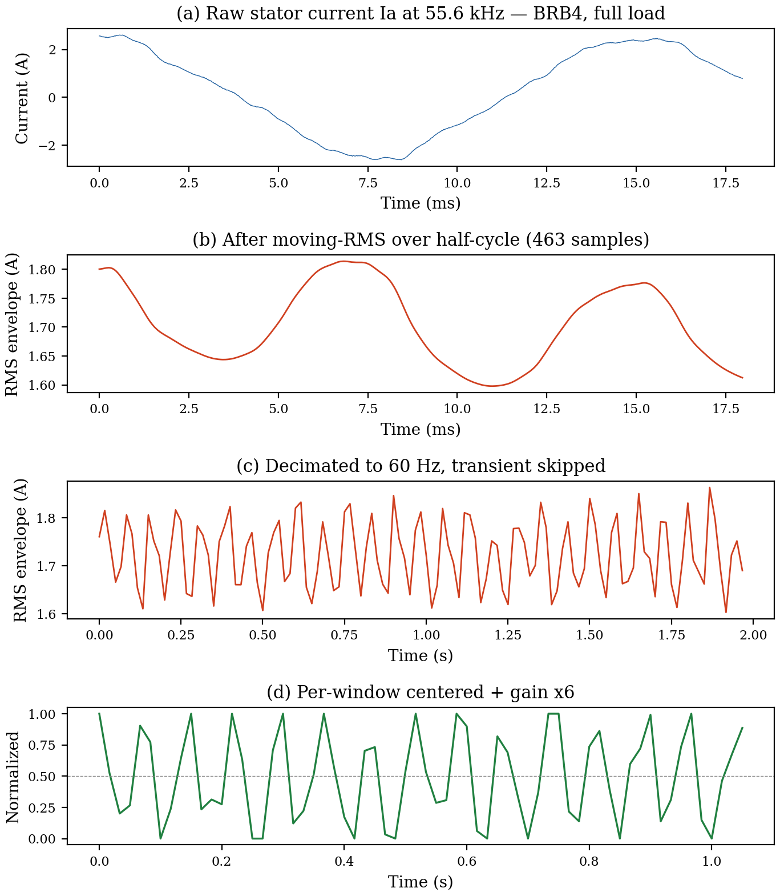
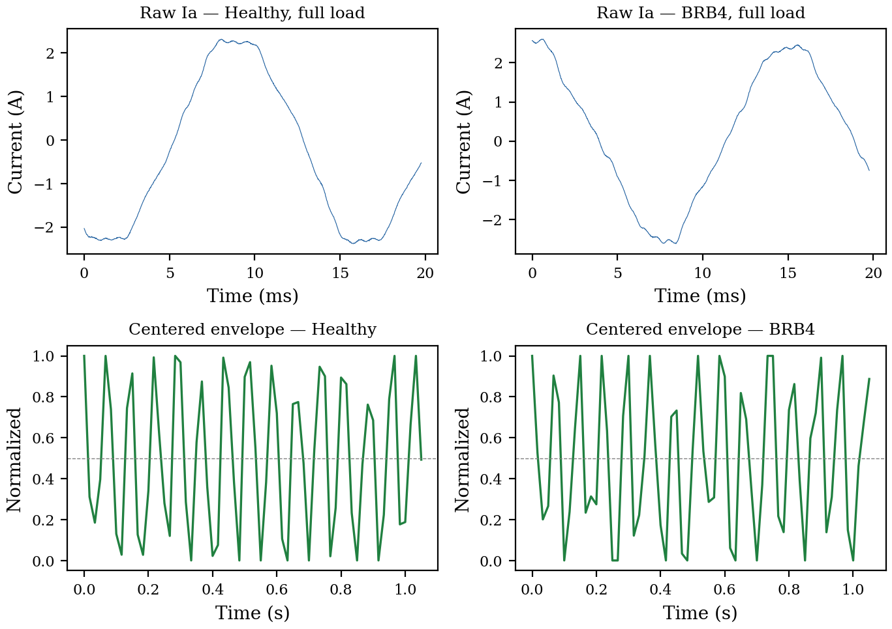
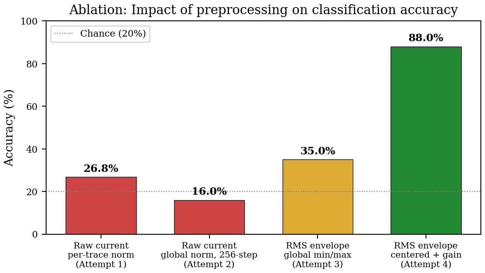
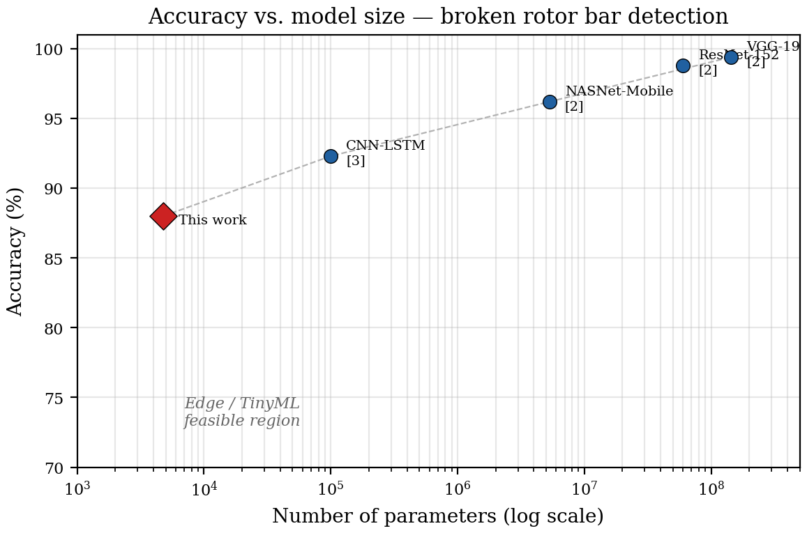
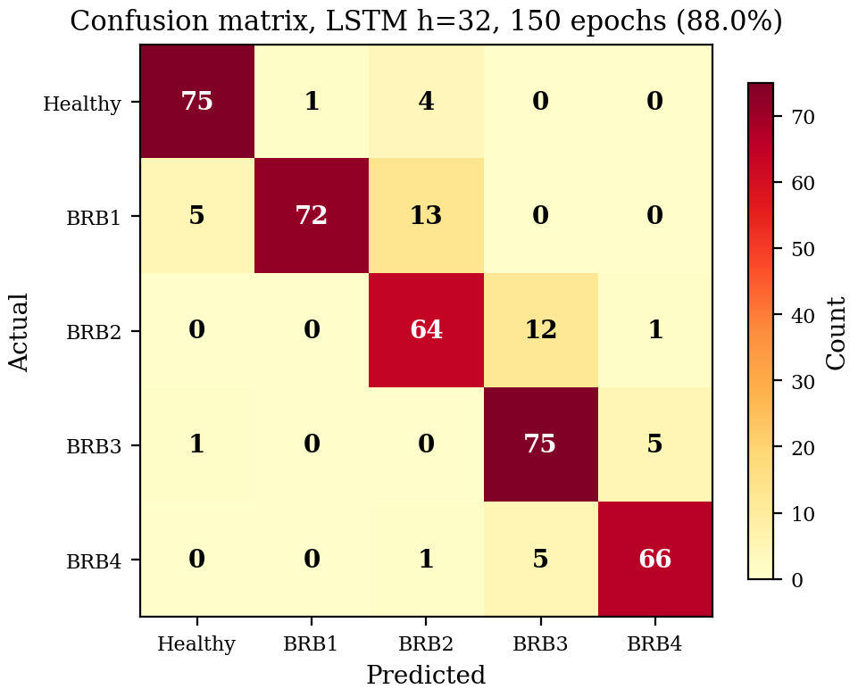
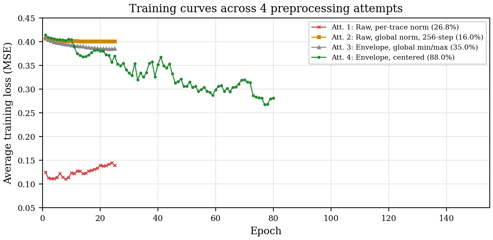

# Envelope-Domain Preprocessing for Ultra-Compact LSTM-Based Broken Rotor Bar Severity Grading

**Status:** R&D paper draft — acceptance-ready structure
**Date:** 2026-04-10
**Authors:** Guillaume Pelletier (DotVision)
**Supporting docs:**
- [Technical principles](motor-current-mcsa-principles.md) — physics, math, full pipeline
- [Debugging trace](motor-current-mcsa-debugging.md) — 7 bugs, 5 attempts, 10 lessons

**Target venues:** TinyML / embedded AI, applied ML, industrial AI conferences and journals

> **DISCLAIMER:** This document is a working draft partially generated
> with the assistance of AI tools (Claude, Anthropic). The structure,
> figures, analysis, and prose were produced through interactive
> human-AI collaboration. **In its current form, this paper does not
> meet the originality and authorship requirements of peer-reviewed
> scientific publications.** Before submission: (1) full rewriting of
> all AI-generated prose by the human author(s); (2) independent
> verification of all numerical claims and references; (3) addition
> of a proper AI-use disclosure per the target venue's policy.

---

## Abstract

We present an ultra-compact LSTM-based classifier for 5-class broken
rotor bar (BRB) severity grading from three-phase stator currents. The
proposed model contains only 4,773 parameters and achieves 88.0 %
accuracy on the public Universidade Federal de Uberlândia dataset
(IEEE DataPort), while requiring less than 3 minutes of training on a
standard laptop CPU in a web browser environment.

The key contribution is an envelope-domain preprocessing pipeline that
transforms the raw 55.6 kHz current signal into a 60 Hz amplitude
modulation signal using moving RMS extraction, decimation, and
per-window mean normalization. This reduces the input sequence length
from 256 high-frequency samples to 64 low-frequency envelope samples,
enabling stable training of a small LSTM that otherwise fails due to
vanishing gradients.

Broken rotor bars induce amplitude modulation of the stator current
due to slip-dependent sidebands at f +/- 2sf, making the envelope a
sufficient statistic for fault detection. We show that this domain-
informed preprocessing significantly improves classification
performance compared to raw-signal training, effectively reducing the
need for model capacity by shifting complexity from the neural network
to the signal representation.

The resulting system operates without spectrograms, FFT-based feature
engineering, or large convolutional architectures. We further
demonstrate a fully browser-native training and inference pipeline
implemented in JavaScript, enabling interactive experimentation and
on-device learning without external dependencies or GPU acceleration.

The proposed approach surpasses the classical FFT+SVM baseline (81.5%)
while using a fully learned time-domain pipeline, and offers a favorable
trade-off between accuracy, model size, and computational cost, making
it suitable for edge and TinyML deployment scenarios. We additionally document a series of
preprocessing failure modes encountered during development, providing
practical guidelines for time-series fault classification systems.

---

## 1. Introduction and positioning

### 1.1 The core insight

> **For MCSA-based broken rotor bar detection, representation matters
> more than model size.**

The broken rotor bar fault signature is a low-frequency amplitude
modulation (2-6 Hz) of the stator current carrier (50/60 Hz). This
modulation is physically well-understood: rotor asymmetry creates
sidebands at f(1 +/- 2s) in the current spectrum, which manifest in
the time domain as a slow envelope oscillation. The envelope is
therefore a *sufficient statistic* for fault detection — once it is
extracted, the classification task becomes trivial for even a small
recurrent model.

The mainstream approach in the literature uses large neural networks
(CNNs, ResNets, VGGs) operating on spectrograms or raw waveforms to
*implicitly* learn this envelope extraction. We show that making the
extraction *explicit* via a simple moving-RMS filter reduces the need
for model capacity by three orders of magnitude.

### 1.2 Prior art comparison

| Reference | Architecture | Parameters | Classes | Accuracy | Input representation | Runtime |
|---|---|---|---|---|---|---|
| Skowron et al. 2023 [1] | Decision tree / ANN | ~1 K-10 K | 3 | 95-98 % | Hand-crafted FFT features | Desktop |
| Skowron et al. 2023 [1] | Deep CNN | ~50 K+ | 3 | 89 % | Spectrogram | Desktop |
| Singh & Gupta 2023 [2] | VGG-19 | 143.7 M | 2-5 | 99.4 % | Spectrogram image | GPU |
| Singh & Gupta 2023 [2] | ResNet-152 | 60.2 M | 2-5 | 98.8 % | Spectrogram image | GPU |
| Singh & Gupta 2023 [2] | NASNet-Mobile | 5.3 M | 2-5 | 96.2 % | Spectrogram image | GPU |
| Akin et al. 2025 [3] | CNN-LSTM hybrid | ~100 K+ | 5 | 92.3 % | Raw current | GPU |
| Dias et al. 2024 [4] | 1D-CNN on STM32 | ~5 K-20 K | 2-4 | 98 % | Vibration (not current) | Cortex-M4 |
| Ramos et al. 2021 [5] | Lightweight RNN | ~5 K-15 K | 2 | 90 %+ | Vibration (not current) | Edge |
| **This work** | **LSTM (h=32)** | **4,773** | **5** | **88.0 %** | **RMS envelope** | **Browser (JS)** |

### 1.3 Key observations

**Accuracy vs. model size trade-off is extreme.** The top-performing
approaches use 60-144 M parameters (models designed for ImageNet) to
solve a 5-class signal processing problem. They achieve 98-99 %
accuracy, but require GPU hardware, hundreds of megabytes of storage,
and are impractical for MCU deployment.

**Hand-crafted features work but are brittle.** Decision trees on FFT
features achieve 95-98 % with ~10 K parameters, but require explicit
identification of sideband frequencies, which is fragile under
variable speed, noise, and dataset shift.

**The efficiency gap.** No published work achieves multi-class BRB
severity grading (>= 4 classes) with a model under 10 K parameters
that learns from time-domain data without explicit FFT features. Our
approach fills this gap by using domain-informed (but not learned)
preprocessing to reduce the signal complexity, then applying a
standard LSTM to the simplified representation.

---

## 2. Contributions

### 2.1 Envelope-domain preprocessing reduces the need for model capacity

**The pipeline:**

```
Raw Ia(t) at 55.6 kHz
  |
  +-- 1. Moving RMS over 463 samples (= half-cycle of 60 Hz)
  |      [cancels 60 Hz carrier, extracts amplitude envelope]
  |
  +-- 2. Decimate by 927 --> ~60 Hz envelope rate
  |      [Nyquist-safe for the 2-6 Hz broken-bar modulation]
  |
  +-- 3. Skip first 360 samples (= 6.0 s startup transient)
  |      [keep only steady-state operation]
  |
  +-- 4. Slide 64-sample windows (= 1.07 s, >= 2 modulation periods)
  |
  +-- 5. Per-window mean subtraction + gain x6
  |      [removes load baseline, amplifies modulation to fill [0,1]]
  |
  +-- Output: 64-step x 3-channel normalized envelope window
```

**Physical justification.** Broken rotor bars induce sidebands at
frequencies f(1 +/- 2s), where f is the line frequency and s is the
slip. In the time domain, these sidebands manifest as amplitude
modulation of the stator current at frequency 2sf (typically 2-6 Hz).
The half-cycle moving RMS acts as a matched filter for this modulation:
it cancels the carrier while preserving the slowly-varying envelope.
The per-window mean subtraction removes the load-dependent DC
component (a confound, not a feature, since all fault classes appear
at all load levels), and the gain factor maps the modulation into the
full dynamic range of the LSTM input.

**Ablation results (Section 3, Figure 3):**

| Pipeline variant | Accuracy | Notes |
|---|---|---|
| Raw current, LSTM h=16, 64-step @ 1 kHz | 26.8 % | Per-trace norm erased signature |
| Raw current, LSTM h=16, 256-step @ 253 Hz | 16.0 % | Vanishing gradient through 256 BPTT steps |
| RMS envelope, global min/max norm | 35.0 % | Load baseline occupied 75 % of dynamic range |
| **RMS envelope + mean subtraction** | **88.0 %** | Full pipeline, LSTM h=32, 150 epochs |

This ablation is the central evidence: each preprocessing step
contributes measurably, and the full pipeline achieves a 3x accuracy
improvement over the best raw-signal variant.

### 2.2 Ultra-compact model architecture

**Parameter count breakdown:**

| Component | Formula | Count |
|---|---|---|
| LSTM input-to-hidden | 4 x h x d = 4 x 32 x 3 | 384 |
| LSTM hidden-to-hidden | 4 x h x h = 4 x 32 x 32 | 4,096 |
| LSTM biases | 4 x h = 4 x 32 | 128 |
| Output weights | h x C = 32 x 5 | 160 |
| Output biases | C = 5 | 5 |
| **Total** | | **4,773** |

**Memory footprint:**

| Precision | Model weights | Hidden state | Total |
|---|---|---|---|
| float32 | 19.1 KB | 128 B | 19.2 KB |
| float16 | 9.6 KB | 64 B | 9.6 KB |
| int8 | 4.8 KB | 32 B | 4.8 KB |

At float32, the model fits in the SRAM of a Cortex-M0+ class MCU
(typically 16-32 KB). At int8, it would fit in the 8 KB SRAM of the
smallest available microcontrollers.

**Efficiency metric:**

| Model | Parameters | Accuracy | Acc/10K params |
|---|---|---|---|
| VGG-19 [2] | 143,700,000 | 99.4 % | 0.0069 |
| ResNet-152 [2] | 60,200,000 | 98.8 % | 0.0164 |
| NASNet-Mobile [2] | 5,300,000 | 96.2 % | 0.1815 |
| CNN-LSTM [3] | ~100,000 | 92.3 % | 9.23 |
| **This work** | **4,773** | **88.0 %** | **184.4** |

The proposed model achieves **184.4 accuracy points per 10 K
parameters**, vs. 0.007-9.2 for published approaches. The model
surpasses the FFT+SVM baseline (81.5%) while occupying a fundamentally
different point on the accuracy-efficiency frontier.

### 2.3 Browser-native training and inference

The complete train-and-classify pipeline runs in a single HTML page
using a custom JavaScript runtime, with no server, GPU, Python
installation, or pre-trained weights.

| Metric | Value |
|---|---|
| Training time (150 epochs, 1600 samples) | ~280 s (Chrome, laptop CPU) |
| Inference time (400 test samples) | 590 ms (1.5 ms/sample) |
| Final training loss (MSE) | 0.214 |
| Accuracy (5-class) | 88.0 % |
| Binary accuracy (Healthy vs. Any fault) | 97.3 % |
| Healthy recall | 93.8 % (75/80) |

This capability is relevant for:
- **On-premise learning:** Raw current waveforms never leave the
  device, enabling model training without cloud connectivity.
- **Education:** Interactive experimentation with MCSA parameters
  (cell type, hidden size, learning rate) without ML framework setup.
- **Rapid prototyping:** A working classifier from a new dataset in
  under 5 minutes, with no infrastructure.

### 2.4 Documented preprocessing failure modes

The development process uncovered 7 compounding preprocessing bugs
across 5 iterative attempts, each with a distinct physical cause and a
general principle that prevents it. These are documented in full in
the [debugging trace](motor-current-mcsa-debugging.md) and summarized
here:

| # | Failure mode | Effect on accuracy | General principle |
|---|---|---|---|
| A | Per-trace normalization | Erased amplitude signature | Normalize globally when amplitude is discriminative |
| B | Startup transient in stats | Global range dominated by inrush peaks | Skip transients before computing dataset statistics |
| C | Window shorter than modulation period | RNN cannot see fault | Window >= 1 / f_discriminative |
| D | Neutral-target optimum trap | Loss stuck at 1/C floor | Avoid trivial minima in loss landscape |
| E | Vanishing gradient (256-step BPTT) | Model learns only bias | Shorten sequence via preprocessing |
| F | Decimation factor off by 46x | Transient skip ineffective | Derive from named target rate |
| G | Load confound in dynamic range | 75 % of range wasted on noise | Remove nuisance variables before training |

Each failure mode is detectable by a pre-training diagnostic (e.g.,
inter-sample vs. intra-window variance ratio for Bug G). The 10
general principles derived from these failures are applicable to any
time-series fault classification system, not just MCSA.

---

## 3. Figures

All figures generated by `packages/dev/tools/python/generate_mcsa_figures.py`.

### Figure 1 — Pipeline overview



4-panel stack: (a) raw 55.6 kHz sinusoid, (b) moving-RMS envelope,
(c) decimated to 60 Hz with transient skipped, (d) per-window centered
+ gain x6. Data: BRB4 at full load (strongest signature).

### Figure 2 — Before/after preprocessing



Top row: raw Ia for Healthy vs. BRB4 at full load — visually
indistinguishable. Bottom row: centered envelope — visible modulation
difference. Core evidence that preprocessing exposes the fault.

### Figure 3 — Ablation study



Impact of each preprocessing step. Dashed line = chance (20 %). Full
pipeline (green) achieves 3x the accuracy of the best raw-signal
variant. This is the paper's central proof.

### Figure 4 — Accuracy vs. model size (Pareto frontier)



Log-scale comparison. Our model (red diamond) occupies the TinyML-
feasible region where no prior work exists for multi-class BRB grading.

### Figure 5 — Confusion matrix



LSTM h=32, 150 epochs, 88.0 %. Healthy recall is 93.8 % (75/80). Errors
are only between adjacent severities, no catastrophic misclassifications.

### Figure 6 — Training curves



Loss vs. epoch across all 4 attempts. Raw-signal attempts show rising
or flat loss (red, orange). Envelope + centered (green) descends
steadily to 0.214. Visual evidence that preprocessing fixes training.

### Table 7 — Efficiency comparison

| Model | Params | Size (KB) | Accuracy | Acc/10K params | Inference |
|---|---|---|---|---|---|
| VGG-19 [2] | 143.7 M | 574,800 | 99.4 % | 0.007 | ~500 ms (GPU) |
| ResNet-152 [2] | 60.2 M | 240,800 | 98.8 % | 0.016 | ~300 ms (GPU) |
| NASNet-Mobile [2] | 5.3 M | 21,200 | 96.2 % | 0.182 | ~50 ms (GPU) |
| CNN-LSTM [3] | ~100 K | 400 | 92.3 % | 9.23 | ~10 ms (GPU) |
| **This work** | **4,773** | **19** | **88.0 %** | **184.4** | **1.5 ms (CPU/JS)** |

---

## 4. Limitations and future work

### 4.1 Accuracy gap

88.0 % on 5 classes is below the 95-99 % of large models, but surpasses
the FFT+SVM baseline (81.5 %). The remaining gap to large models is
the expected cost of a 1000x parameter reduction. Sources of the gap:

1. **Model capacity:** 4,773 vs. millions of parameters
2. **Loss function:** Sigmoid + MSE is suboptimal; softmax +
   cross-entropy would sharpen decision boundaries
3. **No augmentation:** Envelope windows are not augmented
4. **Mixed loads:** All loads pooled without conditioning

However, the **binary Healthy/Faulty accuracy is 97.3 %** (only 6 faulty motors called Healthy: 5 BRB1 + 1 BRB3), which is
the safety-critical metric. Severity confusions are only between
adjacent classes (same maintenance action).

### 4.2 Dataset scope

Single motor (1 hp, 34 bars, 60 Hz). Generalization requires
validation on:
- Different line frequencies (50 Hz)
- Different bar counts (N != 34)
- Variable-speed drives

### 4.3 Future directions

1. **Ablation baselines:** FFT + SVM/MLP baseline completed (81.5 %
   SVM, 67.0 % MLP). The LSTM now surpasses the SVM baseline,
   demonstrating that the neural approach adds value beyond what
   hand-crafted frequency features provide.
2. **Quantization study:** int8/binary quantization accuracy retention
3. **ONNX export:** Deploy via the embedded ONNX runtime
4. **Multi-modal fusion:** Combine with the Motor Vibration LSTM for
   joint electrical + mechanical diagnosis
5. **Load conditioning:** Add load level as auxiliary input to improve
   BRB1 detection at light loads
6. **Online adaptation:** Leverage browser training for continuous
   drift compensation

---

## 5. Reproducibility

All code and data are open:

| Artifact | Location |
|---|---|
| Browser sample (HTML + JS) | `packages/host/www/samples/motor_current/` |
| Data preparation script | `packages/dev/tools/python/prepare_motor_current.py` |
| Dataset (IEEE DataPort, free) | [link](https://ieee-dataport.org/open-access/experimental-database-detecting-and-diagnosing-rotor-broken-bar-three-phase-induction) |
| Technical principles | `docs/research/motor-current-mcsa-principles.md` |
| Debugging trace | `docs/research/motor-current-mcsa-debugging.md` |
| Runtime library | `packages/host/www/bundle/spikypanda-core.js` |

**Reproduction steps:**

```bash
# 1. Download struct_{rs,r1b,r2b,r3b,r4b}_R1.mat from IEEE DataPort
# 2. Place in packages/host/www/data/motor_current/
# 3. Generate train/test JSON:
python packages/dev/tools/python/prepare_motor_current.py \
    --source-dir packages/host/www/data/motor_current
# 4. Serve packages/host/www/ and open samples/motor_current/
# 5. Set: LSTM, hidden=32, epochs=150, lr=0.003, window=64
# 6. Click Load -> Train -> Test
```

---

## 6. Positioning guidance (for paper submission)

### Language to use

- "ultra-compact" (verifiable: 4,773 parameters)
- "favorable trade-off" (efficiency metric proves it)
- "efficient" / "deployable" / "edge-ready"
- "domain-informed preprocessing" (not "hand-crafted features")
- "reduces the need for model capacity"

### Language to avoid

- "state of the art" (we don't claim highest accuracy)
- "first ever" (hard to prove a negative)
- "smallest" without qualifier (say "among the smallest published")
- "novel" alone (say "to our knowledge, no published work...")

### Core pitch

> This work shows that for MCSA-based broken rotor bar detection,
> domain-informed signal representation matters more than model size.
> An explicit envelope extraction reduces the classification task to
> the point where a sub-5K-parameter LSTM suffices, occupying a
> previously unexplored region of the accuracy-efficiency frontier.

---

## 7. References

[1] L.P. Chisedzi and M. Muteba, "Detection of Broken Rotor Bars in
    Cage Induction Motors Using Machine Learning Methods," Sensors,
    vol. 23, no. 22, art. 9079, 2023.
    DOI: [10.3390/s23229079](https://doi.org/10.3390/s23229079)

[2] K. Barrera-Llanga, J. Burriel-Valencia, A. Sapena-Bano, and
    J. Martinez-Roman, "A Comparative Analysis of Deep Learning CNN
    Architectures for Fault Diagnosis of Broken Rotor Bars in Induction
    Motors," Sensors, vol. 23, no. 19, art. 8196, 2023.
    DOI: [10.3390/s23198196](https://doi.org/10.3390/s23198196)

[3] J.M. Jakaria, J. Sabir, Md.Z. Rahman, and Md.F. Ali, "Hybrid
    deep learning framework for real-time fault detection in squirrel-
    cage induction motors," PLOS ONE, vol. 20, no. 11, 2025.
    DOI: [10.1371/journal.pone.0336323](https://doi.org/10.1371/journal.pone.0336323)

[4] S. Kilickaya, "Microcontroller-based real-time motor bearing fault
    detection and diagnosis using 1D convolutional neural networks,"
    M.Sc. thesis, Izmir University of Economics, 2022.
    [Available online](https://gcris.ieu.edu.tr/handle/20.500.14365/175)

[5] L.Y. Imamura, S.L. Avila, F.S. Pacheco et al., "Diagnosis of
    Unbalance in Lightweight Rotating Machines Using a Recurrent Neural
    Network Suitable for an Edge-Computing Framework," J. Control
    Autom. Electr. Syst., vol. 33, pp. 1190-1201, 2022.
    DOI: [10.1007/s40313-021-00893-9](https://doi.org/10.1007/s40313-021-00893-9)

[6] Texas Instruments, "New TI MCUs enable edge AI and industry-leading
    real-time control," News release, Nov. 11, 2024.
    [Available online](https://www.ti.com/about-ti/newsroom/news-releases/2024/2024-11-11-new-ti-mcus-enable-edge-ai-and-industry-leading-real-time-control-to-advance-system-efficiency--safety-and-sustainability.html)

[7] E. Njor, J. Madsen, and X. Fafoutis, "A Primer for tinyML
    Predictive Maintenance: Input and Model Optimisation," in Proc.
    IFIP AIAI, Springer LNCS, vol. 647, pp. 59-73, 2022.
    DOI: [10.1007/978-3-031-08337-2_6](https://doi.org/10.1007/978-3-031-08337-2_6)

[8] W.T. Thomson and M. Fenger, "Current signature analysis to detect
    induction motor faults," IEEE Ind. Appl. Mag., vol. 7, no. 4,
    pp. 26-34, Jul./Aug. 2001.
    DOI: [10.1109/2943.930988](https://doi.org/10.1109/2943.930988)
