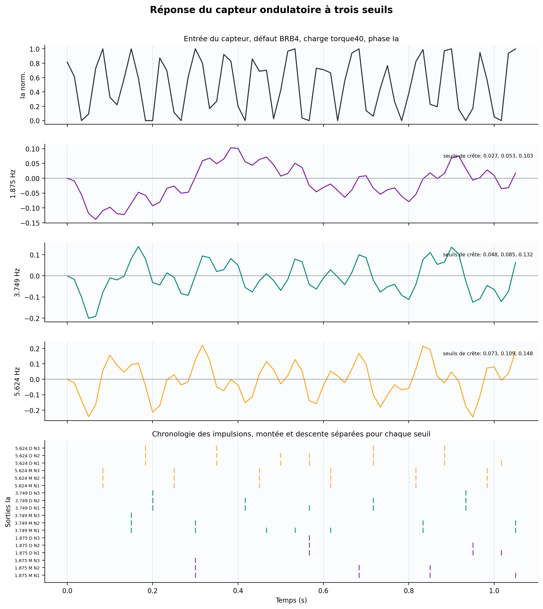
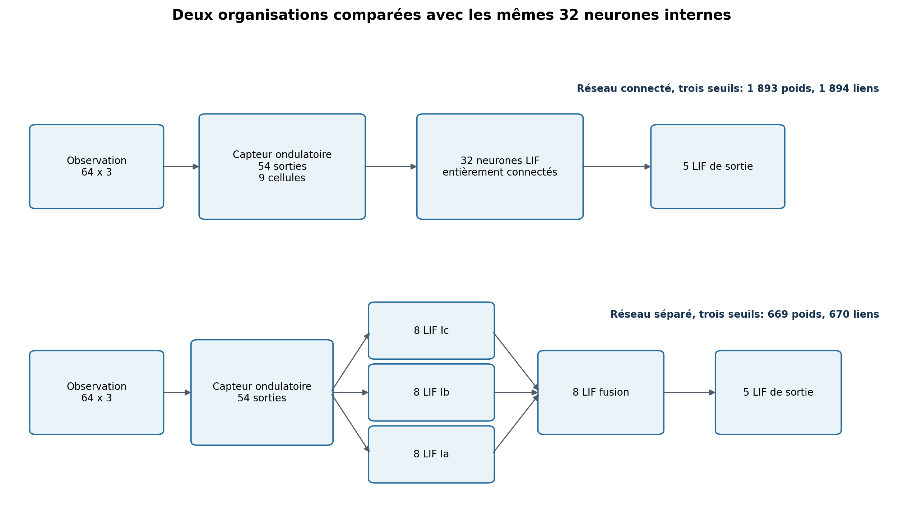
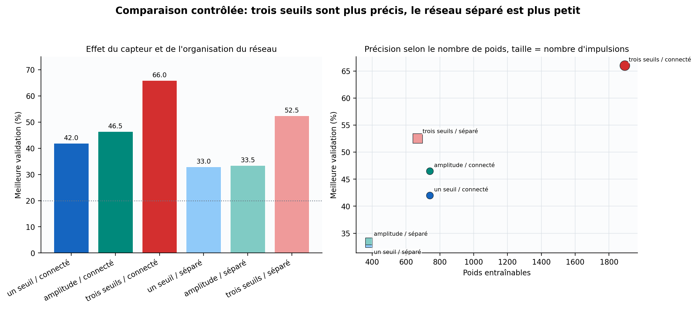
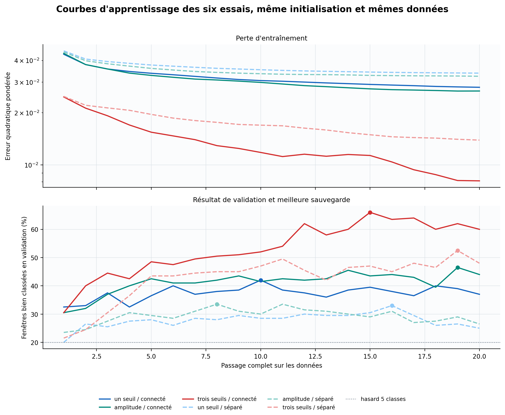
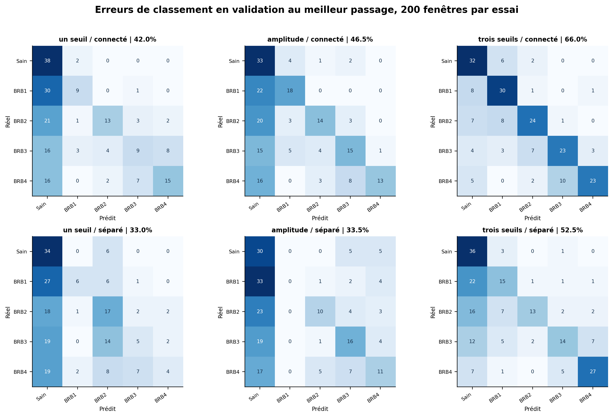
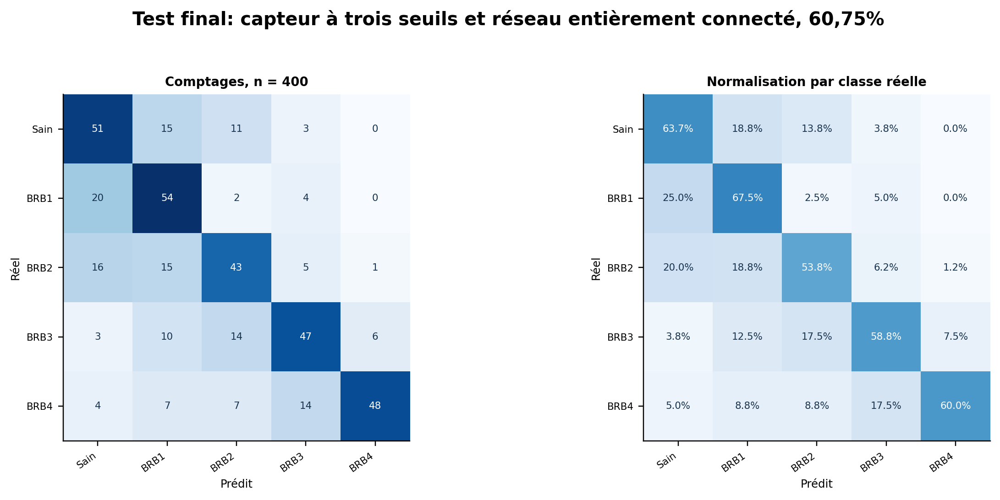

# Un petit réseau à impulsions peut-il reconnaître un défaut de rotor ?

Compte rendu de l'expérience du 27 août 2026.

## Réponse courte

Le meilleur réseau reconnaît correctement 243 fenêtres sur 400, soit 60,75 %. Il contient 37 neurones à impulsions et 1 893 poids entraînés.

Le résultat le plus important concerne le capteur placé devant le réseau. Avec un seul seuil de détection, le score de validation atteint 42,0 %. Avec trois seuils distincts, il atteint 66,0 %. Le réseau apprend donc mieux lorsque le capteur conserve plusieurs niveaux d'intensité.

Le réseau à impulsions reste moins précis que le réseau récurrent LSTM étudié auparavant, qui atteignait 88,0 %. Il est plus petit, mais il ne peut pas encore le remplacer pour un diagnostic à cinq états.

Aucune consommation d'énergie n'a été mesurée sur microcontrôleur. Le nombre d'impulsions décrit l'activité du réseau, pas une énergie en joules.

## 1. Question posée

Le défaut recherché est le nombre de barres cassées dans le rotor d'un moteur asynchrone. Cinq états sont distingués :

- moteur sain ;
- une barre cassée, notée BRB1 ;
- deux barres cassées, notées BRB2 ;
- trois barres cassées, notées BRB3 ;
- quatre barres cassées, notées BRB4.

Le courant ne va pas directement au réseau. Il traverse d'abord un capteur logiciel qui cherche des oscillations lentes dans son enveloppe. Ce capteur détermine donc quelle information sera disponible pour apprendre.

Trois questions ont été testées :

1. Faut-il un seul seuil de détection ou trois niveaux ?
2. Faut-il mélanger immédiatement les trois phases électriques, ou commencer par les traiter séparément ?
3. Le petit modèle continu utilisé pendant l'apprentissage peut-il être remplacé exactement par un vrai neurone à impulsions ?

## 2. Données et séparation des lots

Les enregistrements viennent du jeu Broken Rotor Bar de l'Universidade Federal de Uberlândia. Chaque acquisition contient les trois courants Ia, Ib et Ic. Le moteur est observé sous huit charges, avec plusieurs répétitions.

| Lot           | Fenêtres | Utilisation                                    |
| ------------- | -------: | ---------------------------------------------- |
| Apprentissage |    1 400 | Régler les poids, les fréquences et les seuils |
| Validation    |      200 | Choisir le meilleur des six essais             |
| Test final    |      400 | Mesurer une seule fois le réseau retenu        |

Une même acquisition produit plusieurs fenêtres qui se chevauchent. Toutes les fenêtres issues d'une même acquisition restent dans le même lot. Sans cette précaution, le réseau pourrait retrouver pendant le test un signal presque identique à un signal déjà vu pendant l'apprentissage.

Les 400 fenêtres du test final n'ont servi ni à choisir les fréquences, ni à régler les seuils, ni à choisir le réseau.

## 3. Préparation du courant

Une barre cassée modifie légèrement l'amplitude du courant. Cette variation est lente, de l'ordre de quelques hertz. Le courant secteur oscille à 60 Hz. Le prétraitement retire cette oscillation rapide et conserve son enveloppe.

### 3.1 Enveloppe du courant

Pour chaque phase \(c\), la valeur efficace est calculée sur 463 mesures successives :

\[
r*c[n] = \sqrt{\frac{1}{463}\sum*{k=0}^{462} i_c[n+k]^2}.
\]

L'enveloppe est ensuite gardée tous les 927 points. Le signal obtenu contient 59,990291 mesures par seconde. Les six premières secondes sont retirées, car elles contiennent le démarrage du moteur.

### 3.2 Fenêtres soumises au réseau

Chaque exemple contient 64 mesures par phase, soit 1,067 seconde. Deux fenêtres consécutives se recouvrent de moitié.

La moyenne de chaque fenêtre est retirée. La variation restante est multipliée par 6, puis limitée entre 0 et 1 :

\[
x_c[t] = \operatorname{limite}\left(0{,}5 + 6(e_c[t]-\bar e_c), 0, 1\right).
\]

Ce centrage retire surtout l'effet de la charge moyenne du moteur. La petite modulation liée au défaut devient plus visible.

## 4. Capteur ondulatoire

Le capteur comporte neuf cellules : trois fréquences pour chacune des trois phases. Chaque cellule est un filtre qui réagit surtout autour de sa fréquence.

Les fréquences ont été choisies uniquement sur les 1 400 fenêtres d'apprentissage. Pour une fréquence \(k\), on mesure d'abord son amplitude dans chaque fenêtre :

\[
M(s,c,k)=\frac{2}{N}\sqrt{\left(\sum*t x*{s,c,t}\cos\frac{2\pi kt}{N}\right)^2+\left(\sum*t x*{s,c,t}\sin\frac{2\pi kt}{N}\right)^2}.
\]

Le pouvoir de séparation compare l'écart entre les cinq états à la dispersion observée dans un même état :

\[
F(k)=\frac{\text{dispersion entre les états}}{\text{dispersion dans chaque état}+10^{-12}}.
\]

| Fréquence retenue | Pouvoir de séparation |
| ----------------: | --------------------: |
|          1,875 Hz |                0,2018 |
|          3,749 Hz |                0,1645 |
|          5,624 Hz |                0,0343 |

Pour la phase Ia, les trois seuils mesurés sont :

| Fréquence | Seuil bas | Seuil moyen | Seuil haut |
| --------: | --------: | ----------: | ---------: |
|  1,875 Hz |   0,02684 |     0,05275 |    0,10271 |
|  3,749 Hz |   0,04779 |     0,08495 |    0,13223 |
|  5,624 Hz |   0,07339 |     0,10868 |    0,14797 |

Les seuils sont calculés séparément pour chaque phase et chaque fréquence.

### 4.1 Mémoire de chaque cellule

Chaque cellule est un filtre passe-bande du second ordre. Avec une fréquence centrale \(f_c\), une largeur de bande \(B\) et une fréquence d'échantillonnage \(F_s\) :

\[
\omega=2\pi f_c/F_s,\quad Q=f_c/B,\quad \alpha=\sin(\omega)/(2Q).
\]

Les coefficients du filtre sont :

\[
b_0=\alpha/a_0,\ b_1=0,\ b_2=-\alpha/a_0,
\]

\[
a_1=-2\cos(\omega)/a_0,\quad a_2=(1-\alpha)/a_0,\quad a_0=1+\alpha.
\]

La sortie évolue selon :

\[
y[n]=b_0x[n]+b_1x[n-1]+b_2x[n-2]-a_1y[n-1]-a_2y[n-2].
\]

La mémoire caractéristique des cellules vaut environ \(1/(\pi B)\). Elle va ici de 113,2 à 339,6 ms.

### 4.2 Trois façons d'émettre une impulsion

Chaque cellule suit une demi-onde, mesure sa valeur de crête, puis décide si elle doit émettre.

| Nom lisible  | Nom dans le code   | Règle                                                   | Sorties du capteur |
| ------------ | ------------------ | ------------------------------------------------------- | -----------------: |
| Un seuil     | `phase-binary`     | Une impulsion de valeur 1 au-dessus du seuil            |                 18 |
| Amplitude    | `phase-amplitude`  | Une impulsion dont la force suit la hauteur de la crête |                 18 |
| Trois seuils | `phase-multilevel` | Une sortie distincte pour chaque niveau franchi         |                 54 |

Les règles exactes sont :

\[
\text{un seuil : } s=1\text{ si }p\ge q\_{0,85},\text{ sinon }0,
\]

\[
\text{amplitude : } s=p/q*{0,85}\text{ si }p\ge q*{0,85},\text{ sinon }0,
\]

\[
\text{trois seuils : }s_l=1\text{ si }p\ge q_l,\quad l\in\{0,55;0,75;0,90\}.
\]

## 5. Deux organisations du réseau

Les deux réseaux possèdent 32 neurones internes et cinq neurones de sortie. Ils ne diffèrent que par leurs connexions.

Dans le réseau entièrement connecté, les 54 sorties du capteur à trois seuils alimentent les 32 neurones internes. Ces 32 neurones alimentent ensuite les cinq sorties :

\[
54\times32 + 32\times5 + 5 = 1\,893\text{ poids}.
\]

Dans le réseau séparé par phase, huit neurones reçoivent Ia, huit reçoivent Ib et huit reçoivent Ic. Leurs résultats convergent vers huit autres neurones, puis vers les cinq sorties :

\[
(18\times8)\times3 + 24\times8 + 8\times5 + 5 = 669\text{ poids}.
\]

## 6. Apprentissage puis remplacement par de vrais neurones

Un vrai neurone à impulsions répond par 0 ou 1. Cette coupure nette empêche de calculer directement comment corriger ses poids.

Pendant l'apprentissage, chaque futur neurone LIF, c'est-à-dire un neurone à fuite et seuil, est représenté par un petit modèle continu en trois étapes : accumulation, seuil progressif et remise à zéro.

Entre deux événements, le potentiel \(u\) revient progressivement vers zéro :

\[
u(t)=u(t_0)e^{-(t-t_0)/\tau}+\sum_j w_jx_j(t).
\]

Les 32 neurones internes utilisent quatre mémoires : 66,7, 133,4, 266,7 et 533,4 ms. Le seuil vaut 0,8. Après une impulsion, le potentiel revient à zéro.

Pendant l'apprentissage, le seuil net est remplacé par la fonction continue :

\[
p=\frac{1}{1+e^{-5(u-0,8)}}.
\]

Sa dérivée est :

\[
\frac{dp}{du}=5p(1-p).
\]

L'erreur quadratique pour une sortie \(y\) et une cible \(c\) est :

\[
L=\frac{1}{2}(y-c)^2.
\]

Les poids sont corrigés avec l'algorithme Adam. Les paramètres sont fixes pour les six essais : 20 passages complets, groupes de 16 fenêtres, pas de 0,01, gradients limités à 1 et même initialisation aléatoire.

Après chaque passage, le petit modèle continu est remplacé par un vrai neurone LIF. Ses connexions extérieures et leurs poids sont conservés. Le réseau final contient exactement 37 neurones LIF, 32 neurones internes et cinq sorties. Le petit modèle continu n'est donc pas conservé pendant l'utilisation du réseau.

La meilleure sauvegarde est celle qui classe le plus de fenêtres de validation. En cas d'égalité, la plus faible erreur d'apprentissage départage les deux passages.

## 7. Résultats des six essais

| Capteur      | Réseau               | Poids | Meilleur passage | Validation |
| ------------ | -------------------- | ----: | ---------------: | ---------: |
| Un seuil     | Entièrement connecté |   741 |               10 |     42,0 % |
| Amplitude    | Entièrement connecté |   741 |               19 |     46,5 % |
| Trois seuils | Entièrement connecté | 1 893 |               15 |     66,0 % |
| Un seuil     | Séparé par phase     |   381 |               16 |     33,0 % |
| Amplitude    | Séparé par phase     |   381 |               11 |     33,5 % |
| Trois seuils | Séparé par phase     |   669 |               19 |     52,5 % |

Le passage d'un seuil à trois seuils apporte 24 points dans le réseau entièrement connecté. En revanche, séparer les phases réduit le nombre de poids de 1 893 à 669, mais fait perdre 13,5 points. Dans cette première version, la réunion des trois phases est trop étroite.

L'erreur utilisée pour corriger les poids continue de baisser après le passage 15, alors que le nombre de bonnes réponses diminue. La fonction continue d'apprentissage n'est donc pas parfaitement alignée avec la décision finale à 0 ou 1.

## 8. Test final

Après les six essais, la sauvegarde du passage 15 est restaurée. Le test final est alors lu une seule fois.

Le réseau obtient 243 bonnes réponses sur 400, soit 60,75 %. La marge d'incertitude statistique à 95 %, calculée avec l'intervalle de Wilson, va de 55,9 % à 65,4 %.

| État réel | Fenêtres | Bonnes réponses | Taux reconnu |
| --------- | -------: | --------------: | -----------: |
| Sain      |       80 |              51 |       63,7 % |
| BRB1      |       80 |              54 |       67,5 % |
| BRB2      |       80 |              43 |       53,8 % |
| BRB3      |       80 |              47 |       58,8 % |
| BRB4      |       80 |              48 |       60,0 % |

BRB2 est l'état le moins bien reconnu. Seize fenêtres BRB2 sont classées moteur sain et quinze sont classées BRB1.

## 9. Taille, temps et activité

| Méthode                          |      Poids | Mémoire des poids en nombres flottants de 32 bits |   Score |
| -------------------------------- | ---------: | ------------------------------------------------: | ------: |
| Réseau à impulsions              |      1 893 |                                          7,40 Kio | 60,75 % |
| Réseau récurrent LSTM, 32 unités |      4 773 |                                         18,64 Kio |  88,0 % |
| Petit réseau sur spectre FFT     |        773 |                                          3,02 Kio |  67,0 % |
| Classifieur SVM sur spectre FFT  | sans objet |                                     non rapportée |  81,5 % |

FFT désigne la décomposition du signal en fréquences. SVM désigne une machine à vecteurs de support utilisée comme classifieur.

Sur le navigateur utilisé pour ce test, une fenêtre demande 34,37 ms. Le capteur produit en moyenne 126,05 impulsions par fenêtre. Les 37 neurones en produisent ensemble 17,09.

Ces temps ne permettent pas de comparer directement le réseau à impulsions au LSTM, car les deux chemins de calcul sont différents. Une mesure sur le même microcontrôleur reste nécessaire.

## 10. Limites

Une seule initialisation aléatoire a été utilisée. Nous ne savons donc pas encore quelle part de l'écart entre deux essais vient réellement du capteur et quelle part vient de l'initialisation des poids.

Les six choix ont été comparés sur le même lot de validation. Le test final réduit ce biais de sélection, mais il ne remplace pas plusieurs répétitions complètes.

Toutes les données proviennent d'un seul banc moteur. Un autre moteur, une alimentation à 50 Hz ou une vitesse variable demanderont une nouvelle vérification du capteur.

Aucune consommation d'énergie ni aucune latence sur microcontrôleur n'a été mesurée.

## 11. Prochaine expérience

La prochaine étape est de répéter les six essais avec dix initialisations différentes. Si l'avantage des trois seuils se confirme, il faudra élargir progressivement la partie qui réunit les phases, sans consulter le jeu de test. La quantification du modèle et la mesure sur microcontrôleur viendront ensuite.

## 12. Reproduction

Ouvrir `packages/host/www/samples/motor_current/index.html`, charger les acquisitions groupées, choisir le modèle SNN, fixer 32 neurones internes, 20 passages d'apprentissage et un pas de 0,01.

Exécuter les six couples capteur-réseau du tableau de la section 7. Réinitialiser la sauvegarde avant le premier lancement de chaque architecture. Restaurer ensuite le meilleur réseau et lancer une seule fois le test final.

Valeurs à retrouver :

- partition 1 400/200, puis test final de 400 fenêtres ;
- empreinte des données `dcb578a0` ;
- architecture gagnante `cb96077f` ;
- meilleure validation au passage 15, avec 132/200 ;
- test final 243/400 ;
- empreinte SHA-256 de la sauvegarde `5dcf0665c00662ec174a780de319815fa9826a837c79faa24b745c06076eba8a`.

Les résultats bruts sont dans `data/experiment-results.json`. Les poids retenus sont dans `data/winner-checkpoint.json`.

## Conclusion

L'expérience valide toute la chaîne, depuis le courant mesuré jusqu'au réseau LIF final. Elle montre surtout que le capteur doit conserver plusieurs niveaux d'intensité. Le résultat de 60,75 % est prometteur pour 1 893 poids, mais reste trop faible pour remplacer le LSTM actuel. La prochaine décision dépendra des répétitions avec plusieurs initialisations.

## Études de suivi

Les expériences menées après cette première campagne sont documentées séparément afin de ne pas modifier rétroactivement son protocole ni ses conclusions :

- [champs récepteurs appris sur les spikes](spike-aligned-receptive-fields-method.md) ;
- [récurrence LIF et diagnostic de l'ancienne conversion soft vers hard](recurrent-lif-conversion-profile.md) ;
- [forward LIF binaire et gradient surrogate au backward](hard-forward-surrogate-backward-method.md) ;
- [loss alignée sur le décodeur LIF du runtime](runtime-decoder-loss-experiment.md).
