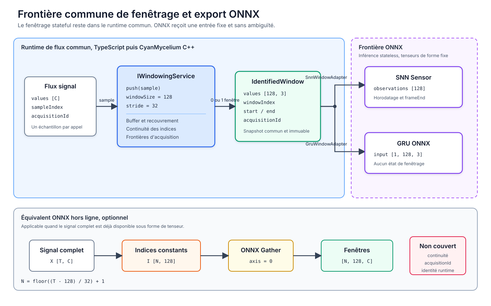

# Fenêtrage commun SNN/GRU et frontière ONNX

## Résumé

Le fenêtrage temporel ne doit pas être dupliqué dans les branches SNN et GRU. Il constitue une fonction d'acquisition commune, déterminée par le phénomène physique observé. La solution retenue place donc `IWindowingService` avant les modèles. Le service reçoit le flux échantillonné, contrôle sa continuité, construit des fenêtres glissantes identifiées et transmet exactement les mêmes valeurs aux deux architectures.

ONNX ne possède pas d'opérateur standard équivalent à un service de fenêtrage stateful. Un modèle ONNX d'inférence est une fonction sans état persistant. Pour le streaming et le futur port MCU, le buffer doit rester dans le runtime TypeScript ou C++. ONNX reçoit uniquement une fenêtre complète de forme fixe. Pour un traitement hors ligne, lorsque le signal complet est déjà disponible, un sous-graphe `Gather` peut produire le tenseur des fenêtres.

## 1. Objectif architectural

Le flux visé est le suivant:

```text
RawSignalSample
    -> IWindowingService
    -> IdentifiedSignalWindow
        -> SnnWindowAdapter -> SNN Sensor
        -> GruWindowAdapter -> GRU
```

Cette frontière garantit que la comparaison SNN/GRU utilise:

- les mêmes acquisitions;
- les mêmes indices de départ et de fin;
- le même horizon de 128 pas;
- le même stride de 32 pas;
- les mêmes valeurs d'entrée;
- la même politique face aux échantillons manquants.

Le stride de 32 pas correspond à une cadence de décision d'environ 0,267 s pour le flux actuel à 119,904077 Hz. Il reste un paramètre physique du système, pas un artifice destiné à augmenter le nombre d'exemples.

## 2. Contrat commun TypeScript et C++

Le contrat TypeScript public est `IWindowingService`. La classe concrète n'est pas instanciable directement. La factory `WindowingService.create(config)` retourne uniquement l'interface portable.

```typescript
export interface IWindowingService {
    readonly config: Readonly<IResolvedWindowingServiceConfig>;
    readonly state: IWindowingServiceState;

    push(sample: IRawSignalSample): IIdentifiedSignalWindow | null;
    reset(): void;
}
```

La correspondance C++ naturelle est:

```cpp
class IWindowingService {
public:
    virtual std::optional<IdentifiedSignalWindow>
    push(const RawSignalSample& sample) = 0;

    virtual void reset() = 0;
    virtual ~IWindowingService() = default;
};
```

Une invocation de `push` produit zéro ou une fenêtre. Cette propriété permet une implémentation à mémoire bornée avec un buffer circulaire sur MCU.

### Identité et traçabilité

Chaque fenêtre transporte une identité déterministe:

```text
acquisitionId
windowIndex
startSampleIndex
endSampleIndex
```

L'identité ne représente pas la classe prédite. Elle représente la provenance temporelle de la décision. Elle permet de rapprocher sans ambiguïté les sorties du SNN et du GRU, puis de calculer leurs désaccords fenêtre par fenêtre.

### Frontières d'acquisition

Un changement de `acquisitionId` vide le buffer. Une fenêtre ne peut donc jamais contenir la fin d'une acquisition et le début d'une autre. En cas de trou dans les indices, le service peut soit réinitialiser la fenêtre incomplète, soit rejeter le flux selon la configuration.

## 3. Architecture recommandée



La zone bleue contient la logique de flux commune. Elle sera implémentée en TypeScript pour les expériences, puis en C++ dans CyanMycelium. La zone violette contient uniquement l'inférence du modèle.

Le service ne réalise pas de classification et n'ajoute aucun feature engineering propre à un réseau. Les deux adaptateurs transforment la même fenêtre:

- `SnnWindowAdapter` produit des observations horodatées et signale la fin de fenêtre;
- `GruWindowAdapter` produit une séquence de vecteurs de features;
- les deux sorties conservent la même identité de fenêtre.

## 4. Pourquoi il n'existe pas d'équivalent ONNX direct

La spécification ONNX définit un modèle d'inférence comme une fonction stateless. Le runtime ne conserve donc pas implicitement un buffer entre deux appels. Un opérateur standard `WindowingService` devrait au contraire mémoriser les échantillons précédents, compter le stride, détecter les discontinuités et réagir aux changements d'acquisition.

La liste officielle des opérateurs ONNX ne contient pas d'opérateur `Windowing` ou `SlidingWindow`. Les opérateurs disponibles permettent de reconstruire une partie du comportement, mais pas le contrat complet en une opération standard.

### Fenêtrage hors ligne avec Gather

Pour un signal complet `X` de forme `[T, C]`, une matrice d'indices `I` de forme `[N, W]` peut sélectionner toutes les fenêtres:

```text
I[n, w] = n * S + w
N = floor((T - W) / S) + 1
```

Avec `W = 128` et `S = 32`:

```text
I[0] =   0 .. 127
I[1] =  32 .. 159
I[2] =  64 .. 191
```

L'opérateur ONNX `Gather(X, I, axis=0)` produit alors un tenseur `[N, 128, C]`. Cette solution est exacte pour le calcul des valeurs et du recouvrement. Elle ne gère toutefois ni `acquisitionId`, ni les trous d'échantillonnage, ni l'identité runtime des fenêtres.

### Simulation d'un service stateful dans ONNX

Une version ONNX appelée pour chaque échantillon devrait exposer explicitement son état:

| Direction | Tenseur                    | Rôle                                      |
| --------- | -------------------------- | ----------------------------------------- |
| Entrée    | `sample [C]`               | Nouvel échantillon                        |
| Entrée    | `previous_buffer [W-1, C]` | Historique réinjecté par l'hôte           |
| Entrée    | `counter`                  | Position dans le stride                   |
| Entrée    | `reset`                    | Changement d'acquisition ou discontinuité |
| Sortie    | `next_buffer [W-1, C]`     | État à conserver par l'hôte               |
| Sortie    | `window [W, C]`            | Fenêtre candidate                         |
| Sortie    | `window_valid`             | Autorisation de lancer l'inférence        |
| Sortie    | `next_counter`             | Compteur mis à jour                       |

Ce graphe demanderait notamment `Concat`, `Slice`, `Where` ou `If`. `Scan` pourrait porter un état lors du parcours d'un tenseur complet, mais il ne rend pas un modèle d'inférence persistant entre plusieurs invocations. L'hôte resterait responsable de la conservation de l'état.

Cette construction augmente le nombre d'opérateurs requis et rend le déploiement plus dépendant du niveau de support ONNX du runtime MCU. Elle n'apporte aucun avantage numérique au GRU ou au SNN.

## 5. Frontière de déploiement retenue

La frontière recommandée est:

```text
MCU acquisition
    -> CyanMycelium IWindowingService C++
    -> IdentifiedSignalWindow [128, 3]
    -> modèle d'inférence
```

Pour le GRU ONNX, la fenêtre devient directement un tenseur d'entrée `[1, 128, 3]`. Pour le SNN, la fenêtre est convertie en observations horodatées ou en événements selon le backend retenu.

Les responsabilités sont ainsi séparées:

| Composant           | Responsabilités                                                 |
| ------------------- | --------------------------------------------------------------- |
| `IWindowingService` | buffer, stride, continuité, frontières d'acquisition, identité  |
| Adaptateur SNN      | timestamps, fin de fenêtre, format d'observation ou d'événement |
| Adaptateur GRU      | disposition du tenseur `[batch, time, channels]`                |
| Modèle ONNX         | inférence numérique uniquement                                  |

## 6. Conséquences pour la comparaison SNN/GRU

La comparaison devra enregistrer l'identité de chaque fenêtre avec les deux prédictions:

```text
window identity
true label
SNN prediction
GRU prediction
SNN latency
GRU latency
SNN activity
GRU operation count
```

Cette structure permet de mesurer l'accuracy et le macro F1 sur le même test groupé, mais aussi d'étudier les fenêtres sur lesquelles les modèles divergent. Les groupes d'apprentissage, de validation et de test doivent être figés avant le passage dans `IWindowingService`.

## 7. Critères de validation du port CyanMycelium

L'implémentation C++ devra être validée par équivalence avec TypeScript:

1. mêmes indices de début et de fin pour une suite d'échantillons donnée;
2. mêmes fenêtres pour `windowSize = 128` et `stride = 32`;
3. aucune fenêtre traversant une frontière d'acquisition;
4. même réaction aux échantillons manquants;
5. mêmes valeurs et même ordre des trois canaux;
6. mémoire interne bornée;
7. aucun état de fenêtrage caché dans le modèle ONNX.

Des vecteurs de test communs pourront être sérialisés afin d'exécuter exactement les mêmes cas dans Jest et dans la suite de tests C++.

## 8. Décision

Le fenêtrage streaming ne sera pas intégré au modèle ONNX. Il restera derrière `IWindowingService`, avec une implémentation TypeScript et une implémentation C++ conformes au même contrat. ONNX commencera à la frontière de la fenêtre complète.

Un sous-graphe `Gather` pourra être proposé séparément pour les traitements ONNX hors ligne, lorsque l'entrée est un signal complet et que la traçabilité par acquisition est déjà assurée en amont.

## Références

- ONNX, [IR Specification, Model Semantics](https://onnx.ai/onnx/repo-docs/IR.html)
- ONNX, [Operator list](https://onnx.ai/onnx/operators/)
- ONNX, [Gather](https://onnx.ai/onnx/operators/onnx__Gather.html)
- ONNX, [Slice](https://onnx.ai/onnx/operators/onnx__Slice.html)
- ONNX, [Scan](https://onnx.ai/onnx/operators/onnx__Scan.html)
- ONNX, [If](https://onnx.ai/onnx/operators/onnx__If.html)

## Fichiers d'implémentation associés

- [`windowing.interfaces.ts`](../../../packages/dev/core/src/dsp/windowing.interfaces.ts)
- [`windowing.service.ts`](../../../packages/dev/core/src/dsp/windowing.service.ts)
- [`windowing.adapters.ts`](../../../packages/dev/core/src/neuralnetwork/windowing.adapters.ts)
- [`windowing-service.test.ts`](../../../packages/tests/dsp/windowing-service.test.ts)
