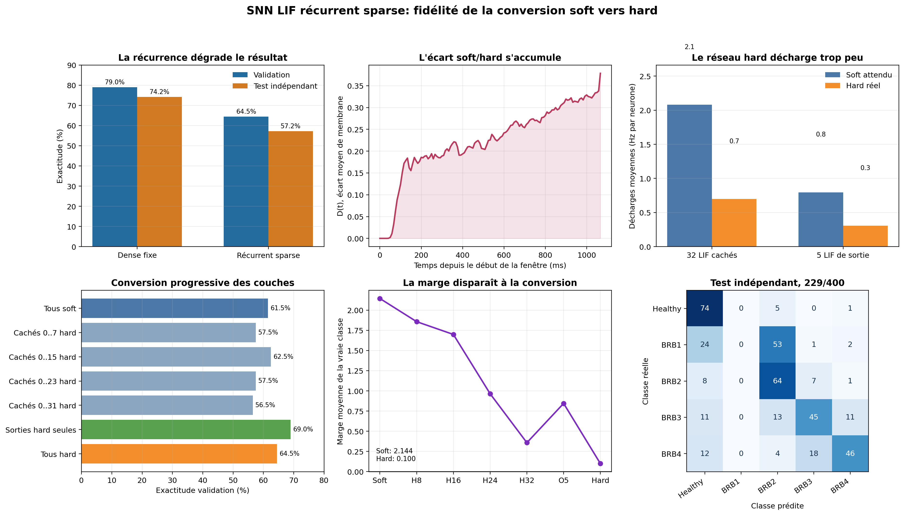
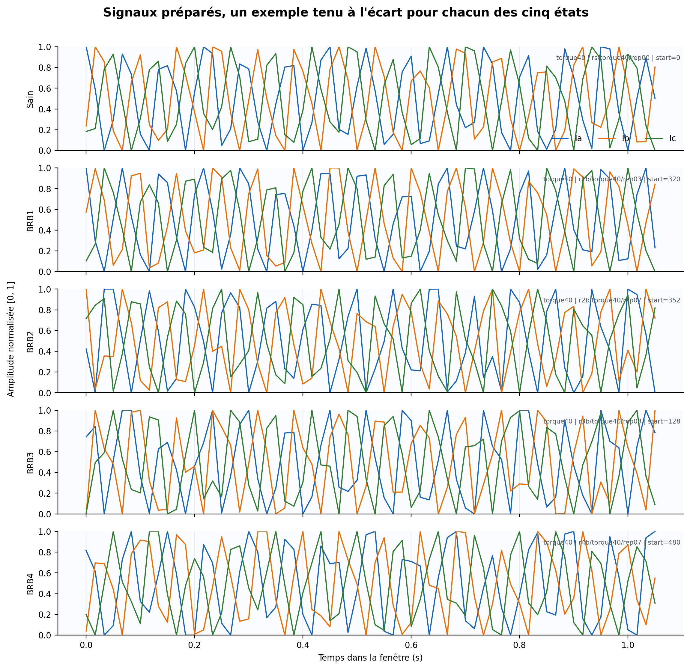

# Récurrence LIF et fidélité de la conversion soft vers hard

Compte rendu expérimental du 27 août 2026.

> **Statut historique.** Cette étude décrit l'architecture v4, désormais obsolète. Elle a mis en évidence que le forward d'entraînement transmettait une activité fractionnaire impossible à reproduire par le runtime LIF. Ce défaut est corrigé dans l'architecture v5 : le forward y est strictement binaire et le surrogate n'intervient qu'au backward. Voir [forward LIF binaire et gradient surrogate au backward](hard-forward-surrogate-backward-method.md). Les résultats relatifs à la topologie récurrente restent la trace de l'expérience menée avec v4, mais ne décrivent pas le comportement actuel.

## Résumé simple

Cette expérience répond à deux questions distinctes.

La première était de savoir si 128 connexions récurrentes entre les 32 LIF cachés permettraient de reconnaître des motifs temporels que le capteur fréquentiel seul ne peut pas mémoriser. La réponse est négative pour cette première topologie. Le meilleur checkpoint atteint 64,5 % sur la validation et 57,25 % sur les 400 fenêtres de test indépendant. La référence sans récurrence atteignait respectivement 79,0 % et 74,25 %.

La seconde question était de comprendre ce qui se passe lorsque le réseau continu utilisé pour l'apprentissage est remplacé par le vrai réseau à impulsions. Le nouveau profileur montre un écart dynamique réel. Sur les LIF cachés, le modèle soft produit l'équivalent de 70,93 impulsions par fenêtre, contre 23,80 impulsions réelles en mode hard. L'écart moyen entre les potentiels de membrane passe de 0 au début de la fenêtre à 0,379 à la fin. La marge moyenne de classification passe de 2,144 en soft à 0,100 en hard.

Le problème principal n'est pas un décalage temporel des impulsions qui existent dans les deux modèles. Leur décalage moyen reste inférieur à 1,2 ms. Le problème est que le modèle soft produit beaucoup d'activité fractionnaire qui n'existe plus après la conversion hard. Cette activité modifie les remises à zéro, les entrées récurrentes et finalement toute la trajectoire du réseau.



## 1. Question expérimentale

Le SNN dense précédent reçoit des événements produits par neuf cellules fréquentielles. Chaque LIF possède une mémoire de membrane, mais il n'existe pas de chemin permettant à un neurone caché de réinjecter son activité dans la couche cachée au pas suivant.

L'hypothèse testée était la suivante : une petite boucle récurrente, entièrement exprimable avec les synapses et les LIF du runtime, pourrait conserver des motifs temporels plus riches sans introduire de GRU ou de LSTM dans le microcontrôleur.

Une seconde hypothèse devait être vérifiée avant d'interpréter le résultat : le réseau soft entraîné et le réseau hard compilé suivent-ils réellement la même dynamique ? Une comparaison de leurs seules exactitudes finales ne permet pas de répondre. Il faut comparer leurs états internes sous les mêmes conditions.

## 2. Données et protocole fixe

Le jeu de données et son découpage sont identiques à ceux de la référence dense.

| Lot | Fenêtres | Utilisation |
| --- | ---: | --- |
| Apprentissage | 1 400 | Mise à jour des poids |
| Validation | 200 | Sélection du checkpoint et profilage soft/hard |
| Test indépendant | 400 | Mesure finale |

Les fenêtres provenant d'une même acquisition restent dans le même lot. Le fingerprint du jeu chargé est `ec00f5c3` et le protocole est `grouped-acquisition-v2-120hz`.

Chaque fenêtre contient 128 échantillons des trois enveloppes de courant Ia, Ib et Ic. La fréquence d'échantillonnage est 120,110 Hz, ce qui donne une durée de 1,066 s.

Le capteur ne change pas pendant cette expérience :

```text
3 phases de courant
3 bandes par phase
3 niveaux d'intensité
2 polarités de passage par zéro
9 cellules physiques simulées
54 ports d'événements
```

Les signaux d'entrée utilisés dans cette série sont visibles dans la figure générale de la campagne :



## 3. Topologie récurrente testée

Le graphe suit ce chemin :

```text
observation à 3 phases
        |
        v
capteur ondulatoire, 54 ports
        |
        v
32 LIF cachés densément connectés au capteur
        |  ^
        |  | 128 synapses récurrentes, délai 1 pas
        v  |
5 LIF de classe
```

Chaque LIF caché reçoit quatre connexions récurrentes. Pour un neurone cible d'indice `i`, les sources sont choisies de manière déterministe sur un anneau, aux décalages 1, 9, 17 et 25 pour une couche de 32 neurones. Il n'y a pas d'auto-connexion directe.

Le délai est exactement un pas du signal brut, soit :

\[
\Delta t = \frac{1}{120{,}110} \simeq 8{,}326\ \text{ms}.
\]

Les 32 LIF sont répartis en quatre groupes de huit. Leurs constantes de temps sont :

| Indices | Constante de temps | Rôle attendu |
| --- | ---: | --- |
| 0 à 7 | 33,3 ms | Variation rapide |
| 8 à 15 | 66,6 ms | Mémoire courte |
| 16 à 23 | 133,2 ms | Mémoire intermédiaire |
| 24 à 31 | 266,4 ms | Mémoire longue |

Le graphe d'apprentissage contient 113 nœuds, 2 133 liens et 2 021 poids entraînables. Après compilation, les mini-sous-graphes sont remplacés un pour un par des LIF natifs. Le graphe runtime contient alors 39 nœuds, 2 022 liens et 37 LIF natifs. Les 128 synapses récurrentes sont conservées.

## 4. Dynamique mathématique du LIF

Le calcul est événementiel. Si aucun événement n'arrive sur un neurone, son état n'est pas recalculé. Lorsqu'un événement arrive à l'instant \(t\), la fuite est d'abord appliquée :

\[
\lambda_i(t)=\exp\left(-\frac{t-t_{i,\mathrm{préc}}}{\tau_i}\right),
\]

\[
\tilde V_i(t)=V_{\mathrm{repos}}+
\left(V_i(t^-)-V_{\mathrm{repos}}\right)\lambda_i(t)+I_i(t).
\]

L'entrée totale d'un LIF caché est :

\[
I_i(t)=\sum_j W_{ij}x_j(t)+\sum_k R_{ik}q_k(t-\Delta t).
\]

Dans cette expression :

- \(x_j(t)\) est l'amplitude d'un événement du capteur ;
- \(W_{ij}\) est un poids capteur vers LIF ;
- \(R_{ik}\) est un poids récurrent ;
- \(q_k\) est la sortie soft ou hard du LIF source ;
- le second terme lit obligatoirement le pas précédent.

### 4.1 Neurone soft utilisé pendant l'apprentissage

Le seuil dur est remplacé dans le calcul avant par une sigmoïde :

\[
p_i(t)=\sigma\left(\beta_i(\tilde V_i(t)-\theta_i)\right)
=\frac{1}{1+\exp[-\beta_i(\tilde V_i(t)-\theta_i)]}.
\]

Ici, \(\beta_i=5\) et \(\theta_i=0{,}8\). La remise à zéro est également continue :

\[
V_i^{soft}(t)=(1-p_i(t))\tilde V_i(t)+p_i(t)V_{reset}.
\]

Une sortie \(p=0{,}2\) compte donc comme 0,2 impulsion. Elle est aussi transmise par une synapse récurrente comme une impulsion d'amplitude 0,2.

### 4.2 Neurone hard exécuté par le runtime

Le LIF natif prend une décision binaire :

\[
s_i(t)=
\begin{cases}
1 & \text{si }\tilde V_i(t)\geq\theta_i,\\
0 & \text{sinon.}
\end{cases}
\]

Son état devient :

\[
V_i^{hard}(t)=
\begin{cases}
V_{reset} & \text{si }s_i(t)=1,\\
\tilde V_i(t) & \text{sinon.}
\end{cases}
\]

Une synapse récurrente hard ne transmet quelque chose que si \(s_i(t)=1\). Cette différence est centrale : une petite activité soft peut circuler dans les boucles récurrentes, tandis qu'elle disparaît complètement dans le runtime hard.

## 5. Apprentissage

La loss est une erreur quadratique pondérée :

\[
L=\frac{1}{\sum_{t,c}w_{t,c}}
\sum_{t,c}w_{t,c}\frac{1}{2}\left(p_c(t)-y_c(t)\right)^2.
\]

La cible vaut zéro pour les cinq sorties pendant la fenêtre. Ces pas intermédiaires ont un poids de 0,05. Au signal de fin de fenêtre, la cible est un vecteur one-hot de poids 1.

Les poids sont mis à jour par Adam, avec un learning rate de 0,003, des mini-lots de 16 fenêtres et un clipping du gradient à 1. La rétropropagation traverse le temps et les synapses retardées. Pour un poids récurrent, le terme élémentaire a la forme :

\[
\frac{\partial L}{\partial R_{ik}}
=\sum_t \delta_i(t)q_k(t-\Delta t).
\]

Les pas sans événement du capteur sont conservés dans la séquence d'apprentissage. Sans eux, un délai d'un pas signifierait un délai d'un événement, variable selon le signal, au lieu de 8,326 ms.

## 6. Sélection et score runtime

Le checkpoint est choisi sur la décision hard de validation, pas sur la loss soft. Le score de chaque classe est :

\[
S_c=2N_c+\frac{V_c(T)}{\theta_c},
\]

où \(N_c\) est le nombre total d'impulsions du LIF de classe et \(V_c(T)\) son potentiel final. La classe prédite est celle dont le score est maximal.

Le meilleur score de validation, 64,5 %, est atteint une première fois à l'epoch 18. L'epoch 20 est conservée car elle obtient les mêmes 129 bonnes réponses avec une loss plus faible. L'apprentissage n'améliore plus ensuite la validation et est arrêté après une longue absence de progrès.

## 7. Profileur apparié soft/hard

Le profileur rejoue chacune des 200 fenêtres de validation dans deux réseaux :

```text
mêmes événements du capteur
mêmes poids
mêmes potentiels initiaux

relecture soft  -> trace soft complète
relecture hard  -> trace hard complète
```

Le capteur est déjà hard dans les deux relectures. Le profileur mesure donc uniquement la conversion des 32 LIF cachés et des 5 LIF de sortie.

### 7.1 Écart instantané de sortie

Pour chaque neurone et chaque pas :

\[
d_y(t,i)=|p_i(t)-s_i(t)|.
\]

La valeur publiée est la moyenne sur les fenêtres, les pas et les neurones.

### 7.2 Écart de potentiel de membrane

\[
d_V(t,i)=|V_i^{soft}(t)-V_i^{hard}(t)|.
\]

Le rapport donne sa moyenne absolue et la corrélation de Pearson entre tous les potentiels soft et hard de la couche.

La divergence temporelle combine les 37 LIF :

\[
D(t)=\frac{1}{200\times37}
\sum_{s=1}^{200}\sum_{i=1}^{37}
|V_{s,i}^{soft}(t)-V_{s,i}^{hard}(t)|.
\]

### 7.3 Taux de décharge

Pour chaque neurone :

\[
r_i=\frac{N_i}{T_{total}}.
\]

En soft, \(N_i\) est la somme des probabilités \(p_i\). En hard, c'est le nombre entier d'impulsions. Le profileur calcule la moyenne des taux et leur corrélation entre neurones.

### 7.4 Erreur de timing

Pour chaque impulsion hard, le profileur cherche le maximum local soft le plus proche :

\[
e_{temps}=\min_k|t_{hard}-t_{pic\ soft,k}|.
\]

Cette mesure décrit le placement des impulsions hard existantes. Elle ne pénalise pas directement les impulsions soft qui n'ont aucune impulsion hard correspondante. Le nombre d'impulsions doit donc être lu en parallèle.

### 7.5 Densité près du seuil

Parmi les états autorisés à déclencher, un état est considéré proche du seuil lorsque :

\[
\left|\frac{\tilde V_i-\theta_i}{\theta_i}\right|<0{,}1.
\]

La fraction publiée indique si beaucoup de décisions sont fragiles à une très petite variation de potentiel.

### 7.6 Écart de décision

Le même décodeur \(S_c\) est appliqué aux deux traces. Pour la vraie classe \(y\), la marge est :

\[
m=S_y-\max_{c\neq y}S_c.
\]

Le profileur publie la marge soft, la marge hard et leur différence. Il calcule aussi l'erreur absolue moyenne entre les cinq scores soft et hard.

## 8. Conversion progressive

Pour localiser la perte, le même réseau est rejoué en convertissant progressivement les groupes de huit LIF cachés :

| Étape | Neurones hard | Validation | Marge moyenne |
| --- | --- | ---: | ---: |
| Tous soft | Aucun LIF | 61,5 % | 2,144 |
| H8 | Cachés 0 à 7 | 57,5 % | 1,857 |
| H16 | Cachés 0 à 15 | 62,5 % | 1,699 |
| H24 | Cachés 0 à 23 | 57,5 % | 0,965 |
| H32 | Tous les cachés, sorties soft | 56,5 % | 0,358 |
| O5 | Sorties hard seules, cachés soft | 69,0 % | 0,845 |
| Tous hard | 32 cachés et 5 sorties | 64,5 % | 0,100 |

L'exactitude n'évolue pas de manière monotone, car l'argmax peut changer avec une faible variation de score. La marge est plus informative : elle diminue presque continûment lorsque les groupes cachés deviennent hard. Les LIF cachés 16 à 23, dont \(\tau=133{,}2\) ms, provoquent la chute de marge la plus forte dans cet ordre de conversion.

La conversion des cinq sorties n'est pas la source unique de la perte. Avec des cachés soft, elle augmente même l'exactitude de 61,5 % à 69,0 %. Avec tous les cachés hard, elle remonte l'exactitude de 56,5 % à 64,5 %, mais la marge finale reste presque nulle.

## 9. Résultats de fidélité

| Mesure | 32 LIF cachés | 5 LIF de sortie |
| --- | ---: | ---: |
| Écart instantané moyen | 0,0173 | 0,0069 |
| Écart moyen de membrane | 0,1329 | 0,8068 |
| Corrélation des membranes | 0,9843 | 0,8979 |
| Taux soft moyen | 2,080 Hz | 0,796 Hz |
| Taux hard moyen | 0,698 Hz | 0,306 Hz |
| Corrélation des taux | 0,9261 | 0,7389 |
| Erreur moyenne de timing | 1,18 ms | 0,59 ms |
| États soft proches du seuil | 0,32 % | 0,02 % |
| États hard proches du seuil | 0,97 % | 0,58 % |
| Activité soft par fenêtre | 70,93 | 4,24 |
| Impulsions hard par fenêtre | 23,80 | 1,63 |

Sur les scores de classe :

| Mesure | Valeur |
| --- | ---: |
| Erreur absolue moyenne soft/hard | 2,588 |
| Marge soft moyenne | 2,144 |
| Marge hard moyenne | 0,100 |
| Perte moyenne de marge | 2,044 |

La divergence \(D(t)\) vaut 0 au départ, 0,193 au quart de la fenêtre, 0,226 au milieu, 0,282 aux trois quarts et 0,379 à la fin. La courbe complète de 129 points est conservée dans le fichier JSON brut.

## 10. Test indépendant

Le checkpoint retenu classe correctement 229 fenêtres sur 400, soit 57,25 %.

| Réel \ Prédit | Healthy | BRB1 | BRB2 | BRB3 | BRB4 |
| --- | ---: | ---: | ---: | ---: | ---: |
| Healthy | 74 | 0 | 5 | 0 | 1 |
| BRB1 | 24 | 0 | 53 | 1 | 2 |
| BRB2 | 8 | 0 | 64 | 7 | 1 |
| BRB3 | 11 | 0 | 13 | 45 | 11 |
| BRB4 | 12 | 0 | 4 | 18 | 46 |

Le réseau ne prédit jamais BRB1. La récurrence n'a donc pas seulement ajouté du bruit. Elle a fait disparaître une région entière de décision.

Le test a pris 5 679 ms dans le navigateur, soit environ 14,2 ms par fenêtre. Cette durée n'est pas une mesure MCU et n'est pas une mesure d'énergie. Le runtime produit en moyenne 147,2 événements de capteur et 25,3 impulsions neuronales par fenêtre.

## 11. Interprétation

Trois conclusions sont directement appuyées par les mesures.

Premièrement, le problème est dynamique. La croissance régulière de \(D(t)\) montre que le soft et le hard ne suivent plus la même trajectoire. Une différence locale modifie la remise à zéro, puis les quatre sorties récurrentes du neurone, puis les états des autres LIF au pas suivant.

Deuxièmement, le réseau hard est surtout sous-actif. Les cachés hard produisent 66,4 % d'impulsions de moins que l'activité fractionnaire attendue par le modèle soft. Aux sorties, la baisse est de 61,5 %. L'erreur de timing des impulsions conservées est petite. La disparition d'une grande partie de l'activité explique mieux le résultat qu'un simple retard des spikes.

Troisièmement, le réseau n'est pas massivement bloqué juste autour du seuil. Moins de 1 % des états déclenchables se trouvent à moins de 10 % du seuil. L'hypothèse d'une multitude de décisions instantanées extrêmement fragiles n'est donc pas confirmée. L'écart vient plutôt de l'accumulation des probabilités faibles et de leurs remises à zéro continues dans le modèle soft.

Une précision est importante : 61,5 % en mode tout soft n'est pas une mesure de qualité supérieure au 64,5 % hard. C'est la même règle de décodage appliquée à des quantités fractionnaires. Le résultat utile du profilage n'est pas de choisir le plus grand de ces deux scores. Il est de montrer que leurs membranes, leurs taux et leurs marges ne représentent pas le même système.

## 12. Décision et prochaine expérience

Cette topologie récurrente ne doit pas remplacer la baseline dense. Elle ajoute 128 poids et réduit le test indépendant de 17 points.

La prochaine expérience ne devrait pas ajouter davantage de connexions récurrentes ni modifier le capteur. Elle devrait isoler le mécanisme d'apprentissage. Le candidat le plus direct est un mode dit hard-forward, surrogate-backward :

1. le calcul avant utilise les vrais spikes binaires et les vraies remises à zéro ;
2. la rétropropagation utilise la dérivée lisse de la sigmoïde autour du seuil ;
3. les poids voient donc la trajectoire exacte qui sera compilée, sans perdre tout gradient.

Cela diffère du modèle actuel, où la sigmoïde est utilisée à la fois pour le calcul avant et pour le gradient. Le profileur doit rester actif pour vérifier que le nouveau mode ramène \(D(t)\), l'écart de taux et la perte de marge vers zéro.

Une loss de fidélité peut ensuite être testée si nécessaire :

\[
L=L_{tâche}
+\lambda_V\operatorname{MSE}(V^{soft},\operatorname{stopgrad}(V^{hard}))
+\lambda_r\operatorname{MSE}(p,\operatorname{stopgrad}(s)).
\]

Elle ne doit pas être ajoutée avant le test hard-forward. Sinon, deux mécanismes sont modifiés en même temps et l'expérience ne permet plus de savoir lequel corrige la conversion.

## 13. Limites

- Une seule graine et un seul apprentissage récurrent complet ont été mesurés.
- La référence dense provient d'un checkpoint antérieur sur le même protocole, pas d'un nouvel entraînement simultané.
- Le temps navigateur dépend de la machine et de l'état de l'interface.
- L'erreur de timing ne pénalise pas les pics soft sans impulsion hard correspondante.
- Aucune énergie réelle n'a été mesurée sur microcontrôleur.
- Le profileur mesure 200 fenêtres de validation. Le test indépendant reste réservé à la mesure finale de l'exactitude.

## 14. Fichiers de preuve

- Données brutes : `data/recurrent-lif-conversion-profile-results.json`
- Figure : `figures/11-recurrent-lif-conversion-profile.png`
- Implémentation du profileur : `packages/host/www/samples/motor_current/motor_current_snn.js`
- Agrégation et interface : `packages/host/www/samples/motor_current/motor_current.js`
- BPTT avec synapses retardées : `packages/dev/core/src/neuralnetwork/snn/lif-surrogate-network.training.ts`

Le JSON contient les 129 valeurs de \(D(t)\), les sept étapes de conversion, les métriques par couche, la matrice de confusion et les dimensions exactes des graphes.
