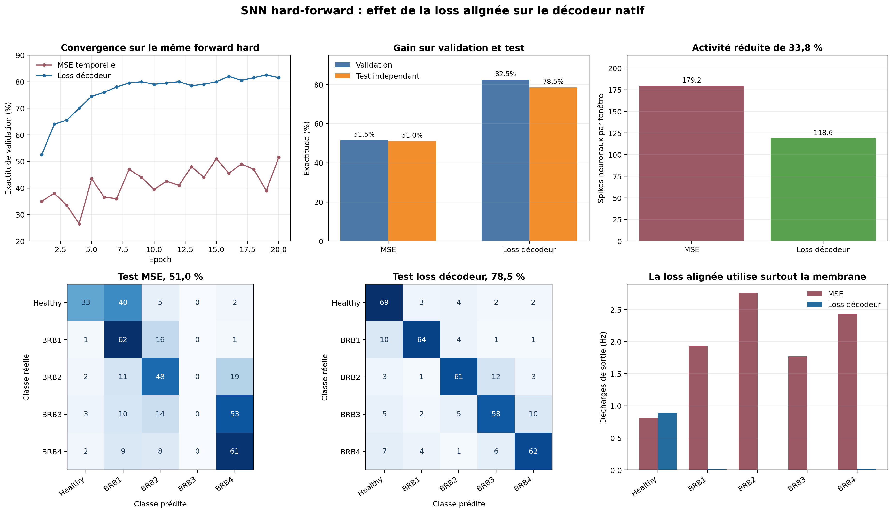

# Loss alignée sur le décodeur LIF du runtime

Compte rendu expérimental du 27 août 2026.

## Résultat principal

À données, topologie, poids initiaux, learning rate et durée d'apprentissage identiques, remplacer la MSE temporelle par une entropie croisée calculée sur le score exact du runtime fait passer :

- la validation de 51,5 % à 82,5 % ;
- le test indépendant de 51,0 % à 78,5 % ;
- la marge moyenne de validation de 0,457 à 6,999 ;
- l'activité totale du réseau sur le test de 179,2 à 118,6 spikes par fenêtre.

Le gain atteint donc 31 points sur la validation et 27,5 points sur le test indépendant. Le nombre de spikes neuronaux diminue de 33,8 %.

Cette comparaison porte sur deux entraînements hard-forward v5. Elle ne mélange pas l'ancien modèle v4 à activité fractionnaire avec le modèle actuel.



## 1. Question étudiée

Le forward binaire avait supprimé les pseudo-spikes, mais la fonction de coût historique ne correspondait toujours pas à la décision réellement prise après compilation.

La question était la suivante : peut-on améliorer l'apprentissage sans réintroduire de forward continu, uniquement en faisant porter le gradient sur la même quantité que celle lue par le runtime ?

## 2. Pourquoi la MSE historique est désalignée

La cible historique vaut zéro pendant la fenêtre, puis devient one-hot au dernier événement :

```text
cible[t,c] = 0                         pour t < T
cible[T,c] = 1 si c est la vraie classe, 0 sinon
```

La loss est une moyenne pondérée :

```text
Ltemps = somme(t,c) w[t,c] * 0,5 * (S[t,c] - cible[t,c])²
         --------------------------------------------------
                         somme(t,c) w[t,c]
```

avec `S[t,c]` strictement égal à 0 ou 1.

Cette formulation demande au réseau de ne pas spiker pendant la fenêtre et de produire un spike de classe au dernier instant. Or le runtime n'utilise pas ce dernier spike isolé. Il additionne toute l'activité de la fenêtre et la membrane résiduelle.

La MSE pénalise donc une partie des événements que le décodeur considère comme de l'information utile. Elle peut aussi réduire sa propre valeur sans améliorer l'ordre des cinq scores runtime.

## 3. Nouvelle fonction de coût

### 3.1 Score strictement identique au runtime

Pour chaque classe `c` :

```text
R[c] = 2 * somme(t) S[t,c] + V[T,c] / theta[c]
```

où :

- `S[t,c]` est le spike binaire du LIF de sortie ;
- `V[T,c]` est sa membrane finale après application de la dynamique hard ;
- `theta[c]` est son seuil ;
- le facteur 2 est exactement celui du décodeur natif.

### 3.2 Probabilités utilisées uniquement par la loss

Les cinq scores sont transformés en probabilités avec une température `tau = 2` :

```text
p[c] = exp(R[c] / tau) / somme(k) exp(R[k] / tau)
```

La température ne change pas la classe gagnante, car elle conserve l'ordre des scores. Elle règle seulement l'amplitude et la répartition du gradient.

### 3.3 Objectif combiné

```text
L = -log(p[classe correcte]) + 0,25 * Ltemps
```

La composante temporelle historique est conservée comme régularisation légère. Elle ne domine plus la classification.

## 4. Gradient appliqué au réseau hard

Pour une entropie croisée avec softmax :

```text
dL/dR[c] = (p[c] - y[c]) / tau
```

Comme chaque spike ajoute deux points au score :

```text
dL/dS[t,c] = 2 * dL/dR[c]
```

pour chaque instant `t` de la fenêtre.

La membrane finale reçoit aussi un gradient direct :

```text
dL/dV[T,c] = (1 / theta[c]) * dL/dR[c]
```

Ce n'est qu'à l'étape suivante, lorsqu'il faut traverser la décision binaire du LIF, que la dérivée triangulaire surrogate est utilisée :

```text
dS/dU ≈ beta * max(0, 1 - beta * abs(U - theta))
```

avec `beta = 1,25`.

Les spikes du forward restent donc exactement binaires. La softmax et la dérivée surrogate servent à calculer la correction des poids, elles ne sont jamais propagées comme des événements dans le graphe.

## 5. Protocole A/B

Les deux branches partagent exactement les éléments suivants :

| Paramètre | Valeur |
| --- | ---: |
| Dataset | UFU groupé, fingerprint `ec00f5c3` |
| Apprentissage | 1 400 fenêtres |
| Validation | 200 fenêtres |
| Test indépendant | 400 fenêtres |
| Fréquence d'échantillonnage | 120,110 Hz |
| Longueur de fenêtre | 128 échantillons, 1,066 s |
| Capteur | 9 cellules, 54 ports, phase-multilevel |
| Bandes | 1,877, 3,753 et 5,630 Hz |
| Topologie | dense |
| LIF cachés | 32 |
| LIF de sortie | 5 |
| Poids entraînables | 1 893 |
| Initialisation | graine fixe identique |
| Learning rate | 0,003, Adam |
| Batch | 16 |
| Epochs | 20 |

La variable expérimentale unique est la fonction de coût :

| Branche | Fonction de coût |
| --- | --- |
| Témoin | MSE temporelle hard-forward |
| Expérience | entropie croisée du décodeur runtime + 0,25 MSE temporelle |

Les checkpoints sont isolés par deux signatures d'architecture différentes : `b422549d` pour le témoin et `5a83490c` pour la loss alignée.

## 6. Courbes d'apprentissage

| Epoch | Validation MSE | Validation alignée |
| ---: | ---: | ---: |
| 1 | 35,0 % | 52,5 % |
| 2 | 38,0 % | 64,0 % |
| 3 | 33,5 % | 65,5 % |
| 4 | 26,5 % | 70,0 % |
| 5 | 43,5 % | 74,5 % |
| 6 | 36,5 % | 76,0 % |
| 7 | 36,0 % | 78,0 % |
| 8 | 47,0 % | 79,5 % |
| 9 | 44,0 % | 80,0 % |
| 10 | 39,5 % | 79,0 % |
| 11 | 42,5 % | 79,5 % |
| 12 | 41,0 % | 80,0 % |
| 13 | 48,0 % | 78,5 % |
| 14 | 44,0 % | 79,0 % |
| 15 | 51,0 % | 80,0 % |
| 16 | 45,5 % | 82,0 % |
| 17 | 49,0 % | 80,5 % |
| 18 | 47,0 % | 81,5 % |
| 19 | 39,0 % | **82,5 %** |
| 20 | **51,5 %** | 81,5 % |

La branche alignée atteint 79,5 % dès l'epoch 8. Le témoin ne dépasse jamais 51,5 %. L'écart n'est donc pas causé par un seul checkpoint chanceux en fin d'entraînement.

## 7. Matrices de confusion

### 7.1 Validation, loss alignée, 82,5 %

| Réel \ Prédit | Healthy | BRB1 | BRB2 | BRB3 | BRB4 |
| --- | ---: | ---: | ---: | ---: | ---: |
| Healthy | 35 | 4 | 1 | 0 | 0 |
| BRB1 | 6 | 34 | 0 | 0 | 0 |
| BRB2 | 2 | 1 | 32 | 5 | 0 |
| BRB3 | 0 | 2 | 2 | 31 | 5 |
| BRB4 | 3 | 1 | 3 | 0 | 33 |

### 7.2 Test indépendant, loss alignée, 78,5 %

| Réel \ Prédit | Healthy | BRB1 | BRB2 | BRB3 | BRB4 |
| --- | ---: | ---: | ---: | ---: | ---: |
| Healthy | 69 | 3 | 4 | 2 | 2 |
| BRB1 | 10 | 64 | 4 | 1 | 1 |
| BRB2 | 3 | 1 | 61 | 12 | 3 |
| BRB3 | 5 | 2 | 5 | 58 | 10 |
| BRB4 | 7 | 4 | 1 | 6 | 62 |

### 7.3 Test indépendant, témoin MSE, 51,0 %

| Réel \ Prédit | Healthy | BRB1 | BRB2 | BRB3 | BRB4 |
| --- | ---: | ---: | ---: | ---: | ---: |
| Healthy | 33 | 40 | 5 | 0 | 2 |
| BRB1 | 1 | 62 | 16 | 0 | 1 |
| BRB2 | 2 | 11 | 48 | 0 | 19 |
| BRB3 | 3 | 10 | 14 | 0 | 53 |
| BRB4 | 2 | 9 | 8 | 0 | 61 |

Le témoin ne prédit aucune fenêtre en BRB3. La loss alignée restaure une diagonale sur les cinq classes, sans sacrifier entièrement Healthy ou BRB1.

## 8. Activité et coût d'inférence

| Mesure sur le test | MSE | Loss alignée | Écart |
| --- | ---: | ---: | ---: |
| Événements du capteur par fenêtre | 147,2 | 147,2 | 0 |
| Spikes neuronaux par fenêtre | 179,2 | 118,6 | -33,8 % |
| Temps navigateur par fenêtre | 13,7 ms | 14,0 ms | non significatif |

Le temps navigateur est dominé par JavaScript, le capteur et l'ordonnanceur. Il ne doit pas être transformé directement en estimation énergétique MCU. En revanche, le nombre d'événements traités est un indicateur architectural utile : la meilleure précision n'a pas été obtenue par une explosion de l'activité, mais avec 60,6 spikes neuronaux de moins par fenêtre.

## 9. Limite observée

Au meilleur checkpoint aligné, les fréquences de sortie moyennes en validation sont :

```text
Healthy = 0,89 Hz
BRB1    = 0,01 Hz
BRB2    = 0,00 Hz
BRB3    = 0,00 Hz
BRB4    = 0,02 Hz
```

Le réseau utilise donc principalement les membranes finales pour séparer BRB1 à BRB4, tandis que Healthy produit davantage de spikes. Ce comportement n'est ni un pseudo-spike ni une divergence avec le runtime : la membrane LIF est un état physique du neurone et fait explicitement partie du décodeur déployé.

Il interdit cependant de présenter ce modèle comme un classifieur à code de sortie exclusivement spiking. Une expérience séparée devra mesurer le coût d'une contrainte plus forte : supprimer le terme de membrane du score, ou recalibrer les seuils de sortie pour obtenir un code de population par spikes. Cette modification ne doit pas être mélangée avec le résultat actuel.

## 10. Vérification du contrat hard-forward

Le meilleur modèle aligné a été rejoué sur les 200 fenêtres de validation :

| Contrôle | Résultat |
| --- | ---: |
| Valeurs neuronales vérifiées | 466 755 |
| Valeurs non binaires | 0 |
| Prédictions différentes, entraînement contre hard analytique | 0 |
| Erreur maximale des scores analytiques | 0 |
| Erreur maximale des membranes | 0 |
| Prédictions différentes, analytique contre runtime compilé | 0 |
| Erreur maximale des scores natifs | 0 |

Le gain de précision ne provient donc pas d'un retour masqué aux pseudo-spikes.

## 11. Conclusion

L'hypothèse est confirmée : le principal blocage de la version hard-forward n'était pas la topologie de 32 LIF, mais la direction fournie par la fonction de coût. La MSE demandait un comportement différent de celui évalué. L'entropie croisée alignée fournit un gradient directement relié à la décision native et améliore simultanément la précision, la marge et le nombre de spikes.

Le checkpoint retenu est `motor_current_snn_h32_5a83490c_best_val_82p5.json`. Il atteint 82,5 % sur la validation et 78,5 % sur les 400 fenêtres de test indépendant.

Résultats bruts : [`data/runtime-decoder-loss-ab-results.json`](data/runtime-decoder-loss-ab-results.json).
