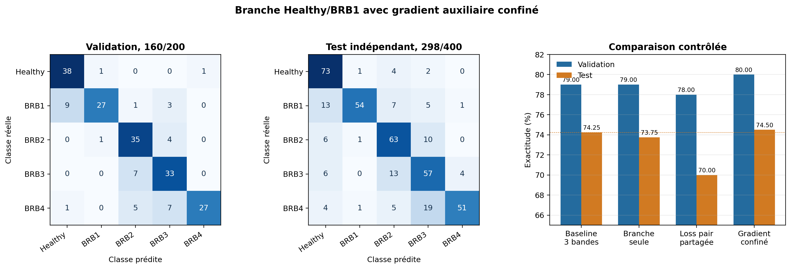

# Expérience SNN, mini-branche Healthy/BRB1

Date d'exécution : 27 août 2026.

## Question expérimentale

La bande à 2,815 Hz réduit les confusions entre BRB1 et Healthy lorsqu'elle remplace une bande globale, mais cette substitution détruit une partie de l'information de sévérité. L'expérience teste si cette bande peut apporter une information locale sans modifier la représentation principale.

L'hypothèse est la suivante : une branche étroite, reliée uniquement aux sorties Healthy et BRB1, doit réduire les erreurs `BRB1 -> Healthy` sans le coût ni les perturbations d'une quatrième bande connectée à tout le réseau.

## Protocole

Le jeu groupé contient 1 600 fenêtres d'apprentissage et 400 fenêtres de test indépendantes. Les 1 600 premières sont séparées de façon déterministe en 1 400 fenêtres d'ajustement et 200 fenêtres de validation. Le test n'intervient ni dans le choix des fréquences, ni dans le calibrage des seuils, ni dans le choix du checkpoint.

Le signal comporte trois phases, 128 instants par fenêtre et une fréquence d'échantillonnage de 120,110 Hz. Les fréquences globales sont choisies par score de Fisher multiclasses sur les 1 400 fenêtres d'ajustement. La fréquence spécialiste est choisie par score de Fisher limité au couple Healthy/BRB1 sur les mêmes données.

Topologie utilisée :

```text
3 bandes globales, 54 ports multiseuils -> 32 LIF principaux -> 5 LIF de classe

1 bande à 2,815 Hz, 6 ports binaires -> 4 LIF spécialistes -> Healthy et BRB1 seulement
```

Le nombre de poids est :

```text
branche principale = 54 x 32 + 32 x 5 + 5 = 1 893
branche spécialiste = 6 x 4 + 4 x 2 = 32
total = 1 925 poids
```

Les poids de la branche principale sont initialisés dans le même ordre que la baseline, avec la même graine fixe `0x534e4e31`. Les poids spécialistes sont tirés ensuite. Cette règle limite les différences initiales à la branche ajoutée.

## Dynamique mathématique

Pour chaque phase et chaque bande, le capteur IIR produit une réponse filtrée `y_k[t]`. Un événement binaire de polarité positive ou négative est émis lorsque la réponse franchit le seuil calibré `theta_k` :

```text
s_k^+[t] = 1 si y_k[t-1] < +theta_k et y_k[t] >= +theta_k, sinon 0
s_k^-[t] = 1 si y_k[t-1] > -theta_k et y_k[t] <= -theta_k, sinon 0
```

Pour la branche spécialiste, les seuils sont 0,086902 A pour Ia, 0,082638 A pour Ib et 0,081594 A pour Ic. Un seul niveau est utilisé, soit trois phases multipliées par deux polarités, donc six ports.

Chaque neurone LIF intègre les impulsions reçues :

```text
u_i[t+1] = alpha_i u_i[t] + somme_j(w_ij s_j[t])
s_i[t+1] = 1 si u_i[t+1] >= theta_i, sinon 0
```

avec `alpha_i = exp(-dt/tau_i)`, `dt = 1/120,110 s`, un seuil neuronal de 0,8 et une remise à zéro à 0 après émission. Le décodage runtime classe les cinq sorties selon :

```text
score_c = 2 x nombre_total_de_spikes_c + potentiel_final_c / seuil_c
prediction = argmax_c(score_c)
```

L'apprentissage utilise Adam, un pas de 0,003, un gradient surrogate de pente 5 et 80 epochs. Le checkpoint maximise l'accuracy runtime sur la validation. À accuracy égale, la loss d'apprentissage la plus faible est retenue.

## Résultats

Le meilleur checkpoint est celui de l'epoch 63 : 158 réponses correctes sur 200, soit 79,0 %. La loss d'apprentissage vaut 0,002464, la loss de validation continue 0,009547 et l'accuracy surrogate 85,0 %. Après restauration, le graphe compilé contient 41 neurones LIF natifs, 43 noeuds et 1 926 liens.

Matrice de validation, lignes réelles et colonnes prédites :

| Réel | Healthy | BRB1 | BRB2 | BRB3 | BRB4 |
| --- | ---: | ---: | ---: | ---: | ---: |
| Healthy | 36 | 1 | 2 | 1 | 0 |
| BRB1 | 7 | 29 | 1 | 3 | 0 |
| BRB2 | 1 | 0 | 37 | 2 | 0 |
| BRB3 | 1 | 0 | 8 | 29 | 2 |
| BRB4 | 0 | 0 | 6 | 7 | 27 |

Sur le test indépendant, le modèle obtient 295 réponses correctes sur 400, soit 73,75 %.

| Réel | Healthy | BRB1 | BRB2 | BRB3 | BRB4 |
| --- | ---: | ---: | ---: | ---: | ---: |
| Healthy | 72 | 2 | 3 | 3 | 0 |
| BRB1 | 13 | 53 | 9 | 4 | 1 |
| BRB2 | 6 | 2 | 63 | 9 | 0 |
| BRB3 | 4 | 1 | 16 | 52 | 7 |
| BRB4 | 2 | 4 | 6 | 13 | 55 |

Le runtime produit 155,5 événements capteur et 36,5 spikes neuronaux par fenêtre. La mesure navigateur est de 43,2 ms par fenêtre. Cette latence n'est pas une mesure MCU et ne doit pas être comparée isolément à un autre run sans répétitions sur le même processus.

## Comparaison contrôlée

| Architecture | Validation | Test | Poids | Événements capteur |
| --- | ---: | ---: | ---: | ---: |
| Baseline, trois bandes globales | 79,0 % | 74,25 % | 1 893 | 147,2 |
| Quatrième bande dense | 80,0 % | 73,25 % | 2 469 | 190,9 |
| Mini-branche Healthy/BRB1 | 79,0 % | 73,75 % | 1 925 | 155,5 |

Par rapport à la baseline, la mini-branche ajoute 32 poids, soit 1,69 %, et 8,3 événements par fenêtre, soit 5,64 %. Elle réduit bien `BRB1 -> Healthy` de 19 à 13 erreurs. Cependant, le nombre de BRB1 correctement classés reste exactement égal à 53. Les six erreurs retirées de Healthy sont déplacées vers BRB2, BRB3 et BRB4. En parallèle, cinq fenêtres Healthy supplémentaires deviennent erronées.

La branche est nettement plus économique que l'ajout dense : 544 poids et 35,4 événements par fenêtre en moins. Elle obtient aussi deux bonnes réponses de plus sur le test. Elle reste néanmoins inférieure de deux bonnes réponses à la baseline.

## Conclusion

L'expérience confirme le mécanisme local : la bande 2,815 Hz contient bien une information qui éloigne BRB1 de Healthy. Elle réfute toutefois l'hypothèse forte selon laquelle ce déplacement suffirait à améliorer la classification globale. La branche ne crée pas plus de BRB1 corrects, elle redistribue leurs erreurs, et elle détériore légèrement Healthy et BRB4.

La prochaine expérience doit donc modifier l'objectif de la branche, pas augmenter sa taille. Une loss auxiliaire binaire Healthy contre BRB1, appliquée uniquement aux deux sorties concernées et pondérée faiblement dans la loss globale, permettrait de tester si l'information locale peut être utilisée sans déplacer les erreurs vers les classes de sévérité voisines.

Les valeurs brutes sont conservées dans `data/specialist-branch-results.json`. Le checkpoint téléchargé est `motor_current_snn_h32_78c242fb_best_val_79p0.json`, avec l'empreinte SHA-256 `0e663d328628a6d0a385404f331410843bdd2ee56c4353165178f8db11dc5465`.

## Expérience complémentaire, loss Healthy/BRB1

La topologie précédente est conservée à l'identique. Pour les seuls échantillons Healthy et BRB1, la fonction d'apprentissage devient :

```text
L = (L_base + lambda x L_pair) / (1 + lambda)
lambda = 0,25
L_pair = (MSE(p_Healthy, y_Healthy) + MSE(p_BRB1, y_BRB1)) / 2
```

`L_pair` est mesurée au dernier instant seulement. Pour BRB2, BRB3 et BRB4, `L = L_base`. Le graphe d'inférence conserve donc 1 925 poids et 41 LIF natifs.

Le meilleur checkpoint apparaît à l'epoch 73 avec 156/200, soit 78,0 % de validation. Le test indépendant obtient 280/400, soit 70,0 %.

| Classe | Sans loss locale | Avec loss locale | Écart |
| --- | ---: | ---: | ---: |
| Healthy | 72/80 | 65/80 | -7 |
| BRB1 | 53/80 | 61/80 | +8 |
| BRB2 | 63/80 | 44/80 | -19 |
| BRB3 | 52/80 | 49/80 | -3 |
| BRB4 | 55/80 | 61/80 | +6 |

L'objectif auxiliaire améliore nettement BRB1, mais déplace la frontière vers Healthy et dégrade fortement BRB2. Il ne reste pas local au sens du gradient : les sorties Healthy et BRB1 reçoivent aussi les 32 LIF principaux, donc leur erreur se propage dans la représentation partagée, pas seulement dans les quatre LIF spécialistes. La normalisation de la loss réduit aussi le poids relatif des trois autres sorties sur 40 % des échantillons.

Cette variante est donc rejetée sous sa forme actuelle. La suite méthodologiquement correcte consiste à router le gradient auxiliaire uniquement dans les synapses de la branche spécialiste, ou à utiliser une tête auxiliaire d'apprentissage retirée avant compilation. Réduire simplement `lambda` peut limiter les dégâts, mais ne résout pas ce défaut de localisation.

Les valeurs brutes sont dans `data/pair-loss-results.json`. Le checkpoint est `motor_current_snn_h32_065276ab_best_val_78p0.json`, avec l'empreinte SHA-256 `156f5b1c3f3b95da02d5d5e4cb608cc6c97d0e541d5b368f6850da665cea28ad`.

## Expérience complémentaire, gradient auxiliaire confiné

Cette troisième variante répond directement au défaut observé ci-dessus. Le passage principal reste strictement identique et entraîne les 1 925 poids runtime avec Adam et un pas de 0,003. Pour un échantillon Healthy ou BRB1, un second passage ne contient que les six ports binaires, les quatre LIF spécialistes et les deux sorties concernées. Les 1 893 poids du chemin principal sont absents de ce calcul.

Si `p_H` et `p_B` sont les probabilités finales des sorties Healthy et BRB1, la loss auxiliaire est :

```text
L_scope = ((p_H - y_H)^2 + (p_B - y_B)^2) / 4
```

Le facteur quatre vient de l'implémentation exacte : `LossFunctions.MSE` retourne la demi-erreur quadratique pour chaque sortie, puis le trainer divise la somme par les deux poids de loss actifs. Dans chaque mini-lot, Adam applique d'abord le passage principal. Le passage auxiliaire filtre ensuite les seuls échantillons Healthy et BRB1, puis applique SGD avec :

```text
theta_auxiliaire <- theta_auxiliaire - 0,0003 x gradient(L_scope)
```

`theta_auxiliaire` contient 34 poids pendant l'apprentissage. Trente-deux sont des poids runtime partagés : 24 poids des six ports vers les quatre LIF, puis huit poids des quatre LIF vers les deux sorties. Deux poids temporaires déclenchent le calcul au dernier instant. Ces deux poids ne sont ni intégrés au graphe runtime, ni compilés, ni sauvegardés. L'inférence reste donc exactement celle de la mini-branche précédente : 41 LIF natifs et 1 925 poids. Aucun des 1 893 poids du chemin principal ne reçoit ce gradient auxiliaire.

Le meilleur checkpoint apparaît à l'epoch 55 avec 160/200, soit 80,0 % de validation. La matrice est :

| Réel | Healthy | BRB1 | BRB2 | BRB3 | BRB4 |
| --- | ---: | ---: | ---: | ---: | ---: |
| Healthy | 38 | 1 | 0 | 0 | 1 |
| BRB1 | 9 | 27 | 1 | 3 | 0 |
| BRB2 | 0 | 1 | 35 | 4 | 0 |
| BRB3 | 0 | 0 | 7 | 33 | 0 |
| BRB4 | 1 | 0 | 5 | 7 | 27 |

Sur les 400 fenêtres de test indépendantes, le checkpoint obtient 298 bonnes réponses, soit 74,5 % :

| Réel | Healthy | BRB1 | BRB2 | BRB3 | BRB4 |
| --- | ---: | ---: | ---: | ---: | ---: |
| Healthy | 73 | 1 | 4 | 2 | 0 |
| BRB1 | 13 | 54 | 7 | 5 | 1 |
| BRB2 | 6 | 1 | 63 | 10 | 0 |
| BRB3 | 6 | 0 | 13 | 57 | 4 |
| BRB4 | 4 | 1 | 5 | 19 | 51 |



Par rapport à la mini-branche sans objectif auxiliaire, le résultat gagne trois bonnes réponses sur 400. Healthy gagne une réponse correcte, BRB1 en gagne une, BRB2 reste inchangé, BRB3 en gagne cinq et BRB4 en perd quatre. Le changement visé entre Healthy et BRB1 est donc minime : `Healthy -> BRB1` passe de deux à une erreur, tandis que `BRB1 -> Healthy` reste à treize erreurs.

La loss auxiliaire apporte une information encore plus nette. Elle vaut 0,23559 à l'epoch 1, atteint son minimum à ce même epoch, puis vaut 0,24112 au meilleur checkpoint et 0,24113 à l'epoch 80. Le second objectif n'apprend donc pas la séparation binaire demandée. Le gain global de trois réponses ne peut pas être attribué à une amélioration démontrée du couple Healthy/BRB1.

## Décision expérimentale

Le confinement corrige bien le défaut technique de la loss pondérée : aucune erreur auxiliaire ne traverse désormais la représentation principale. Il évite la chute de 74,5 % à 70,0 % observée avec le gradient partagé. En revanche, il ne valide pas le mécanisme recherché. Le score de test est pratiquement celui de la baseline à trois bandes, 74,5 % contre 74,25 %, et la loss spécialisée ne converge pas.

Cette piste est donc classée comme neutre et non retenue pour remplacer la baseline. La conclusion utile est structurelle : ajouter un objectif local ne suffit pas si les événements de la bande spécialiste et la dynamique de quatre LIF ne permettent pas de résoudre Healthy contre BRB1. Avant tout nouvel essai de loss, il faut mesurer directement la séparabilité produite par le capteur, par exemple avec un classifieur linéaire sur les six trains de spikes, puis seulement modifier le capteur ou sa dynamique si cette séparabilité est insuffisante.

Les valeurs brutes sont dans `data/scoped-pair-gradient-results.json`. Le checkpoint est `motor_current_snn_h32_ca78aec5_best_val_80p0.json`, avec l'empreinte SHA-256 `680d0cacc846826dc2890b3ccaff350f2416184d9c30080eb3e529ef387cbac6`.
