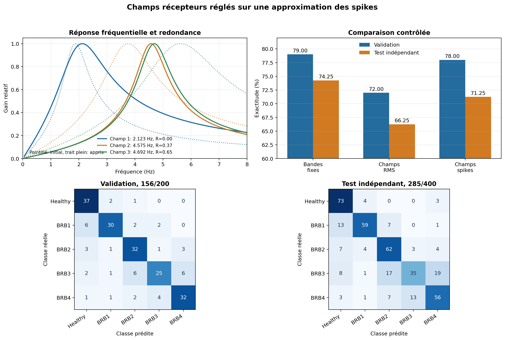

# Option SNN, champs récepteurs appris sur les spikes

Date : 27 août 2026.

## Résumé simple

Cette option apprend la fréquence centrale et la largeur des trois champs du capteur avant d'entraîner les poids du SNN. Elle juge un champ à partir des événements qu'il produirait réellement : passages par zéro, niveaux de seuil et mémoire temporelle. Elle ne le juge plus seulement à partir de l'énergie moyenne du signal filtré.

Le résultat est positif, mais incomplet. Le modèle atteint 78,00 % sur la validation et 71,25 % sur les 400 fenêtres de test indépendant. Il récupère 20 bonnes réponses par rapport aux champs appris sur le RMS, mais reste 12 bonnes réponses sous les bandes fixes de référence.

Ce réglage est entièrement supprimé après l'apprentissage. Sur le microcontrôleur, le capteur utilise toujours neuf filtres biquad et des comparaisons de seuil. La figure, la matrice de confusion et les paramètres exacts du run sont conservés avec ce document.

## Question expérimentale

La première méthode réglait la fréquence centrale et la largeur de chaque filtre en maximisant la séparation des classes par l'énergie RMS du signal filtré. Cette mesure décrit correctement la réponse continue du biquad, mais elle ne décrit pas ce que reçoit réellement le SNN.

Le SNN ne reçoit pas une énergie moyenne. Il reçoit des événements produits à des instants précis, avec une polarité et un niveau de seuil. L'expérience précédente a confirmé ce désalignement : les trois scores RMS progressaient, tandis que le test indépendant descendait de 74,25 % à 66,25 %.

La nouvelle option pose donc la question suivante : peut-on régler le même capteur avec une approximation continue de ses vrais spikes, sans ajouter de calcul au runtime embarqué ?

## Ce qui reste identique

La comparaison conserve les éléments suivants :

```text
jeu de données groupé
1 400 fenêtres d'apprentissage
200 fenêtres de validation
400 fenêtres de test indépendant
3 phases de courant
3 champs fréquentiels par phase
3 seuils par cellule
2 polarités par seuil
54 ports de spikes
32 LIF cachés
5 LIF de sortie
1 893 poids entraînables
```

La topologie cachée, le décodeur runtime et la graine d'initialisation des poids ne changent pas. Cette expérience isole le réglage du capteur.

## Étape 1, réponse du filtre

Chaque cellule utilise le même filtre passe-bande biquad que le runtime. Pour l'entrée `x[t]`, sa sortie est :

```text
y[t] = b0 x[t] + b1 x[t-1] + b2 x[t-2]
       - a1 y[t-1] - a2 y[t-2]
```

Les coefficients dépendent de la fréquence centrale `f_c` et de la largeur `Delta_f`. Le facteur de qualité est :

```text
Q = f_c / Delta_f
```

Le filtre est causal. Son état est réinitialisé au début de chaque fenêtre, exactement comme pendant l'entraînement et l'inférence du SNN.

## Étape 2, événements de phase

Le runtime émet un événement montant lorsque :

```text
y[t-1] <= 0 et y[t] > 0
```

Il émet un événement descendant lorsque :

```text
y[t-1] >= 0 et y[t] < 0
```

Entre deux passages par zéro, la cellule mémorise l'amplitude maximale :

```text
p = max |y[t]|
```

Le passage par zéro fixe donc la phase et l'instant de l'événement. L'amplitude maximale de la demi-onde détermine les niveaux de seuil franchis.

## Étape 3, seuils calculés sur l'apprentissage

Pour chaque phase et chaque champ candidat, toutes les amplitudes `p` sont collectées sur les seules 1 400 fenêtres d'apprentissage. Les trois seuils sont les quantiles :

```text
q1 = 55 %
q2 = 75 %
q3 = 90 %
```

Cette opération est refaite pour chaque paire candidate `(f_c, Delta_f)`, car une modification du filtre change l'échelle des amplitudes. La validation et le test ne participent pas au calcul des seuils.

## Étape 4, approximation continue du spike

Le runtime applique la décision binaire :

```text
h(p, theta) = 1 si p >= theta, sinon 0
```

Pendant le pré-entraînement seulement, cette fonction est remplacée par une sigmoïde :

```text
s(p, theta) = 1 / (1 + exp(-(p - theta) / temperature))
```

avec :

```text
temperature = 0,12 x theta
```

Une amplitude très inférieure au seuil produit une valeur proche de zéro. Une amplitude très supérieure produit une valeur proche de un. Autour du seuil, la transition reste progressive. Cette continuité évite qu'une très petite modification du filtre fasse apparaître ou disparaître brutalement un événement dans l'objectif d'apprentissage.

Le spike binaire est également calculé en parallèle. Il sert à vérifier que l'amélioration n'existe pas uniquement dans la sigmoïde.

## Étape 5, mémoire temporelle proche des LIF

Un simple comptage de spikes perdrait leur position dans la fenêtre. Pour conserver cette information, chaque événement alimente quatre traces exponentielles :

```text
z[tau] = somme_e s_e x exp(-(T - t_e) / tau)
```

où `T` est la fin de la fenêtre et `t_e` l'instant de l'événement. Les constantes de temps sont exactement celles de la banque de LIF cachés :

```text
tau = 4, 8, 16 et 32 échantillons
```

À 120,110 Hz, elles correspondent à :

```text
33,3 ms
66,6 ms
133,2 ms
266,4 ms
```

Les traces sont calculées séparément pour les trois phases, les deux polarités, les trois seuils et les quatre constantes de temps. Un champ candidat est ainsi représenté par :

```text
3 phases x 2 polarités x 3 seuils x 4 mémoires = 72 caractéristiques
```

Ces caractéristiques n'existent que pendant le pré-entraînement. Elles représentent approximativement la quantité d'activité encore mémorisable par les différents LIF à la fin de la fenêtre.

## Étape 6, séparation des classes

Le score de Fisher est calculé une première fois sur les traces lissées, puis une seconde fois sur les traces binaires :

```text
F = variance entre les classes / variance dans les classes
```

Les deux mesures sont combinées :

```text
D = 0,75 x F_soft + 0,25 x F_hard
```

La partie lissée guide la recherche sans discontinuité excessive. La partie binaire vérifie que le champ reste utile après le retour au comportement strict du runtime.

## Étape 7, pénalité de redondance

Deux champs peuvent obtenir de bons scores individuels tout en produisant presque les mêmes événements. Pour éviter de gaspiller une cellule, la méthode mesure la corrélation absolue moyenne entre les 72 traces du champ candidat et celles des champs déjà retenus.

Cette redondance est notée `R`, entre zéro et un. L'objectif final est :

```text
J = D / (1 + lambda x R)
lambda = 1,0
```

Le premier champ n'a pas de pénalité. Le deuxième est comparé au premier. Le troisième est comparé aux deux précédents. Cette sélection reste gloutonne : elle ne garantit pas l'optimum global des trois champs. La redondance est donc enregistrée dans le checkpoint et dans les logs afin que cette limite reste visible.

## Recherche des paramètres

Les trois fréquences DFT de la baseline fournissent les points de départ. Pour chaque champ :

1. une grille locale de cinq centres et cinq largeurs est évaluée ;
2. la meilleure paire devient le centre de la grille suivante ;
3. les pas sont divisés par deux ;
4. trois tours sont exécutés ;
5. le centre reste dans le territoire délimité par les milieux des centres DFT voisins ;
6. la largeur reste positive et bornée ;
7. en cas d'égalité, la paire la plus proche de l'initialisation est conservée.

La recherche est déterministe. À données et paramètres identiques, elle produit les mêmes champs.

## Passage au runtime MCU

Après le pré-entraînement :

1. les fréquences centrales et les largeurs sont figées ;
2. les seuils binaires sont recalibrés sur les fenêtres d'apprentissage ;
3. la sigmoïde, les 72 traces et le score de Fisher sont supprimés ;
4. le SNN apprend ses poids avec les vrais événements ;
5. le graphe est compilé vers les LIF natifs.

Le coût d'inférence reste donc celui de la baseline : neuf biquads, des comparaisons de seuil, 32 LIF cachés et cinq LIF de sortie. Aucun FFT, aucune sigmoïde et aucun calcul de Fisher ne sont embarqués.

## Limites de cette version

Cette méthode est mieux alignée avec le runtime que l'énergie RMS, mais ce n'est pas encore un entraînement conjoint du capteur et du réseau. Elle optimise la séparabilité des événements avant de connaître les poids que les LIF apprendront ensuite.

Elle ne reproduit pas non plus toute la dynamique du potentiel membranaire. Les traces exponentielles représentent sa mémoire, mais pas le seuil, le reset et les interactions entre plusieurs ports pondérés.

Le test décisif reste donc le test indépendant sur 400 fenêtres. Une hausse de `J` ne sera considérée comme utile que si la validation runtime et ce test progressent aussi.

## Reproductibilité

L'option de la page est nommée `3 champs appris sur spikes`. Le checkpoint enregistre :

```text
version de la méthode
objectif mathématique
température de la sigmoïde
constantes de temps
poids de redondance
centres et largeurs avant et après recherche
scores soft et hard
redondance de chaque champ
nombre moyen d'événements binaires
seuils temporaires par phase
nombres d'échantillons train, validation et test utilisés
```

La valeur attendue pour les deux derniers compteurs est toujours zéro pour la validation et le test.

## Résultats du run complet

Le run de 80 époques a retenu le checkpoint de l'époque 35. Les trois champs obtenus sont :

| Champ | Centre initial | Centre appris | Largeur initiale | Largeur apprise | Objectif initial | Objectif appris | Redondance finale |
|---|---:|---:|---:|---:|---:|---:|---:|
| 1 | 1,877 Hz | 2,123 Hz | 0,938 Hz | 1,759 Hz | 0,0570 | 0,0863 | 0,000 |
| 2 | 3,753 Hz | 4,575 Hz | 1,877 Hz | 1,173 Hz | 0,0549 | 0,0695 | 0,370 |
| 3 | 5,630 Hz | 4,692 Hz | 2,815 Hz | 1,232 Hz | 0,0288 | 0,0552 | 0,652 |

L'objectif progresse pour les trois champs. Le deuxième réduit sa redondance de 0,518 à 0,370. Le troisième se rapproche cependant de la limite inférieure de son territoire et reste fortement redondant avec les deux premiers. La pénalité rend ce défaut visible, mais ne suffit pas à l'empêcher.

### Comparaison des scores

| Capteur | Validation runtime | Test indépendant | Bonnes réponses au test |
|---|---:|---:|---:|
| Trois bandes fixes | 79,00 % | 74,25 % | 297/400 |
| Champs appris sur RMS | 72,00 % | 66,25 % | 265/400 |
| Champs appris sur spikes | 78,00 % | 71,25 % | 285/400 |

L'alignement sur les événements récupère six points de validation et cinq points de test par rapport au critère RMS. Cela représente 20 fenêtres de test supplémentaires correctement classées. La baseline fixe reste toutefois devant de trois points, soit 12 fenêtres.

L'intervalle de Wilson à 95 % du score de 71,25 % va approximativement de 66,63 % à 75,47 %. Il recouvre le score de la baseline. Un seul run ne suffit donc pas à affirmer que la différence de trois points est stable. Il faudra plusieurs graines et, idéalement, une comparaison appariée des prédictions.

### Matrice de confusion indépendante

```text
             Healthy  BRB1  BRB2  BRB3  BRB4
Healthy           73     4     0     0     3
BRB1              13    59     7     0     1
BRB2               7     4    62     3     4
BRB3               8     1    17    35    19
BRB4               3     1     7    13    56
```

Les taux de reconnaissance par classe sont :

```text
Healthy : 91,25 %
BRB1    : 73,75 %
BRB2    : 77,50 %
BRB3    : 43,75 %
BRB4    : 70,00 %
```

Le principal défaut est maintenant concentré sur BRB3. Dix-sept fenêtres BRB3 deviennent BRB2 et dix-neuf deviennent BRB4. Le modèle conserve donc l'ordre de sévérité, mais place mal la frontière centrale autour de BRB3. Ce comportement est cohérent avec le fort recouvrement des deux champs situés à 4,575 et 4,692 Hz.



## Conclusion expérimentale

L'hypothèse principale est partiellement validée. Un objectif construit à partir des passages de phase, des seuils et de la mémoire temporelle prédit beaucoup mieux l'utilité du capteur que l'énergie RMS seule. Il n'égale pas encore la sélection DFT fixe.

La prochaine expérience ne doit pas modifier la topologie LIF. Elle doit traiter le défaut restant dans la sélection du banc de capteurs : les trois champs sont encore optimisés successivement. Une recherche conjointe des trois champs, avec une contrainte explicite sur la complémentarité du banc complet, est plus justifiée qu'une nouvelle correction locale de BRB3.

Le runtime MCU reste inchangé : 39 noeuds compilés, 1 894 liens et 37 LIF natifs. Le test produit en moyenne 151,745 événements d'entrée et 38,923 spikes neuronaux par fenêtre. Le temps navigateur de ce run n'est pas comparé à celui des runs précédents, car les conditions d'exécution n'ont pas été contrôlées comme un benchmark.

Les résultats numériques sont enregistrés dans `data/spike-aligned-receptive-fields-results.json`. Le checkpoint porte la signature `2cc3a0ae`. Son SHA-256 est `AB2E1E7C35E1416452F81DB73BFFA6E3B3B08802063939B7729B47D693D922E7`.
