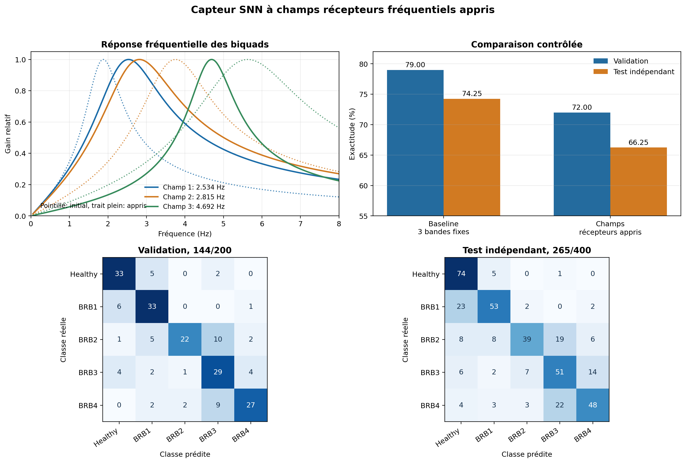

# Option SNN, champs récepteurs fréquentiels appris

Date : 27 août 2026.

## Pourquoi cette option existe

Une cellule du capteur n'écoute pas une fréquence mathématiquement ponctuelle. Elle réagit à une bande de fréquences. Dans le runtime SpikyPanda, cette cellule est déjà un filtre passe-bande IIR de type biquad. Elle possède une fréquence centrale et une largeur de bande.

Jusqu'ici, ces deux valeurs étaient réglées ainsi :

1. un score de Fisher calculé sur des bins DFT choisissait trois fréquences centrales ;
2. la largeur était imposée par la règle `largeur = 0,5 x fréquence centrale` ;
3. ces paramètres restaient ensuite fixes pendant tout l'apprentissage du SNN.

Le problème n'était donc pas l'absence de bande passante dans le runtime. Le problème était que le champ récepteur était choisi par une règle fixe, puis interprété à tort comme une fréquence ponctuelle.

L'option `3 champs récepteurs appris` remplace cette règle par un pré-entraînement supervisé du capteur. Elle conserve la topologie SNN de référence : 54 ports multiseuils, 32 LIF cachés et cinq LIF de sortie.

## Paramètres appris

Pour chacun des trois champs fréquentiels, le pré-entraînement règle deux paramètres :

```text
f_c = fréquence centrale du filtre
Delta_f = largeur de bande du filtre
```

Les trois phases Ia, Ib et Ic partagent les mêmes couples `(f_c, Delta_f)`, mais disposent ensuite de leurs propres seuils de spikes. Il reste donc neuf cellules runtime, trois champs multipliés par trois phases.

Les seuils ne sont pas appris pendant cette première expérience. Ils sont recalibrés après le réglage fréquentiel avec les percentiles habituels. Le gain reste porté par les poids synaptiques entre les ports du capteur et les LIF.

## Réponse continue utilisée pendant le pré-entraînement

Pour une séquence `x[t]`, le même biquad causal que celui du runtime calcule :

```text
y[t] = b0 x[t] + b1 x[t-1] + b2 x[t-2]
       - a1 y[t-1] - a2 y[t-2]
```

Les cinq coefficients dépendent de `f_c` et de `Delta_f`. Le facteur de qualité vaut :

```text
Q = f_c / Delta_f
```

Le pré-entraînement ne génère pas encore de spikes. Il mesure la réponse continue de la cellule par son énergie RMS sur la fenêtre :

```text
r = racine(somme_t(y[t]^2) / (T - 1))
```

Cette valeur est calculée séparément pour Ia, Ib et Ic. Une cellule produit donc trois caractéristiques continues par fenêtre pendant cette phase.

## Objectif supervisé

Pour une caractéristique donnée, on note `mu_c` sa moyenne dans la classe `c`, `mu` sa moyenne globale et `n_c` le nombre de fenêtres de la classe. Le score utilisé est :

```text
F = variance entre classes / variance dans les classes

variance entre classes = somme_c(n_c x (mu_c - mu)^2)
variance dans les classes = somme_c somme_{k dans c}((r_k - mu_c)^2)
```

Le score total additionne les contributions des trois phases. Une valeur élevée signifie que la cellule produit des niveaux différents selon l'état du rotor, avec une dispersion limitée à l'intérieur de chaque classe.

## Recherche des paramètres

Le réglage est déterministe. Pour chaque champ :

1. la fréquence centrale initiale vient de la sélection DFT multiclasses ;
2. la largeur initiale reprend la baseline, soit `0,5 x f_c` ;
3. une grille locale de cinq centres et cinq largeurs est évaluée ;
4. la meilleure paire devient le centre de la grille suivante ;
5. le pas est divisé par deux ;
6. trois tours sont effectués.

Chaque centre reste dans son territoire initial. La frontière entre deux territoires est le milieu des deux centres DFT voisins. Cette contrainte empêche les trois champs de converger vers la même bande tout en autorisant le recouvrement de leurs courbes de sensibilité.

La largeur reste positive et bornée. La fréquence reste comprise entre 1,5 et 8 Hz, ainsi que sous la limite de Nyquist.

## Séparation stricte des données

Le découpage est effectué avant le pré-entraînement du capteur :

```text
1 400 fenêtres : réglage du capteur et apprentissage des poids SNN
200 fenêtres : choix du meilleur checkpoint SNN
400 fenêtres : test indépendant final
```

Le capteur utilise uniquement les 1 400 fenêtres d'apprentissage. Le fichier de checkpoint enregistre explicitement :

```text
validationSamplesUsed = 0
testSamplesUsed = 0
```

Les centres, largeurs, scores avant et après réglage, limites de recherche et nombre d'évaluations sont également sauvegardés.

## Passage au runtime discret

Après le pré-entraînement :

1. les centres et largeurs sont figés ;
2. les coefficients des neuf biquads sont calculés ;
3. les seuils de crête sont calibrés sur les fenêtres d'apprentissage ;
4. les réponses filtrées sont converties en spikes montants et descendants ;
5. le SNN est entraîné avec ces spikes ;
6. le graphe est compilé vers les LIF natifs habituels.

Cette option n'ajoute aucun calcul spectral lourd au runtime. Sur MCU, chaque cellule reste un biquad à cinq coefficients et quelques variables d'état. Aucun FFT n'est exécuté pendant l'inférence.

## Ce que cette expérience permet de conclure

La comparaison avec la baseline répond à une question précise : régler les champs récepteurs avec la réponse continue du vrai filtre améliore-t-il les spikes présentés au même SNN ?

Elle ne prouve pas encore qu'un entraînement conjoint capteur plus SNN serait meilleur. Le score de Fisher continu et la loss du SNN restent deux objectifs distincts. Si cette première expérience est positive, l'étape suivante pourra propager un gradient surrogate à travers le biquad et apprendre simultanément les paramètres du capteur et les poids synaptiques.

Si elle est négative, cela indiquera soit que le score RMS de Fisher n'est pas aligné avec les événements de phase, soit que les trois champs actuels suffisent déjà. Dans les deux cas, nous aurons isolé le rôle du capteur sans modifier la taille du réseau caché.

## Résultat de l'expérience du 27 août 2026

L'essai complet a utilisé le découpage groupé, 1 400 fenêtres d'apprentissage, 200 fenêtres de validation et 400 fenêtres de test indépendant. Le SNN est resté identique à la référence : 32 LIF cachés, cinq LIF de sortie et 1 893 poids entraînables. Seuls les centres et les largeurs des trois champs ont changé avant l'apprentissage du réseau.

### Paramètres obtenus

| Champ | Centre initial | Centre appris | Largeur initiale | Largeur apprise | Fisher initial | Fisher appris |
|---|---:|---:|---:|---:|---:|---:|
| 1 | 1,877 Hz | 2,534 Hz | 0,938 Hz | 1,759 Hz | 0,2552 | 0,3397 |
| 2 | 3,753 Hz | 2,815 Hz | 1,877 Hz | 1,994 Hz | 0,2704 | 0,3378 |
| 3 | 5,630 Hz | 4,692 Hz | 2,815 Hz | 1,232 Hz | 0,0549 | 0,1791 |

Le critère continu augmente pour les trois champs. L'optimiseur a donc bien exécuté ce qui lui était demandé. Ce résultat ne suffit toutefois pas à établir que les événements discrets sont meilleurs.

### Scores obtenus

| Configuration | Validation | Test indépendant | Bonnes réponses au test |
|---|---:|---:|---:|
| Référence, trois bandes fixes | 79,00 % | 74,25 % | 297/400 |
| Trois champs appris par RMS Fisher | 72,00 % | 66,25 % | 265/400 |

Le meilleur checkpoint des champs appris est celui de l'époque 43. Le graphe compilé contient toujours 39 noeuds, 1 894 liens et 37 LIF natifs. La baisse ne provient donc ni d'une réduction de capacité, ni d'un changement de topologie cachée.

La matrice de confusion du test indépendant est :

```text
             Healthy  BRB1  BRB2  BRB3  BRB4
Healthy           74     5     0     1     0
BRB1              23    53     2     0     2
BRB2               8     8    39    19     6
BRB3               6     2     7    51    14
BRB4               4     3     3    22    48
```

Le capteur reconnaît bien Healthy, mais perd une partie de la progression de sévérité. Les erreurs `BRB2 -> BRB3` et `BRB4 -> BRB3` deviennent particulièrement importantes. Le rapprochement des deux premiers centres, 2,534 et 2,815 Hz, produit aussi deux champs très recouvrants. La contrainte de territoire évite leur fusion exacte, mais elle ne garantit pas que leurs trains de spikes portent des informations complémentaires.



## Interprétation

Cette expérience est négative pour l'algorithme actuel, mais elle ne réfute pas le modèle du champ récepteur. Elle montre plus précisément que l'énergie RMS continue du filtre n'est pas un bon substitut des événements réellement consommés par le SNN.

Le pré-entraînement maximise :

```text
séparation des classes par le niveau RMS du signal filtré
```

Le runtime exploite au contraire :

```text
instants de franchissement des seuils
+ sens montant ou descendant
+ niveau de seuil franchi
+ phase du signal
+ rémanence et adaptation du capteur
```

Une bande peut donc avoir un excellent score RMS tout en déplaçant les franchissements de seuil dans le temps, en supprimant des événements utiles ou en produisant deux trains trop semblables. C'est exactement la zone de désalignement révélée ici.

L'option reste disponible comme mode expérimental reproductible. Elle ne doit pas remplacer la baseline. L'expérience suivante optimise une représentation continue des passages de seuil et de leur mémoire temporelle. Sa méthode complète est décrite dans `spike-aligned-receptive-fields-method.md`. Elle utilise encore une recherche locale déterministe, et non une rétropropagation conjointe à travers le SNN.

Les valeurs brutes, les matrices, les coûts et l'identité du checkpoint sont enregistrés dans `data/trainable-receptive-fields-results.json`. Le checkpoint exporté porte la signature `6dd28ae0` et son SHA-256 est `2278B96E61FA83835806386D1ED9AE23C4C4A2CE12E200A1A0FB492910C065DF`.
