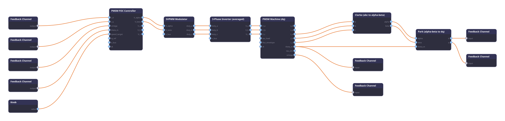

# Clarke et Park

`Physics.Electric.Motor.PMSM:clarke` · `Physics.Electric.Motor.PMSM:park`

Les deux transformations de repère du FOC, en noeuds séparés. Ports fidèles du legacy `sensors/ThreePhaseTransforms`, l'oracle de validation. Elles forment le chemin de retour canonique : courants de phase machine `i_abc` -> repère stationnaire `αβ` (Clarke) -> repère rotor `dq` (Park), de quoi alimenter directement le `i_d` / `i_q` du contrôleur FOC.

## Clarke : abc -> alpha-beta

Convention amplitude-invariante (Concordia) :

```
alpha = (2/3) * (a - b/2 - c/2)
beta  = (2/3) * (sqrt(3)/2) * (b - c)
```

Sous courants équilibrés `a = I*cos(theta)`, `b = I*cos(theta - 2pi/3)`, `c = I*cos(theta + 2pi/3)` : `alpha = I*cos(theta)`, `beta = I*sin(theta)`.

- **Entrées** : `a`, `b`, `c` (courants de phase, depuis `i_a/i_b/i_c` de la machine).
- **Sorties** : `alpha`, `beta`.

## Park : alpha-beta -> dq

Aligne l'axe d sur le flux rotor à l'angle électrique `theta_e = P * theta_m` :

```
d =  alpha * cos(theta_e) + beta * sin(theta_e)
q = -alpha * sin(theta_e) + beta * cos(theta_e)
```

- **Entrées** : `alpha`, `beta` (depuis Clarke), `theta_m` (angle mécanique rotor, depuis la machine).
- **Sorties** : `d`, `q`.
- **Éditable** : `P` (paires de pôles, par défaut 1 ; doit égaler le `P` de la machine et du FOC).

Les deux noeuds sont sans état et n'allouent rien dans la boucle chaude.

## Pourquoi des noeuds séparés

Le FOC porté calcule déjà le repère interne pour ses propres boucles, et expose un drive idéal `V_a/V_b/V_c`. Sortir Clarke et Park en noeuds permet de bâtir la **boucle de retour fidèle au schéma bloc canonique** : la machine ne renvoie que ses courants de phase physiques `i_abc` (ce qu'un vrai capteur mesure, et là où vit la signature MCSA), et la transformation vers `dq` se fait explicitement dans le graphe. C'est aussi ce qui rend la chaîne réutilisable hors PMSM (toute mesure triphasée).

## Exemple : chaîne FOC canonique



Câblage. La chaîne aller est acyclique ; **les quatre signaux de retour qui rentrent dans le FOC** (`i_d`, `i_q`, `omega`, `theta_m`) passent chacun par un `Control.Feedback:channel` (Z⁻¹). Le seul lien de retour direct est `Machine.theta_m -> Park.theta_m`, qui est de l'aval (la machine alimente Park), pas un cycle.

```
Knob.value           -> FOC.speed_target              (consigne pilotable)
FOC.V_alpha/V_beta   -> SVPWM.V_alpha/V_beta          aller
SVPWM.duty_a/b/c     -> Inverter.duty_a/b/c           aller
Inverter.V_a/b/c     -> Machine.V_a/b/c               aller
Machine.i_a/b/c      -> Clarke.a/b/c                  retour (aval)
Clarke.alpha/beta    -> Park.alpha/beta               retour (aval)
Machine.theta_m      -> Park.theta_m                  retour (aval, direct)
Park.d   -> Feedback Z⁻¹ -> FOC.i_d                   retour bouclé
Park.q   -> Feedback Z⁻¹ -> FOC.i_q                   retour bouclé
Machine.omega   -> Feedback Z⁻¹ -> FOC.omega          retour bouclé
Machine.theta_m -> Feedback Z⁻¹ -> FOC.theta_m        retour bouclé
```

Chaque chemin qui repart du FOC et y revient (`FOC -> SVPWM -> Inverter -> Machine -> ... -> FOC`) traverse donc au moins un Z⁻¹ : le graphe n'a aucune boucle instantanée. Sans ces délais, le cycle sature les slots de capacité 1 du scheduler ; le retard d'un tick est l'échantillonnage discret standard de la commande (même mécanisme que la boucle omega->charge des graphes motorwatch).

## Physique vérifiée

Validée (`packages/tests/physics/pmsm-clarke-park.test.ts`) :

- **Clarke == oracle** : `alpha`/`beta` égalent `ThreePhaseTransforms.clarke` au bit près (1e-12).
- **Park == oracle** : `d`/`q` égalent `ThreePhaseTransforms.park` à `theta_e = P*theta_m` au bit près (1e-12).
- **Chaîne** : Clarke -> Park sur des courants équilibrés redonne le pipeline legacy `abcToDq` (1e-9).

## Pièges

- `P` du Park doit égaler `P` de la machine et du FOC : un `P` faux fait tourner le repère à la mauvaise vitesse et le couple s'effondre.
- Park attend l'angle **mécanique** `theta_m` et applique `P` en interne (comme la machine et le FOC) ; ne pas lui passer un angle déjà électrique.
