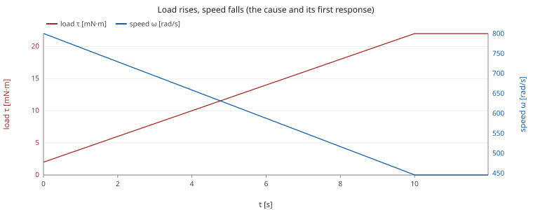
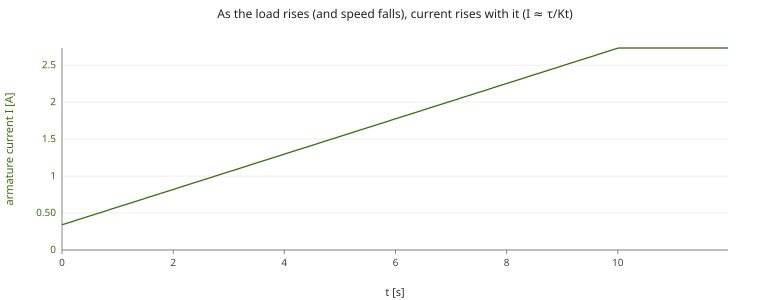
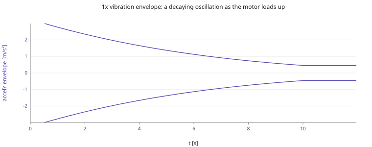
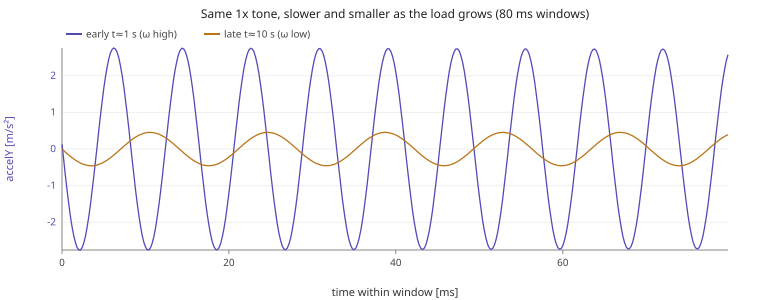
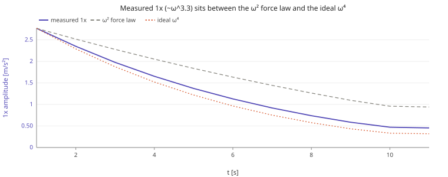
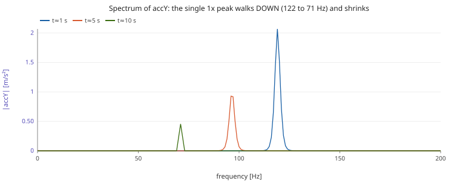
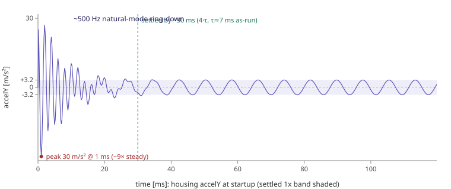

# RS-385, load ramp-up, second by second (Phase 6)

Single brushed-DC motor (RS-385) at a **constant 7 V**, one **Load Torque** ramping **2.0 → 22.0 mN·m over 10 s** (then held to 12 s). A rotor-imbalance fault provides the 1x ("once per shaft revolution", i.e. at the rotation frequency) vibration. Sampled at 5 kHz.

## How to read it

The mechanical time constant τ_m ≈ 10 ms is far shorter than the 10 s ramp, so the motor is **quasi-steady** the whole time: every second it sits at the closed-form steady point for the load it sees right then. So the ramp lets us *sweep* the operating point and watch each quantity move for a textbook reason.

## Second-by-second table

| t [s] | τ_load [mN·m] | ω [rad/s] | f_mech [Hz] | I [A] | 1x vib [m/s²] | ω vs pred | I vs pred |
|---|---|---|---|---|---|---|---|
| 1.0 | 4.00 | 765.5 | 121.8 | 0.580 | 2.766 | 0.0% | 0.4% |
| 2.0 | 6.00 | 730.0 | 116.2 | 0.819 | 2.348 | 0.0% | 0.3% |
| 3.0 | 8.00 | 694.6 | 110.5 | 1.058 | 1.976 | 0.1% | 0.2% |
| 4.0 | 10.00 | 659.1 | 104.9 | 1.297 | 1.653 | 0.1% | 0.2% |
| 5.0 | 12.00 | 623.7 | 99.3 | 1.535 | 1.370 | 0.1% | 0.2% |
| 6.0 | 14.00 | 588.2 | 93.6 | 1.774 | 1.128 | 0.1% | 0.1% |
| 7.0 | 16.00 | 552.8 | 88.0 | 2.013 | 0.918 | 0.1% | 0.1% |
| 8.0 | 18.00 | 517.3 | 82.3 | 2.252 | 0.738 | 0.1% | 0.1% |
| 9.0 | 20.00 | 481.9 | 76.7 | 2.491 | 0.587 | 0.1% | 0.1% |
| 10.0 | 21.75 | 450.7 | 71.7 | 2.701 | 0.471 | 0.0% | 0.0% |
| 11.0 | 22.00 | 446.1 | 71.0 | 2.732 | 0.455 | 0.0% | 0.0% |

Across the ramp the load rises 4.0→22.0 mN·m and the motor moves **ω 765→446 rad/s**, **I 0.58→2.73 A**, **1x vibration 2.77→0.46 m/s²** (a 6.1× drop), **f_mech 122→71 Hz**.

## Each signal: value AND shape

### Speed ω(t), smooth decreasing curve
**Law:** ω = (Kt·V/R − τ_load) / (Kt·Ke/R + b). As τ_load climbs linearly, ω falls, almost linearly while back-emf damping dominates, with a gentle convex bend. **Shape:** a single, smooth, monotonically decreasing curve (no ripple): a rigid rotor integrates torque, so its speed is the clean low-pass of the load. **Why it tracks the ramp:** each 1 s step of the load settles in ~10 ms (τ_m), so ω never lags the ramp visibly. Sim matches the closed form to <1% every second.



### Armature current I(t), increasing curve, the mirror of ω
**Law:** I = (V − Ke·ω)/R = (τ_load + b·ω)/Kt. Almost all of I goes into the load torque (Kt·I ≈ τ_load), so I rises nearly in step with the load. **Shape:** a smooth increasing curve, the mirror image of ω (when ω is high, back-emf is high, so I is low; as ω drops, back-emf drops and I climbs). On top of the DC trend rides a tiny **1x ripple** at f_mech from the unbalanced-magnetic-pull (the rotor offset modulates the air-gap), but it is orders of magnitude below the DC level.



### Radial vibration accY(t), accZ(t), a down-chirped sinusoid, steeper than the ω² force
**Drive:** the imbalance is a rotating centrifugal force F = m·r·ω² at the shaft frequency (1x). **Housing:** the accelerometer sits on a bracket modelled as a 2nd-order mass-spring whose natural frequency is **500 Hz**, far ABOVE the 71–122 Hz the 1x lives at, so in-band the bracket is stiffness-controlled: its DISPLACEMENT just tracks the force quasi-statically (x ≈ F/k). **Shape:** a clean 1x sine whose *frequency slides down* (f_mech falls with ω) and whose *amplitude shrinks* as the load ramps, a down-chirp inside a decaying envelope. accZ is the same tone **90° out of phase** with accY (the force vector rotates); the axial accX stays ≈ 0 (imbalance is purely radial).





**Why it falls FASTER than ω²:** an accelerometer reads *acceleration* = ω²·displacement, and the displacement itself grows as the force (∝ ω²), so the read-out scales as ω²·ω² = **ω⁴** in the ideal far-below-resonance limit. The exact 2nd-order transfer function gives **ω^4.1** over this band (a 8.7×-ish drop); the distant 500 Hz resonance STEEPENS the exponent slightly above 4, not below. Measured here it is **ω^3.3** (the 1x falls **6.1×** vs the ω² force law's **2.9×**). It lands BELOW 4 not because of the resonance but because of the **discrete implicit-Euler bracket integrator** running at the housing's requiredHz = 8·fn = 4000 Hz: its numerical damping bites harder at higher drive frequency, flattening the exponent from ~4.1 toward ~3.3 (raising the sample rate recovers it, ~3.3 at 4 kHz, ~4.0 at 20 kHz). The headline still holds: the extra steepness over the ω² force is the accelerometer double-differentiating an ω²-growing displacement, NOT a resonance effect, which is why raw 1x amplitude is a poor stand-alone load proxy unless the bracket AND its sample rate are known.



### Spectrum (FFT of accY), one peak sliding down toward DC
A pure imbalance is a single tone, so the spectrum is **one 1x peak at f_mech** with no harmonics. As the load ramps the peak **slides toward lower frequency** (122→71 Hz) **and loses height steeply**: both the ω² force AND the bracket's acceleration response fall as the 1x line walks down toward DC, away from the 500 Hz mode. On a waterfall (FFT vs time) this is a single ridge drifting down-left and fading, the signature of a machine being loaded down.



## The chain of causation (one load knob, four readouts)

```
τ_load ↑   (the ramp)
   │  electromechanical balance
   ▼
  ω ↓   ─────────────┬─────────────┐
   │ back-emf ↓      │ f_mech=ω/2π │ centrifugal force ∝ ω²
   ▼                 ▼             ▼
  I ↑           1x freq ↓     1x accel ↓↓ (~ω^3.3: force ω² × accel-of-displacement ω²)
```

## Startup transient (why the decomposition skips the first 0.5 s)

At t = 0 the rotor already spins at full speed, so the imbalance force F = m·r·ω² is applied in FULL the instant the sim starts, but the accelerometer bracket starts at rest (x = v = 0). That near-step excitation hits a lightly-damped (ζ = 2 %) 2nd-order bracket, so the acceleration first **overshoots to ≈ 30 m/s²** (about 9× the steady ≈ 3 m/s² 1x level, a stiff bracket's instantaneous reaction, accel(0⁺) = F/m exactly), then **rings down at the bracket's own ≈ 500 Hz natural frequency**. The ideal continuous decay constant is τ = 1/(ζ·ω_n) = 1/(0.02·2π·500) ≈ 16 ms, but the implicit-Euler bracket integrator adds numerical damping, so **as simulated it rings down about twice as fast** (τ ≈ **7 ms** measured off the trace), settling (≈ 4τ) by **≈ 30 ms**, leaving only the steady 122 Hz forced 1x.



This transient is physical, not numerical, but it is a startup artefact unrelated to the load sweep: folding it into the first per-second window would inflate that 1x reading. The decomposition therefore starts at **SETTLE = 0.5 s**, about thirty ring time-constants in, long after the bracket has settled, so every tabulated 1x is a clean quasi-steady value.

**Verdict:** every second's (ω, I) matches the closed-form quasi-steady point within a few %, so the simulated ramp is physically faithful: the observable signals move exactly as the motor equations require.

