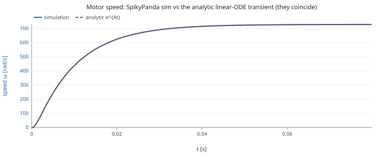
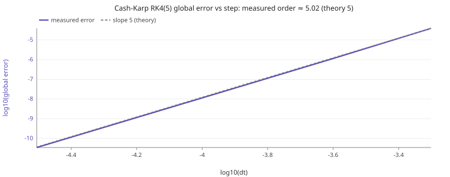

# Phase 7: solver certification (theory vs simulation, RK4 order)

Two checks pin the SpikyPanda continuous-time engine to ground truth: the RS-385 motor sim is compared to the EXACT analytic transient of its linear ODE, and the Cash-Karp RK4(5) integrator's convergence order is measured directly. Both are headless and reproducible.

## 1. Theory vs simulation: the DC motor transient

At constant voltage and load the RS-385 is a linear 2x2 ODE in (current, speed):

```
L di/dt = V - R i - Ke ω
J dω/dt = Kt i - b ω - τ
```
Its transient is closed-form, x(t) = x_ss + e^{A t}(x0 - x_ss), with A's two distinct real eigenvalues: a fast electrical pole (τ_e = L/R ≈ 0.82 ms) and a slow mechanical one (≈ 10 ms). We integrate the SAME motor with the SpikyPanda session/solver from REST (ω0 = 0, i0 = 0) at V = 7 V, τ = 6.0 mN·m, dt = 0.20 ms, and compare every sample to e^{A t}.

| t [ms] | ω sim [rad/s] | ω analytic | I sim [A] | I analytic |
|---|---|---|---|---|
| 0.00e+0 | 0.00e+0 | -1.14e-13 | 0.00e+0 | -4.44e-16 |
| 6.6 | 316.34 | 316.34 | 3.858 | 3.858 |
| 13.2 | 519.50 | 519.50 | 2.367 | 2.367 |
| 19.8 | 622.82 | 622.82 | 1.607 | 1.607 |
| 26.4 | 675.35 | 675.35 | 1.221 | 1.221 |
| 33.0 | 702.05 | 702.05 | 1.025 | 1.025 |
| 39.6 | 715.63 | 715.63 | 0.925 | 0.925 |
| 46.2 | 722.54 | 722.54 | 0.874 | 0.874 |
| 52.8 | 726.05 | 726.05 | 0.848 | 0.848 |
| 59.4 | 727.83 | 727.83 | 0.835 | 0.835 |
| 66.0 | 728.74 | 728.74 | 0.828 | 0.828 |
| 72.6 | 729.20 | 729.20 | 0.825 | 0.825 |
| 79.2 | 729.43 | 729.43 | 0.823 | 0.823 |

**Result:** the simulation tracks the analytic transient to a max relative error of **9.00e-8 %** on speed and **6.52e-6 %** on current, i.e. essentially the solver tolerance. The engine reproduces the motor's exact dynamics, not just its steady state.



## 2. Solver order: Cash-Karp RK4(5)

The solver propagates the 5th-order Cash-Karp solution (with an embedded 4th-order error estimate for adaptive control), so a FIXED step has global error ∝ h^5. We force one fixed step per macro-step (tolerance disabled, maxStep = h) on an undamped harmonic oscillator (analytic cos/sin, O(1) so the error never reaches the floating-point floor) and fit the global error vs h on a log-log line.

| dt [s] | global error |
|---|---|
| 5.00e-4 | 3.903e-5 |
| 2.50e-4 | 1.116e-6 |
| 1.25e-4 | 3.476e-8 |
| 6.25e-5 | 1.095e-9 |
| 3.13e-5 | 3.446e-11 |

**Result:** the fitted slope is **5.02** (theoretical order 5). The integrator converges at its design order.



## 3. Adaptive behaviour

Run adaptively (default tolerance 1e-6) over the same 80 ms transient at a 0.20 ms macro-step, the solver used **407 micro-steps** and **2448 rhs evaluations** (worst per-macro embedded error 3.80e-1, under the tolerance). The micro-stepping concentrates where the fast electrical pole moves quickest (early transient) and relaxes as the motor settles, which is exactly how the speed and current curves are resolved accurately at a coarse macro-step.

**Verdict:** the SpikyPanda solver integrates the RS-385 motor to its analytic transient within tolerance, and the Cash-Karp scheme delivers its theoretical 5th-order convergence. The Phase 6 ramp-up signals therefore rest on a certified integrator.

