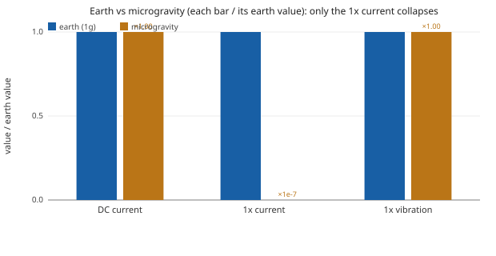

# Phase 8: gravity-sensitive turbine (scrubber)

A centrifugal scrubber presents an aerodynamic (fan-law) load, and it carries rotating-machinery faults. This phase models the turbine as a fault COMPOSER: the faults are applied to the TURBINE PAYLOAD, which reads its own mass and the scene gravity, adds its `k*omega^2` aero load, and forwards a single composed fault to the motor.

```
imbalance ──┐
desaxage  ──┼─► [ turbine: payload mass + geometry + scene gravity + k*omega^2 ] ─► motor.fault_0
scene g   ──┘
```

## What plays the role of gravity

The current has TWO parts. The **DC current** is what drives the aero load (the atmospheric density resistance): it is always present and gravity-blind. Riding on top is a small oscillation at **1x ("once per shaft revolution", i.e. at the rotation frequency)**: the imbalance heavy spot, an offset centre of mass, is a gravity PENDULUM. As it spins, gravity lifts it then drops it, a 1x braking-torque ripple the motor must fight, so a 1x line appears in the current. Because the centrifugal force is purely radial (no shaft torque), this 1x line has NO centrifugal competitor in the current: it is a PURE gravity signature, and it vanishes in microgravity.

## Earth vs microgravity (validated headless)

| quantity | earth (1g) | microgravity | gravity-dependent? |
|---|---|---|---|
| operating speed ω | 704 rad/s | 704 rad/s | no (aero load is gravity-blind) |
| **DC current** (the load) | 0.993 A | 0.993 A | **no, always present** |
| **1x current** (the signature) | 0.0072 A | 7.30e-10 A | **YES, the gravity signature** |
| 1x vibration | 20.642 m/s² | 20.641 m/s² | no (centrifugal) |

The motor draws the SAME ~0.99 A of DC current in both scenes (the scrubber load never goes away), and the 1x vibration is unchanged (1.000x, centrifugal). Only the 1x CURRENT line moves: 0.0072 A in earth, 7.30e-10 A in microgravity (a factor of 9.8e+6). That line is the gravity signature.



## The two faults on the turbine

- **Imbalance** (balourd): the offset CG gives a centrifugal 1x vibration (gravity-blind) AND, via its weight, the 1x current pendulum above (gravity-dependent). Wired to `turbine.fault_0`.
- **Static eccentricity** (desaxage): a fixed off-centre rotor gives a 1x current line through the magnetic pull, but it is **gravity-INDEPENDENT** (it persists in orbit). Wired to `turbine.fault_1`, severity 0 by default. Dial it up to add a current line that does NOT vanish in microgravity: that is how MCSA tells a gravity-driven signature from a real geometric defect. A strong eccentricity also MASKS the gravity line, so it is off for this clean demo.

## The editable graph

[graphs/turbine-scrubber.spikypanda](graphs/turbine-scrubber.spikypanda) is the montage with real registry nodes: drive, motor, the turbine fault-composer, the imbalance + eccentricity faults, a Z^-1 speed feedback, housing, IMU, current sensor, and line + FFT tiles. Open it in the node editor; bind the Scene to earth or a microgravity preset to reproduce the table.

