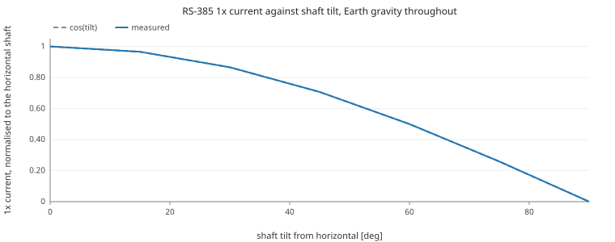

# Phase 9: a vertical shaft silences the gravity signature

Phase 8 compared Earth with orbit, so it changed the gravity. This changes only the orientation of the machine and holds Earth gravity at 9.81 m/s^2 at every point. The signature still disappears.

## The claim

The shaft lies along body X and scene gravity is world (0, 0, -g), so a tilt of p about world Y leaves `g_body = (g*sin p, 0, -g*cos p)` and a radial component of `g*|cos p|`. Both gravity causes the atlas models read that radial part and nothing else: the rotor sag is `rotorMass*g_radial/k_bearing`, and the imbalance gravity torque is `m*r*g_radial*sin(angle - g_angle)`. At a vertical shaft the radial part is zero, the offset centre of mass has no moment arm against an axial field, and the 1x line (once per shaft revolution) has no cause left.

Nothing in the physics nodes was changed to obtain this. The projection `g_body = R^T g_world` already lived in `TransformNode._updateGravityCoupling`, and the atlas graph already placed the assembly through `Attitude -> Transform -> parentWorld`. Only the tilt angle was missing.

## Sweep

| tilt [deg] | g_radial [m/s^2] | 1x current [A] | measured / horizontal | cos(tilt) | speed [rad/s] |
|---:|---:|---:|---:|---:|---:|
| 0 | 9.810 | 5.387e-3 | 1.000e+0 | 1.0000 | 314.2 |
| 15 | 9.476 | 5.203e-3 | 9.659e-1 | 0.9659 | 314.2 |
| 30 | 8.496 | 4.665e-3 | 8.660e-1 | 0.8660 | 314.2 |
| 45 | 6.937 | 3.809e-3 | 7.071e-1 | 0.7071 | 314.2 |
| 60 | 4.905 | 2.693e-3 | 5.000e-1 | 0.5000 | 314.2 |
| 75 | 2.539 | 1.394e-3 | 2.588e-1 | 0.2588 | 314.2 |
| 90 | 0.000 | 6.050e-15 | 1.123e-12 | 0.0000 | 314.2 |

## Reading

The 1x current falls from 5.387e-3 A at a horizontal shaft to 6.050e-15 A at a vertical one, a factor of 1.12e-12, with the scene gravity untouched.

The intermediate points follow `cos(tilt)` rather than its square, which is the expected shape: the sag is linear in the radial gravity and the 1x current is linear in the sag, so the two linearities compose into a plain cosine.

The operating point does not move: the mean speed varies by 0.001 rad/s across the whole sweep. That is expected and worth stating, because it rules out the obvious alternative explanation. The gravity torque is zero-mean over a revolution, so it modulates the current without loading the motor, and the sag is a radial deflection rather than a braking torque.

## Counter-example: the vibration line does not move

The sweep above carries no vibration at all, and that is the correct result rather than a missing measurement: the rotor sag is a static radial deflection, so its force is constant in the body frame and has no once-per-revolution component for an accelerometer to see. It is a purely electrical signature.

Injecting an imbalance on top of the sag gives the channel a source, and that source is centrifugal, `m*r*omega^2`, which owes nothing to gravity. Both causes are active here, so one table carries both channels:

| tilt [deg] | 1x vibration [m/s^2] | 1x current [A] |
|---:|---:|---:|
| 0 | 5.648e-2 | 5.387e-3 |
| 90 | 5.648e-2 | 6.050e-15 |

The vibration holds at 1.0000 times its horizontal value while the current falls to 1.12e-12 of its own. Two channels, one orientation change, opposite responses.

This is the practical consequence. An orientation-induced silence on the electrical channel could otherwise be read as a machine that has stopped misbehaving. The vibration channel does not go quiet, so the two together separate a change of attitude from a change of condition, which neither can do alone.

## Control: yaw does nothing

Yaw rotates the assembly about world Z, which is the gravity axis itself, so `R^T g` returns g unchanged. The housing is isotropic (0.1 kg, 500 Hz, 2 % damping on all three axes), so nothing downstream can see the rotation either. The measurements are identical, not merely close:

| yaw [deg] | 1x current [A] |
|---:|---:|
| 0 | 5.386860e-3 |
| 90 | 5.386860e-3 |
| 180 | 5.386860e-3 |

This is worth recording beyond its role as a control. Earlier atlas iterations swept yaw as though it were the orientation variable. For every gravity coupling in this model it is not one, and the column above is the evidence. Pitch is the orientation axis.

## Consequence for the study

Orientation and gravity are separately capable of removing the signature, which means a silent 1x line does not by itself indicate microgravity. Any ground calibration has to record the shaft attitude alongside the measurement, and any flight comparison has to match it, or the orientation difference will be read as a gravity effect.

