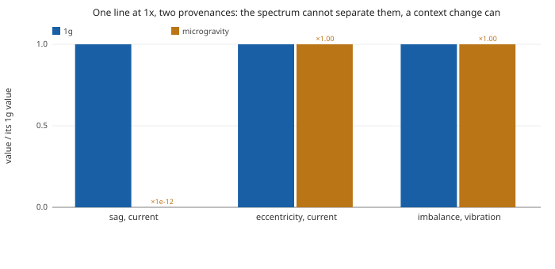
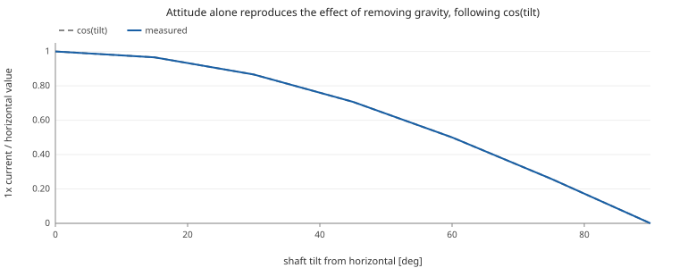
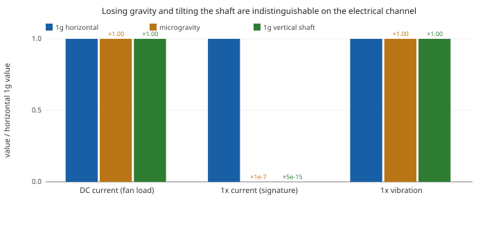

# RS-385 brushed DC: keeping a fault identifiable when gravity changes

The objective is to recognise a fault on a machine running in orbit, using a chain calibrated on the ground. Gravity reaches the terminals of a small brushed DC motor, so part of the signature the ground campaign records is not there in flight, and a classifier that has only ever seen 1g may not survive the trip.

The useful result is that this is largely solvable, and cheaply: tilting the shaft reproduces the effect of removing gravity, so the microgravity end of the training distribution can be produced on a bench. The limitation that remains is narrower than it first appears, and it concerns measuring gravity rather than finding faults.

Every figure and number below is produced by running the models when this document is generated.

Detail per step lives in `report/phase6` through `report/phase9`. This is the argument.

## Hypotheses

| | Hypothesis | Verdict |
|---|---|---|
| H1 | Gravity reaches the armature current through rotor sag, as a line at 1x (once per shaft revolution). | held |
| H2 | A rotor sag and a static eccentricity defect are separable by their behaviour under a change of gravity, though not by the spectrum. | held |
| H3 | An imbalance leaves the current alone and shows only in vibration, so the two channels carry different information. | held |
| H4 | Shaft attitude changes the signature by a different mechanism than gravity magnitude, and is therefore distinguishable from it. | **refuted** |
| H5 | The electrical channel alone can say whether a machine is running in reduced gravity. | **refuted** |
| H6 | A static accelerometer reading resolves the ambiguity H4 and H5 leave open. | held |
| H7 | A ground campaign sweeping shaft orientation can produce flight-like training data, so a fault stays identifiable in microgravity. | held |

H4 was not the expected outcome. The working assumption entering phase 9 was that orientation would modulate the signature partially, or with a phase shift, leaving gravity magnitude identifiable underneath. It does not: a tilt reproduces the effect of removing gravity exactly, to the precision of the measurement.

H5 follows from H4 and is genuinely negative. H7 is the same fact used constructively, and it is the one that matters for the objective: if a vertical shaft is equivalent to microgravity for this coupling, then a tilt table on the ground produces the microgravity end of the training distribution. The limitation on sensing gravity is not a limitation on identifying faults.

## Method

The motor is an explicit graph rather than a transfer function: a DC motor leaf integrated by the solver, faults applied as causes through `applyTo`, a housing with its own resonance, and a scene supplying gravity as a world-fixed vector that each body projects into its own frame. Signatures are read by lock-in at the measured mechanical frequency, on a whole number of cycles.

The solver was certified before any of this was believed (phase 7). Against the closed-form transient of the linear 2x2 motor the session agrees to 9e-8 percent on speed, and the measured global order of the Cash-Karp RK4(5) integrator is 5.02. The numbers below are therefore the model's, not the integrator's.

## Measurement 1: one cause at a time, with and without gravity

| condition | 1x current [A] | 1x vibration [m/s^2] |
|---|---:|---:|
| sag earth | 5.387e-3 | 0 |
| sag orbital | 6.050e-15 | 0 |
| eccentricity earth | 1.055e-1 | 2.187e-31 |
| eccentricity orbital | 1.055e-1 | 2.187e-31 |
| imbalance earth | 6.050e-15 | 5.648e-2 |
| imbalance orbital | 6.050e-15 | 5.648e-2 |

The sag-borne current line falls from 5.387e-3 A to 6.050e-15 A when gravity is removed, a factor of 1.12e-12. The eccentricity line holds at 1.000 of its 1g value. Both sit at the same frequency on the same channel, so a single spectrum cannot separate them; changing the gravity can, and that is H3.

## Measurement 2: the orientation sweep

Gravity held at 9.81 m/s^2 throughout, the machine rotated instead. The shaft lies along body X and gravity along world -Z, so a tilt of p leaves a radial component of `g*|cos p|`, and both gravity causes in the model read that component and nothing else.

| tilt [deg] | g_radial [m/s^2] | 1x current [A] | measured / horizontal | cos(tilt) |
|---:|---:|---:|---:|---:|
| 0 | 9.810 | 5.387e-3 | 1.000e+0 | 1.0000 |
| 15 | 9.476 | 5.203e-3 | 9.659e-1 | 0.9659 |
| 30 | 8.496 | 4.665e-3 | 8.660e-1 | 0.8660 |
| 45 | 6.937 | 3.809e-3 | 7.071e-1 | 0.7071 |
| 60 | 4.905 | 2.693e-3 | 5.000e-1 | 0.5000 |
| 75 | 2.539 | 1.394e-3 | 2.588e-1 | 0.2588 |
| 90 | 0.000 | 6.050e-15 | 1.123e-12 | 0.0000 |

A plain cosine, not its square: the sag is linear in the radial gravity and the current is linear in the sag. At a vertical shaft the line is at 6.050e-15 A, 1.12e-12 of the horizontal value. That is H5.

Yaw is the control. It rotates the assembly about world Z, which is the gravity axis itself, so the body-frame gravity comes back unchanged and nothing downstream can see the rotation. Measured identical to twelve decimals at 0, 90 and 180 degrees. This is worth recording because earlier iterations treated yaw as the orientation variable, and for every gravity coupling in this model it is not one.

## Measurement 3: the turbine scrubber, two ways of losing gravity

A realistic load rather than a bare shaft: a fan whose torque goes as `k*omega^2`, an imbalance applied to the turbine, and the turbine composing everything into a single fault forwarded to the motor. Three runs, one of them the same machine simply stood on end.

| channel | 1g horizontal | microgravity | 1g vertical shaft |
|---|---:|---:|---:|
| DC current [A] | 0.9931 | 0.9931 | 0.9931 |
| 1x current [A] | 7.161e-3 | 7.299e-10 | 3.768e-17 |
| 1x vibration [m/s^2] | 2.064e+1 | 2.064e+1 | 2.064e+1 |
| speed [rad/s] | 704.2 | 704.2 | 704.2 |

Three things to read off. The DC current is the fan load and is gravity-blind, so the motor never goes quiet in any of the three: a current reading alone shows nothing unusual. The 1x line collapses in both the microgravity column and the vertical column, by comparable factors, which is H5 restated on the realistic montage. And the vibration is unmoved in all three at 2.064e+1 m/s^2, because it is centrifugal and owes nothing to gravity.

That last row is H6 and it is the practical result. The defect is still there and still reported, by the other channel. An electrical silence caused by attitude is therefore distinguishable from a machine that has stopped misbehaving, but only if both channels are being watched.

## Measurement 4: the reading that tells the two apart

The montage carries a three-axis accelerometer on the housing. It measures specific force, so its DC term is the gravity vector expressed in the machine frame, and it is the only channel here that answers the question the other two leave open.

| condition | IMU DC [m/s^2] | magnitude | 1x current [A] |
|---|---|---:|---:|
| 1g horizontal | (0.00, -0.00, 9.81) | 9.810 | 7.161e-3 |
| microgravity | (0.00, -0.00, 0.00) | 0.000 | 7.299e-10 |
| 1g vertical shaft | (-9.81, -0.00, 0.00) | 9.810 | 3.768e-17 |

The current column cannot separate the last two rows: both are silent, and by margins (1e-10 and 1e-17 of an ampere) that no instrument would distinguish from each other or from zero. The accelerometer separates them completely. Its magnitude gives the gravity, and the axis carrying it gives the attitude: radial along Z when the shaft is horizontal, axial along X when it is vertical.

## What this establishes

Three different questions are involved and they do not have the same answer. Separating them is most of the result.

### Identifying the fault, in flight: yes, and the ground can prepare for it

A ground training campaign covering shaft orientations from 0 to 90 degrees can reproduce the gravity-dependent variation of the current signature, including its disappearance at 90 degrees. This allows a multichannel fault classifier to remain robust in microgravity, even though current alone cannot determine whether the signature disappeared because of shaft attitude or reduced gravity.

The reason this works is the same fact that limits gravity sensing, read the other way round. A vertical shaft in 1g is not merely similar to microgravity for this coupling, it is equivalent to it: both leave the radial gravity at zero, and the measured channels agree (7.299e-10 A against 3.768e-17 A, both indistinguishable from zero, with the same vibration). A tilt table is therefore a microgravity analogue for the mechanism, and flight-like training data can be produced on the ground at no cost.

The campaign is the sweep in measurement 2:

- horizontal shaft: radial gravity at its maximum, the signature at full amplitude;
- intermediate angles: a `cos(tilt)` modulation, giving the intermediate cases;
- vertical shaft at 90 degrees: radial gravity zero, equivalent to microgravity here.

What such a campaign teaches a classifier is the thing a single-orientation dataset cannot: that the disappearance of the 1x current line does not mean the disappearance of the fault. In the scrubber the imbalance stays plainly observable on the vibration channel at 2.064e+1 m/s^2 while its electrical manifestation through the sag is gone. A classifier trained on current alone, at one orientation, would call that a healthy machine; one trained on both channels across orientations has seen the case and does not.

### Identifying the gravity, from the current: no

The same equivalence forbids the inverse inference. A silent 1x line is consistent with microgravity and with a machine somebody stood on end, and nothing on that channel separates them. This is a real constraint, but it constrains a question most condition-monitoring work is not asking.

### Separating microgravity from a vertical shaft: yes, with one more sensor

The static term of a three-axis accelerometer resolves it outright, as measurement 4 shows: the magnitude gives the gravity and the axis carrying it gives the attitude. The sensor is already in the montage for its vibration role, and the term is the one usually discarded as an offset.

## Consequence for the experimental design

Record the shaft attitude alongside every measurement, on the ground and in flight. It costs one accelerometer channel that is already present, it makes ground and flight data comparable, and it is not recoverable after the fact from the current record alone.

Then treat orientation as a training variable rather than a nuisance. Sweeping it on the ground is the cheapest way to obtain the microgravity end of the distribution, and a classifier that has seen it is the one that will still find the fault in orbit.

## Limits

This is a simulated chain, certified against closed forms rather than against a bench. The housing is a single isotropic second-order mode per axis at 500 Hz, so anything that depends on modal shape or on anisotropy is outside what is modelled here, and yaw would stop being neutral the moment the housing stopped being isotropic. The tilt sweep uses the sag alone so that nothing masks it; a machine carrying several causes at once will show their sum, not a clean cosine.

**The tilt analogy has a boundary and it should be stated.** A vertical shaft is equivalent to microgravity for the mechanisms driven by the RADIAL component of gravity, which is what the sag and the imbalance pendulum are, and that equivalence is exact. It is not equivalence in general: at 90 degrees the payload weight has not disappeared, it has become an axial thrust on the bearing, whereas in orbit it is simply absent. Nothing in this model carries that difference to the electrical channel, so it does not show here. A real bearing whose friction depends on axial preload would show it, and a ground campaign built on tilting alone would then be teaching the classifier one condition that flight will never present. Worth checking on the bench before trusting the analogy beyond the radial mechanisms.

